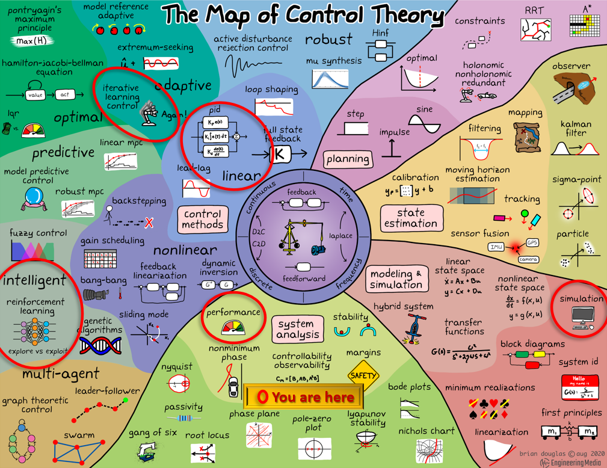

# Robotics II: Robotic Control

Robotic control is the process of controlling a robot. The control system is the part of a robot that is responsible for the robot's behavior. This includes the physical movement of the robot, as well as the logical decisions that the robot makes. The control algorithm receives sensor data from the robot's sensors, and then uses this data to make decisions about how to move the robot. It is usually a computer program that is loaded onto the robot's microcontroller. The control system is usually written in a high-level programming language, such as C or C++ or python, and then compiled into machine code that can be executed by the microcontroller.

In this module we will learn about different types of robotic control algorithms, and how to implement them in python.

After this module, you will be able to:

- [ ] Understand the basic concepts of robotic control
- [ ] Describe several commonly used traditional control algorithms
- [ ] Understand the basic concepts of PID control
- [ ] Implement a PID controller in python to solve a classic control problem

## Traditional Control Theory

Control theory is a vast field across all types of engineering, and is a very important topic in robotics. In this section we will cover the basics of control theory, and how it applies to robotics. There are many different types of control algorithms, and we will cover some of the most common ones in this module. The overlap between control theory and data science comes from new data driven control algorithms that are being developed and implemented. These algorithms are based on reinforcement learning, and are able to learn how to control a robot from data. We will cover reinforcement learning in the next module. 

The map of control theory (by Brian Douglas) below shows the different types of control algorithms and other areas of interest, and how they relate to each other. The areas that we will be working with in this module are highlighted in red.

<div style="text-align: center">

</div>

The video below is a great introduction to control theory. It gives an overview of all the important topics, and is a great starting point for learning more about the field. However, it is a high level overview and does not go into the details of any specific control algorithm. You do not need to be an expert in control theory to be successful in this block, but it is a good idea to have a basic understanding of the field so that you can properly implement and evaluate data driven control algorithms. Don't worry if you don't understand everything in the video, you will learn more about the important details in this module.

<div style="text-align: center;">
<iframe width="640" height="360" src="https://www.youtube.com/embed/lBC1nEq0_nk" title="Everything You Need to Know About Control Theory" frameborder="0" allow="accelerometer; autoplay; clipboard-write; encrypted-media; gyroscope; picture-in-picture" allowfullscreen></iframe>
</div>

Important takeaways:
- Control theory is the study of how to control a system, and how to make the system do what you want it to do without manual intervention.
- Feedback control measures the output of the system, and uses this information to make adjustments to the system to achieve the desired output.

Our focus will be on the development and implementation of the controller. We will learn how to implement a simple PID controller as a baseline with which to compare a more complex data driven controller using reinforcement learning.

### PID Control

<div style="text-align: center;">
<iframe width="640" height="360" src="https://www.youtube.com/embed/wkfEZmsQqiA" title="What Is PID Control? | Understanding PID Control, Part 1" frameborder="0" allow="accelerometer; autoplay; clipboard-write; encrypted-media; gyroscope; picture-in-picture" allowfullscreen></iframe>

<iframe width="640" height="360" src="https://www.youtube.com/embed/NVLXCwc8HzM" title="Anti-windup for PID control | Understanding PID Control, Part 2" frameborder="0" allow="accelerometer; autoplay; clipboard-write; encrypted-media; gyroscope; picture-in-picture" allowfullscreen></iframe>

<iframe width="640" height="360" src="https://www.youtube.com/embed/7dUVdrs1e18" title="Noise Filtering in PID Control | Understanding PID Control, Part 3" frameborder="0" allow="accelerometer; autoplay; clipboard-write; encrypted-media; gyroscope; picture-in-picture" allowfullscreen></iframe>
</div>

### Error Signals and Controllers

The first 3 minutes of this video are a good introduction to the concept of error signals and controllers.

<div style="text-align: center;">
<iframe width="640" height="360" src="https://www.youtube.com/embed/UR0hOmjaHp0" title="PID Control - A brief introduction" frameborder="0" allow="accelerometer; autoplay; clipboard-write; encrypted-media; gyroscope; picture-in-picture" allowfullscreen></iframe>
</div>

In order to control a robot, we need to know how far away it is from its goal. This is called the error signal. The error signal is the difference between the current state of the robot and the desired state of the robot. For example, if the robot is 10 cm away from its goal, then the error signal is 10 cm. Error signals are the difference between the desired output and the actual output. The error signal is used to determine how to change the input to the system to reduce the error. The error signal is usually a number, but it can also be a vector. 

### Bang Bang Control

Bang bang control is a simple control algorithm that is used to control a system that has two possible states. For example, a robot that has a motor that can be turned on or off. The control algorithm turns the motor on when the error signal is positive, and turns the motor off when the error signal is negative. This is called bang bang control because the motor is either on or off, there is no in-between state.

GIF of bang bang control

### Proportional Control

Proportional control is a control algorithm that is used to control a system that has a continuous range of possible states. For example, a robot that has a motor that can be turned on at any speed. The control algorithm turns the motor on at a speed that is proportional to the error signal. This is called proportional control because the motor speed is proportional to the error signal.

The drawback of proportional control is that it can be prone to overshoot and steady state errors. Overshoot is when the output of the system overshoots the desired output. Steady state error is when the output of the system is not equal to the desired output, even when the input is constant.

Code Example: Proportional Control

```python
# proportional control
def proportional_control(error_signal, Kp):
    return Kp * error_signal
```

GIF OUT OF DRIVING VIDEO

### Integral Control

Integral control deals with steady state error. The control algorithm adds up the error signal over time, and then uses this value to determine how to change the input to the system. This is called integral control because the input is proportional to the integral of the error signal. The integral of the error signal is called the integral error. 

The drawbacks of integral control are that it can be prone to windup and overshoot. Windup is when the integral error gets too large, and then the control algorithm can't change the input to the system anymore. 

Code Example: Integral Control

```python
# integral control
def integral_control(error_signal, Ki, integral_error):
    integral_error += error_signal
    return Ki * integral_error
```

GIF OUT OF DRIVING VIDEO

### Derivative Control

Derivative control deals with overshoot. The control algorithm uses the rate of change of the error signal to determine how to change the input to the system. This is called derivative control because the input is proportional to the derivative of the error signal. The derivative of the error signal is called the derivative error.

Derivative control is usually used in conjunction with proportional control. The control algorithm uses proportional control to reduce the error signal, and then uses derivative control to reduce the rate of change of the error signal. This is called proportional-derivative control.

Code Example: Derivative Control

```python
# derivative control
def derivative_control(error_signal, Kd, previous_error,dt):
    derivative_error = (error_signal - previous_error)/dt
    return Kd * derivative_error
```

GIF OUT OF DRIVING VIDEO

### PID Control

PID control is a combination of proportional, integral, and derivative control. The control algorithm uses proportional control to reduce the error signal, integral control to reduce the steady state error, and derivative control to reduce the rate of change of the error signal. This is called PID control because the input is proportional to the error signal, proportional to the integral of the error signal, and proportional to the derivative of the error signal. 

<div style="padding: 15px; border: 1px solid transparent; border-color: transparent; margin-bottom: 20px; border-radius: 4px; color: #31708f; background-color: #d9edf7; border-color: #bce8f1;">
Brainteaser ??a: ?
<br>
Brainteaser ??b: ?
<details> 
  <summary>Click for Answers </summary>
   ??a solution:  <br>
   ??b solution: 
</details>
</div>

<div style="padding: 15px; border: 1px solid transparent; border-color: transparent; margin-bottom: 20px; border-radius: 4px; color: #234f1e; background-color: #74B72E; border-color: #028a0f;">
Homework Exercise: <br>
???:<br>

<details> 
  <summary>Click for Answers </summary>
    AAA:<br>
</div>

<div style="padding: 15px; border: 1px solid transparent; border-color: transparent; margin-bottom: 20px; border-radius: 4px; color: #8a6d3b;; background-color: #fcf8e3; border-color: #faebcc;">
Disclaimer: Some of this module was written using AI suggestions by GitHub Copilot.   
</div>

