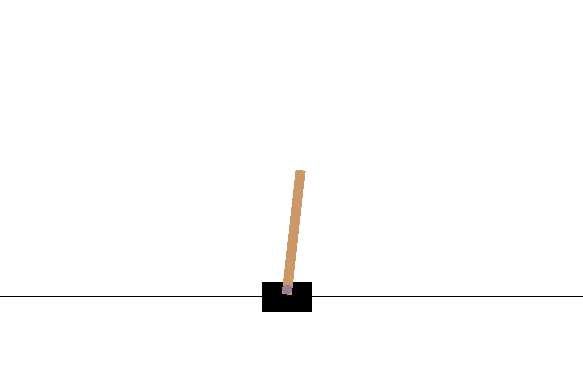
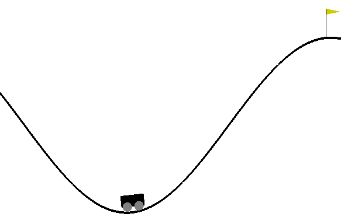
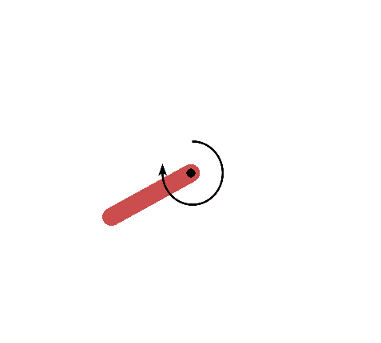
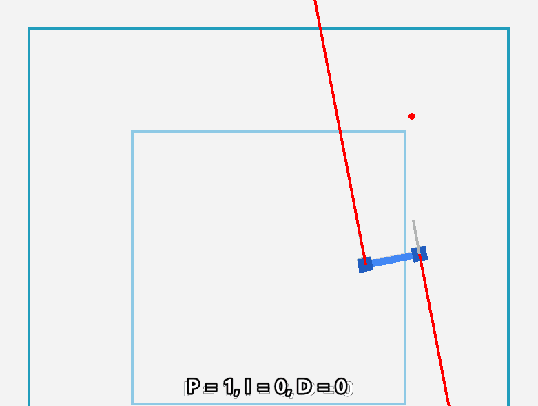
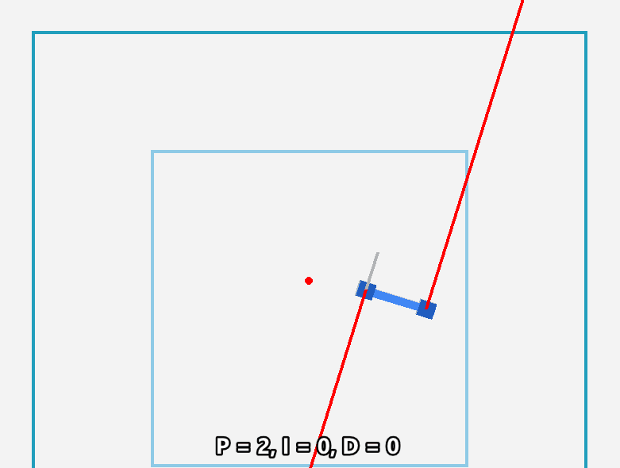
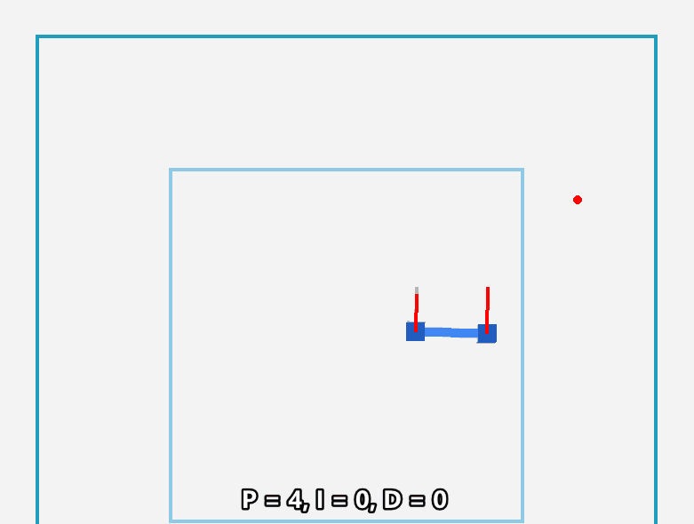
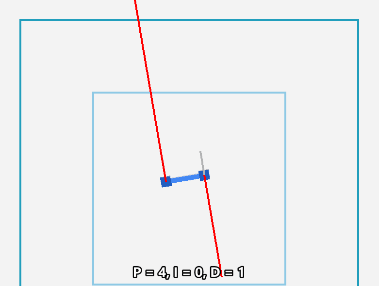
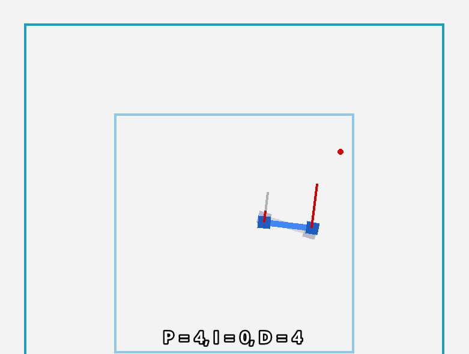
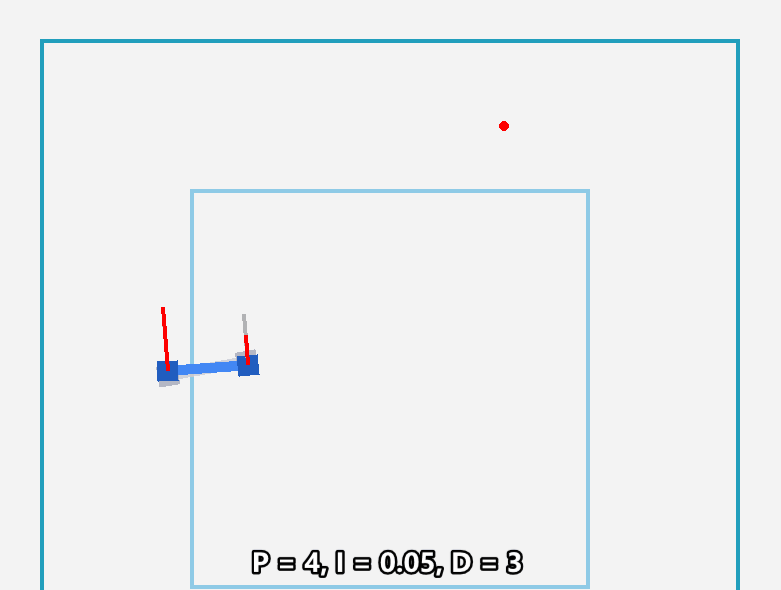
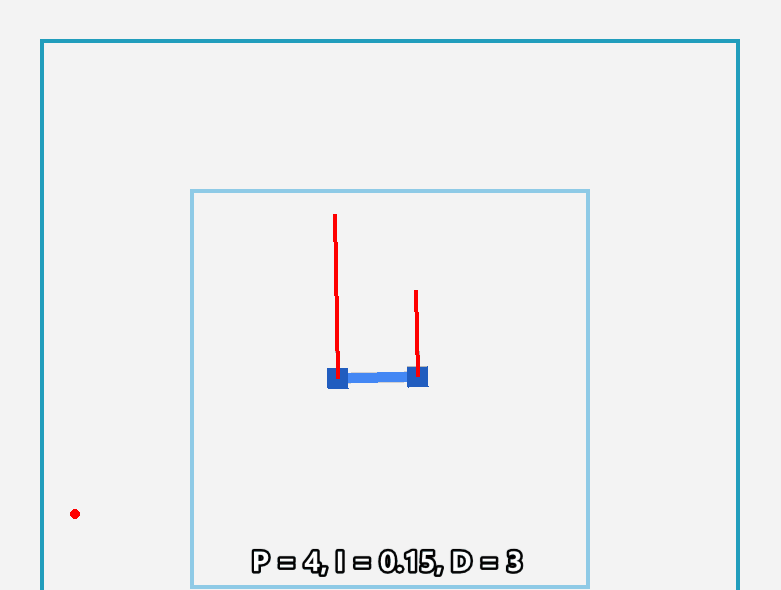

# Robotics IIb: Practical Control Examples

In this section we will look at some practical examples of PID control. We will look at an example of controlling a drone in 2D, then you will create your own controller for a pendulum (datalab prep), and finally you will use the RoboSuite environment to simulate a robotic arm lifting a block (Wednesdays datalab).

We will be using open AI gym environments for these examples.

## 1. Open AI Gym Primer

Open AI Gym is a toolkit for developing and comparing reinforcement learning algorithms. It supports teaching agents everything from walking to playing games like Pong or Pinball. It can also be used to test your own traditional controllers.

Install the Open AI Gym library by running the following command in a terminal:

```bash
pip install gym
```

This can be done in windows or linux through WSL. If you are using a linux machine you may need to use `pip3` instead of `pip`. Some of the more advanced elements of the library do not work on windows.

Once the library is installed starting a new environment is done using the make function:

- `gym.make('MyGymEnvironment-v1')` - Creates an instance of the environment

The three main functions used to interact with a gym environment are:

- `env.reset()`: Resets the environment and returns the initial state.
- `env.step(action)`: Executes the given action and returns the next state, reward, and whether the episode is done.
- `env.render()`: Renders the environment.

The following code snippet shows how to use these functions to interact with the CartPole environment:

```python
import gym
import time

env = gym.make('CartPole-v0')

# Reset the environment and get the initial state
state = env.reset()

# Run the simulation for 1000 steps
for _ in range(1000):
    # Render the environment
    env.render()
    
    # Take a random action
    action = env.action_space.sample()
    
    # Execute the action and get the next state, reward, and whether the episode is done
    state, reward, done, _ = env.step(action)

    # add a delay to slow down the env render
    # This is purely for visualization purposes, DO NOT use this when training!
    time.sleep(0.05)
    
    # If the episode is done, reset the environment
    if done:
        state = env.reset()
```
Try to run the code above and see what happens. You should see a window pop up that shows a cart moving back and forth. 

<div style="text-align: center">

</div>

Now try loading the MountainCar environment and see what happens. You should see a window pop up that shows a car moving up and down a hill.

<div style="text-align: center">

</div>

Next, try loading the Pendulum environment and see what happens. You should see a window pop up that shows a pendulum swinging back and forth. The applied torque is also shown in the window.

<div style="text-align: center">

</div>

A full list of the standard environments can be found [here](https://www.gymlibrary.dev/).

## 2. Applied Example - Drone Altitude Control

This example will show how to use a PID controller to control the altitude of a drone. The drone will be controlled in 2D and already stabilised in roll, so the only state variable will be the altitude. 

You do not need to recreate this example, but you should try to understand how it works.  
<details> 
  <summary>If you are interested in recreating it there is a description here: </summary>
    Step 1: Install the drone 2d custom gym environment: <code>pip install pip install drone-2d-custom-gym-env</code><br> 
    &emsp; The details of the environment can be found <a href="https://github.com/marek-robak/Drone-2d-custom-gym-env-for-reinforcement-learning">here</a>.<br> 
    Step 2: Fork this git repo: <a href="">Drone 2D Height Control</a><br>
    &emsp; This contains a wrapper for the drone environment that allows you to control only the height using a single throttle value.<br>
    Step 3: Add your code in the <code>drone_2d_height_control.py</code> file.<br>
</details>

First we need to import the necessary libraries:

```python
from drone_2d import drone_2d
import gym
import numpy as np
import time
```
Next we need to create the environment and reset it:

```python
# define the time step
dt = 0.025
# Create the environment
env = drone_2d(dt=dt)
# Reset the environment and get the initial state
state = env.reset()
```

Now we need to define a PID controller. We will start by initializing the gains and PID variables:

```python
# PID gains
kp = 1
ki = 0
kd = 0
# PID variables
integral_error = 0
prev_error = 0
```

We also need to define the target altitude:

```python
# Target altitude
heightsetpoint = 0.5
```

Next we need to create the main loop. This loop will run until the episode is done. Inside the loop we will calculate the error, then use the error to calculate the control input. The control input will then be used to execute the action. Finally, we will render the environment.

```python
# loop through the simulation
for step in range(500):
    ## Determine the action using PID control
    #get the current height
    height = state[7]
    #calculate the error
    error = heightsetpoint - height
    #calculate the integral error by adding the error to the integral (past) error
    integral_error += error
    #calculate the derivative error calculating the error change over time (gradient)
    derivative_error = (error - previous_error)/dt
    #update the previous error
    previous_error = error
    #calculate the action by multiplying the errors by the PID gains and summing them
    action = np.clip(error * kp + integral_error * ki + derivative_error * kd, -5, 5)

    # Execute the action and get the next state, reward, and whether the episode is done
    state, reward, done, _ = env.step(action)

    #render the environment
    env.render()
    # add a delay to slow down the env render
    time.sleep(dt)
    if done:
        state = env.reset()
```
<div style="padding: 15px; border: 1px solid transparent; border-color: transparent; margin-bottom: 20px; border-radius: 4px; color: #31708f; background-color: #d9edf7; border-color: #bce8f1;">
Brainteaser 2a: Why is the action clipped?
</div>

When running the code above a window pops up showing a drone falling slowly downwards. The drone is controlled by the PID controller that is trying to keep the drone at a height of 0.5 meters (in line with the top of the inner square). The drone is falling because the PID controller is not able to keep the drone at the target height. This because the proportional gain is too low so the commanded throttle value is not high enough for the drone to climb. 

<div style="text-align: center">

</div>

Next we will try to tune the PID gains to get the drone to hover at a constant altitude. Starting with the proportional gain. We will try increasing the proportional gain and see what happens. When the gain is high enough drone will start to rise. If the gain is too high the drone will overshoot the target height and oscillate.

<div style="text-align: center">



</div>

Then we will try to tune the derivative gain, to damp out the oscillations. If the gain is too low the drone will continue to oscillate. If the gain is too high the drone will not oscillate but will be sluggish to respond to changes in the error.

<div style="text-align: center">



</div>

You will notice that the drone isn't quite able to hover at the correct altitude. The integral gain is used to counteract this steady state error. If the gain is too low the drone will not be able to counteract the steady state error, if the gain is too high the the drone will overshoot the target height and oscillate.

<div style="padding: 15px; border: 1px solid transparent; border-color: transparent; margin-bottom: 20px; border-radius: 4px; color: #31708f; background-color: #d9edf7; border-color: #bce8f1;">
Brainteaser 2a: Why is PD control not enough to get the drone to hover at the desired altitude?
</div>

<div style="text-align: center">



</div>

When the PID gains are tuned correctly the drone will be able to hover at the target height. With little to no oscillations, and no steady state error. 

## 3. Datalab Prep - Pendulum PID Control

Now that you have seen an example of how to use a PID controller to control a drone, you will create your own controller for an inverted pendulum.

The `Pendulum-V1` environment is a simple inverted pendulum environment. Look up the documentation for the environment [here](https://www.gymlibrary.dev/environments/classic_control/pendulum/). 

<div style="padding: 15px; border: 1px solid transparent; border-color: transparent; margin-bottom: 20px; border-radius: 4px; color: #31708f; background-color: #d9edf7; border-color: #bce8f1;">
Question 1: What are the actions that can be taken in this environment?
<br>
Question 2: What are the observations that are returned by the environment?
<details> 
  <summary>Click for Answers </summary>
   Q1 solution:  The action is a ndarray with shape (1,) representing the torque applied to free end of the pendulum as a `float` variable. The possible values range from -2.0 to 2.0. <br>
   Q2 solution:  The observation is a ndarray with shape (3,) representing the x-y coordinates of the pendulum’s free end and its angular velocity.<br>
    - x: The x-coordinate of the pendulum’s free end. <br>
    - y: The y-coordinate of the pendulum’s free end. <br>
    - theta_dot: The angular velocity of the pendulum.
    
</details>
</div>

Head over to the datalab prep section to complete the datalab prep for the data lab on Wednesday.

[Click here to prep](https://adsai.buas.nl/Study%20Content/Robotics%20and%20Reinforcement%20Learning/5.2%20Datalab1-Prep.html)

<div style="padding: 15px; border: 1px solid transparent; border-color: transparent; margin-bottom: 20px; border-radius: 4px; color: #8a6d3b;; background-color: #fcf8e3; border-color: #faebcc;">
Disclaimer: Some of this module was written using AI suggestions by GitHub Copilot.   
</div>
