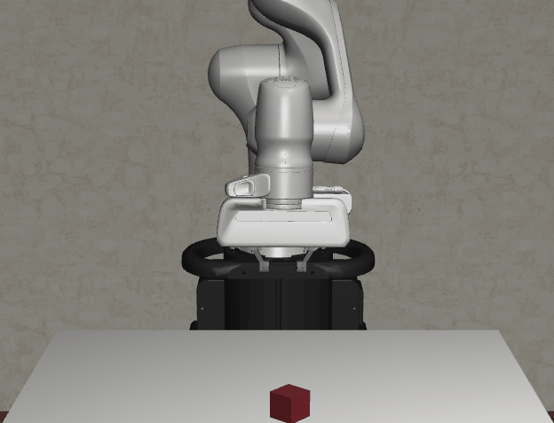

# Block Lifting in RoboSuite

## Goal for the day:

- Work through the Robotics IIIa knowledge module to learn about the RoboSuite environment and how to use it to simulate a robotic arm. Then, use the RoboSuite environment to simulate a robotic arm lifting a block.

### Expected Output

- A gif of a robot arm lifting a block

## General Plan:
- [ ] Discuss any questions about the knowledge modules so far
- [ ] Work through the Robotics IIIa knowledge module
- [ ] Discuss plan for controlling the robotic arm
- [ ] Use the RoboSuite environment to simulate a robotic arm lifting a block, using a controller that you design.

Hint: Start by only trying to control the XYZ position of the end effector.

## Challenge 

- Try to control the yaw of the gripper as well as the position of the gripper.

