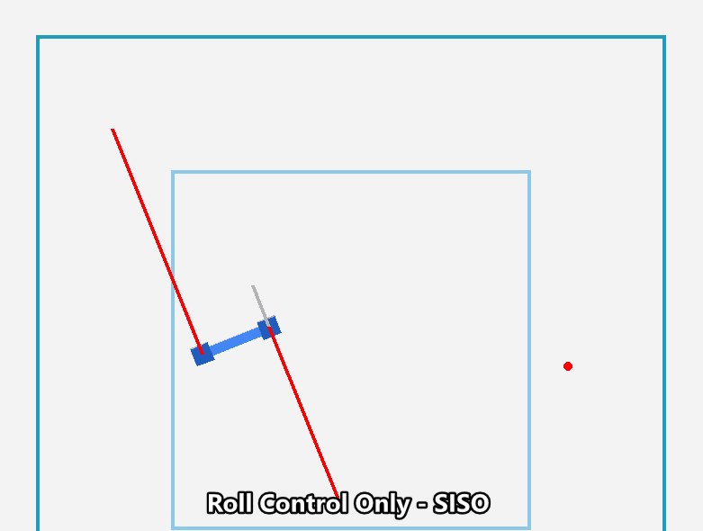
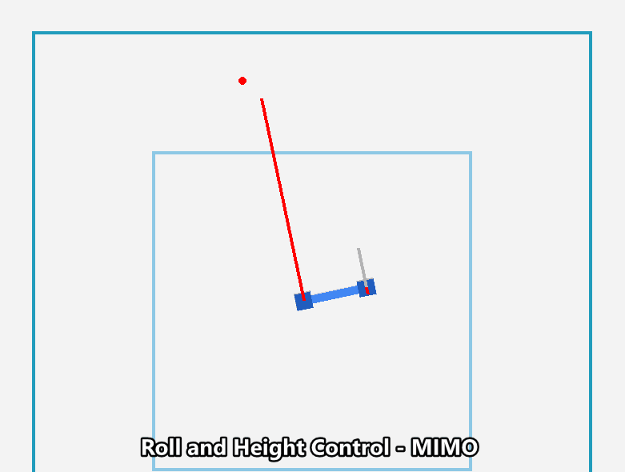
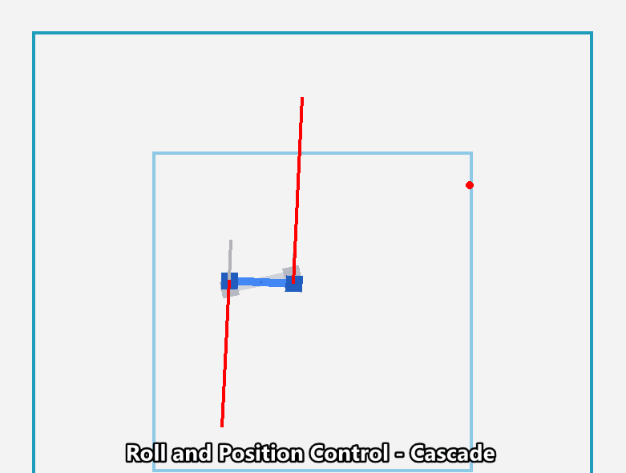
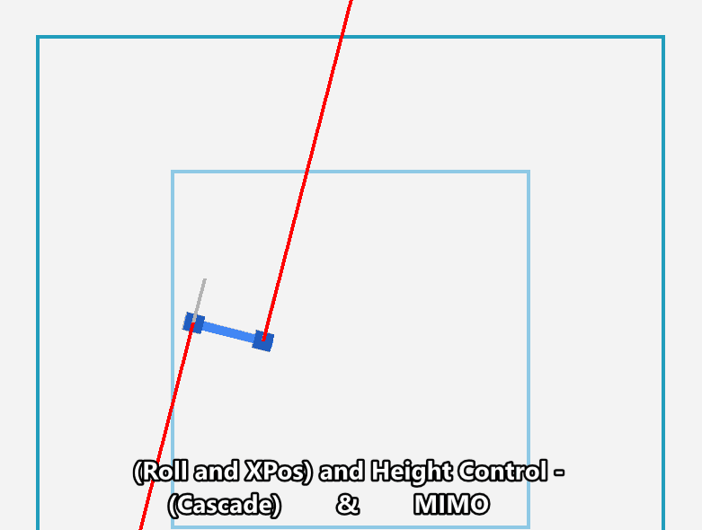
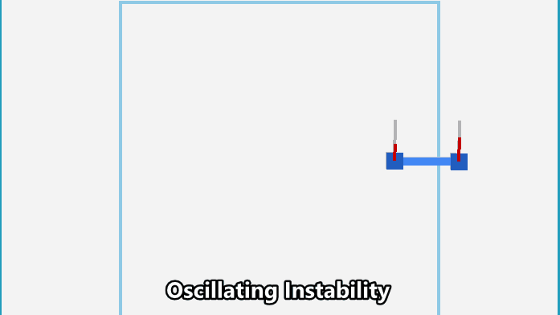
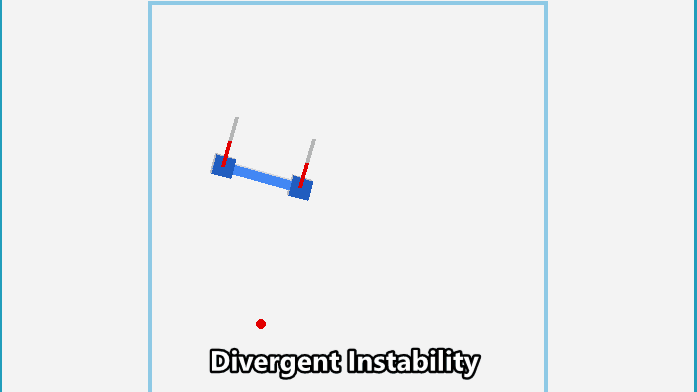

# Robotics IIc: Advanced Control Concepts 

## Multi-Input, Multi-Output PID

So far we have only looked a controlling a single input with a single output. However, in many cases we will want to control multiple inputs with multiple outputs. 

<div style="padding: 15px; border: 1px solid transparent; border-color: transparent; margin-bottom: 20px; border-radius: 4px; color: #31708f; background-color: #d9edf7; border-color: #bce8f1;">
Can you think of any already? 
</div>

Multi-input multi-output (MIMO) PID control is a type of control algorithm that uses multiple PID controllers to control a system with multiple inputs and outputs. In a MIMO PID control system, each PID controller is responsible for controlling a specific input-output relationship within the system. 

For example, consider a robotic arm with multiple joints that can be controlled independently. A MIMO PID control system for this arm might have one PID controller for each joint, with each controller responsible for controlling the position of that joint based on the desired position of the arm's end effector (the part of the arm that interacts with the environment).

MIMO PID control can be useful in situations where a single PID controller is not able to accurately and efficiently control the system, or where the system has multiple interacting components that need to be controlled separately. However, MIMO PID control can also be more complex to design and tune, and can be more susceptible to instability if the individual PID controllers are not properly configured.

If we consider the drone example from the previous section, we can see that a MIMO PID control system would be useful for controlling the drone's position (height) and orientation (roll angle). In this case, we would have one PID controller for controlling the drone's position, and another PID controller for controlling the drone's orientation. In the example we looked at previously we only controlled the drone's position using a PID controller that was only responsible for controlling the drone's height. However, in a MIMO PID control system we would have a separate PID controller for controlling the drone's height, and a separate PID controller for controlling the drone's roll angle. The environment wrapper that we used was already using a PID to control the drones roll angle and x position, so we were technically already using a MIMO PID control system. However, we were developing one of the PID controllers.

So in this example we had 2 inputs (height and roll angle) and 2 outputs both related to required motor throttle. The outputs from the 2 PID controllers were summed to get the final output sent to the motors.

## Cascade PID

Cascade PID control is another type of control algorithm that uses multiple PID controllers to control a single system. In a cascade PID control system the controllers are not independent of each other; the output of one PID controller is used as to set the desired value (setpoint) of the next PID controller in the chain. This allows the system to be controlled at multiple levels of abstraction, with each PID controller focusing on a different aspect of the system's behavior.

For example, consider a temperature control system for a furnace. A cascade PID control system for this system might have one PID controller that is responsible for controlling the overall temperature of the furnace, and another PID controller that is responsible for controlling the flow rate of the furnace's fuel. The output of the first PID controller (the furnace's temperature) would be used as the input to the second PID controller (the fuel flow rate), and the output of the second PID controller would be used to actually control the fuel flow rate.

If we consider the drone example form the previous section, cascade PID control has been used to control the drones roll angle and hence position to allow us to control only the drones height in the demo from Robotics IIb. The drones horizontal position (x) can be controlled by changing the roll angle. If we have a PID controller to control the roll angle then we can control the drones position by changing the setpoint of the roll angle PID controller using a second PID controller. This PID controller will take the current x position as input and compare it to the desired x position to calculate the required roll angle. The output of this second PID controller is then used as the setpoint for the roll angle PID controller.

The gifs below show the response of a the following:

- A single PID controller controlling the drones roll angle at 0<sup>o</sup>. The drone is given a constant throttle value but it still descends as the height is not controlled. The drone also drifts to the left as the x position is not controlled.
- A MIMO PID control system controlling the drones roll angle and height. The drone is able to reach and hover at the height of the first box. The drone still drifts to the left as the x position is not controlled.
- A cascade PID control system controlling the drones roll angle horizontal position, and a constant base throttle value. The drone x position is maintained at the starting x position. The drone still descends as the height is not controlled. 
- A MIMO cascade PID control system controlling the drones roll angle, horizontal position, and height. The drone is able to reach and hover at the height of the first box. The drone x position is maintained at the starting x position.

<div style="text-align: center">




</div>

The RoboSuites `OSC_POSE` controller is another example of cascade and MIMO PID control. There are mulitple PID controllers that control each joint and there are cascaded controllers that control the position and orientation of the end effector, by interfacing with the PID controllers that control the joints.

Cascade PID control can be useful in situations where a single PID controller is not able to accurately and efficiently control the system, or where the system has multiple interacting components that need to be controlled separately. However, cascade PID control can also be more complex to design and tune, and can be more susceptible to instability if the individual PID controllers are not properly configured.

The first 7:30 minutes of this video is a good introduction to cascade PID control:

<div style="text-align: center">
<iframe width="640" height="360" src="https://www.youtube.com/embed/tbgV6caAVcs" title="Important PID Concepts | Understanding PID Control, Part 7" frameborder="0" allow="accelerometer; autoplay; clipboard-write; encrypted-media; gyroscope; picture-in-picture" allowfullscreen></iframe>
</div>

## Stability

### What is stability?

Stability refers to the ability of a system to return to its desired state after being disturbed. In other words, a stable system is one that is able to maintain its desired behavior in the face of external disturbances or changes in its environment.

The response of an unstable system can take many different forms, but in general, an unstable system will exhibit one or more of the following characteristics:

- Oscillation: An unstable system may oscillate or vibrate, either periodically or randomly. This can manifest as rapid fluctuations in the system's output or state, or as regular or irregular motion of the system's components. These oscillations have the potential to grow in amplitude over time, eventually causing the system to fail or break down.

- Divergence: An unstable system may diverge or "blow up", meaning that the system's output or state will increase without bound. This can cause the system to become uncontrollable or to enter a state that is not physically or mechanically possible.

<div style="text-align: center">


</div>

This video provides a good introduction to the concept of stability in control theory:

<div style="text-align: center">
<iframe width="640" height="360" src="https://www.youtube.com/embed/uqjKG32AkC4" title="Introduction to System Stability and Control" frameborder="0" allow="accelerometer; autoplay; clipboard-write; encrypted-media; gyroscope; picture-in-picture" allowfullscreen></iframe>
</div>

### PID control and stability

PID control is often used to help improve the stability of a system. By continuously calculating and applying the appropriate control action, a PID controller can help to keep the system stable and prevent it from drifting away from its desired state. However, it is important to note that a PID controller is not a guarantee of stability. In order for a PID control system to be stable, it must be properly designed and tuned, and the system itself must have the appropriate properties (such as proper feedback and sufficient damping) to support stability. If any of these conditions are not met, the PID control system may be unable to maintain stability. A PID controller can cause a system to become unstable if it is not properly designed or tuned. In particular, there are several factors that can contribute to instability in a PID control system:

1. Insufficient damping: In order for a PID control system to be stable, the system itself must have sufficient damping (i.e. the ability to dissipate energy and resist oscillation). If the system does not have enough damping, the PID controller may be unable to prevent the system from oscillating or becoming unstable.

1. Incorrect tuning: In order for a PID controller to function properly, it must be properly tuned to the specific system it is controlling. If the PID controller is not properly tuned, it may be unable to accurately calculate the appropriate control action, which can cause the system to become unstable.

1. Improper feedback: A PID controller relies on feedback from the system in order to accurately calculate the appropriate control action. If the feedback provided to the PID controller is incorrect or noisy, the PID controller may be unable to accurately control the system, which can cause the system to become unstable.

Overall, a PID controller can cause a system to become unstable if the system itself is not properly designed or if the PID controller is not properly tuned and configured. It is important to carefully consider these factors when designing and implementing a PID control system to ensure that the system remains stable.

## Optional Exercise: PID Control of a 2D Quadrotor 

Use the `drone-2d-custom-gym-env` environment to implement a PID controller for the quadrotor. The quadrotor should be able to reach and hover at the height of the first box. The quadrotor x position should be maintained at the starting x position. The quadrotor should not drift to the left or right.

```bash	
pip install pip install drone-2d-custom-gym-env
```

YYou can use the following starter code:

```python
import drone_2d_custom_gym_env
import gym
import numpy as np
import time

# Create the environment
env = gym.make('drone-2d-custom-v0', render_sim=True, render_path=True, render_shade=True,
               shade_distance=70, n_steps=500, n_fall_steps=0, change_target=True,
               initial_throw=False)

# Initialize the environment
state = env.reset()

# Initialize the roll PID controller

# Initialize the x-position PID controller

# Initialize the height PID controller

# Main loop to control the drone and update the environment
for i in range(500):

```
