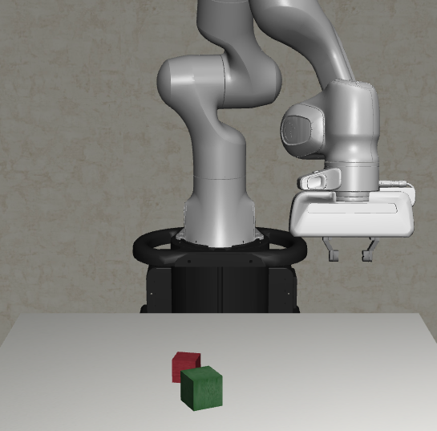

# Planning a High-Level Control Task

For tomorrow's datalab you will need to create a controller that can pick up and stack blocks on top of each other. This is a high-level control task, meaning that you will need to plan out the sequence of actions that the robot will take to complete the task.

Things to consider:
 - What is the goal of the task?
 - What information is available to the agent?
 - What actions can the agent take?
 - What is the most efficient sequence of actions to achieve the goal?

For tomorrows data lab draw up a plan for how you will control the robot to pick up and stack blocks. You can include pseudo code, diagrams, or any other method of planning that you find useful.

