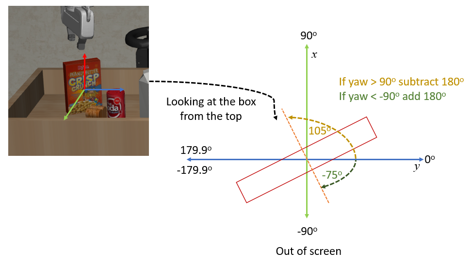
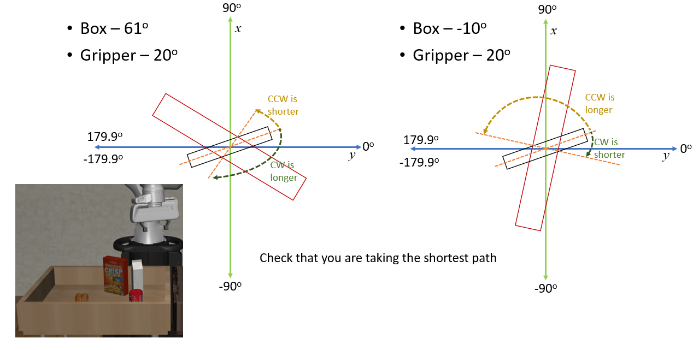

# Controller Hints - Stages and Rotations

## Stages

In order to implement the high level control task of moving the end effector to a desired position, we need to break the task down into smaller stages. If we want to lift a cube the stages may be as follows:

1. Move the end effector to the cube
2. Close the gripper
3. Lift the cube

We can use a variable to keep track of which stage we are in. Then in the main loop we use if statements to check which stage we are in and execute the appropriate code for that stage only. Once the stage is complete, we can increment the stage variable to move on to the next stage. In order to move on to the next stage, we need to check that the stage is complete. For example, if we are in stage 1, we need to check that the end effector is at the cube, i.e. that the error is small enough. Once the error is small enough, we can move on to the next stage by incrementing the stage variable.

Here is an example of how to implement this for lifting a cube:

```python
# Note that this code is not complete, it is just an example of how to implement stages
# Initialize stage variable
stage = 0
done = False
while not done:
    # Retrive all relevant info from simulation
    gripper_pos = obs['robot0_eef_pos']
    cube_pos = obs['cube_pos']    

    #Calculate output of PID controllers for x, y, z
    #I have done this using a PID class I created you will need to put your action calculations here
    actionx = pidx.predict(gripper_pos[0])
    actiony = pidy.predict(gripper_pos[1])
    actionz = pidz.predict(gripper_pos[2])       
    
    ## Stage logic AFTER actions for x,y,z have been calcluated.
    # here we will construct the action vectors and change the setpoints depending on what stage we are in.
    # Stage 0: Move to the cube
    if stage == 0:
        action = [actionx, actiony, actionz, 0, 0, 0, -0.1]
        # If we are close enough move to next stage
        if np.mean(np.abs(cube_pos-gripper_pos))<0.005:
            stage = 1

    # Stage 1: Grip the cube
    if stage == 1:
        action = [0,0,0,0,0,0,0.3]
        #Using a helper function to send the gripping action to the environment for 30 time steps
        obs = delay(30,action,env)
        #Advance to the next stage
        stage = 2

    # Stage 2: Lift
    if stage == 2:
        #Change the z setpoint or desired z value to some height above the table (>0.8)
        pidz.setpoint = 1.1
        action = [actionx, actiony, actionz, 0, 0, 0, 0.1]
        # If the gripper reaches the desired height we are done
        # If we had to do more than just lift the block we would move to the next stage
        if np.sum(np.abs(pidz.setpoint - gripper_pos[2]))<0.005:
            done = True

    print('stage:',stage,'action: ',np.round(action,4))

    # step the environment
    obs, reward, done, info = env.step(action)

    # render the environment
    env.render()
```

Here is the delay function I used to send the gripping action to the environment for 30 time steps, you are free to use it or not.

```python
def delay(timesteps,action,env):
    for i in range(timesteps):
        obs, _, _, _ = env.step(action)
        env.render() #if you are using the remote environment you will need to comment this out, or use the remote render code
    return obs
```

If we want to stack a cube on top of another cube, the stages may be as follows:

1. Move the end effector to the cube_A
2. Close the gripper
3. Lift the cube_A
4. Move the end effector to a position above cube_B
5. Lower the end effector to a certain height above cube_B
6. Open the gripper

If we want to pick and place 4 objects into bins, the stages may be as follows:

1. Move the end effector over the object 1
1. Lower the end effector to a certain height above object 1
1. Close the gripper
1. Lift object 1
1. Move the end effector over the bin 1
1. Lower the end effector to a certain height above bin 1
1. Open the gripper
1. Repeat 1-7 for objects 2, 3, and 4

## Rotations

To pick up certain objects you may need to first rotate (change the yaw angle)of the gripper. You can implement a PID controller for the yaw angle in a similar way to the x, y, and z position controllers. 

However, you don't always need to rotate the gripper to the same angle as the object. For example if you want to pick up the cereal box you need to rotate the gripper so that it can grip the short side of the box. If the box at a yaw angle of 105<sup>o</sup> You can either rotate the gripper to 105<sup>o</sup> or you can rotate the gripper to -75<sup>o</sup>, both of these will result in gripper the short side of the box. In this case it is easier to rotate the griper to -75<sup>o</sup> because that is the shorter rotation.

<div style="text-align: center">

</div>

we can make sure we rotate the gripper to the shortest angle by always transforming the object and gripper yaw angles to be between -90<sup>o</sup> and 90<sup>o</sup>. Then we can rotate the gripper to the object yaw angle. For example, if the object yaw angle is 105<sup>o</sup> we can transform it to -75<sup>o</sup> and rotate the gripper to -75<sup>o</sup>.

It also helps to confirm that you are always rotating the shortest distance.

<div style="text-align: center">

</div>

You can use the following function to calculate  transform the yaw angle to be between -90<sup>o</sup> and 90<sup>o</sup>.

```python
from scipy.spatial.transform import Rotation as R
#convert quaternion to roll, pitch, yaw
def quat_to_rpy(q):
    #convert quaternion to roll, pitch, yaw
    rpy = R.from_quat(q).as_euler('xyz', degrees=True)
    #transform yaw to be between -90 and 90
    if rpy[2]>90:
        rpy[2] = rpy[2]-180
    elif rpy[2]<-90:
        rpy[2] = rpy[2]+180
    return rpy
```

Extra Hint: Once you have picked up the object rotate the gripper back to 0<sup>o</sup> yaw angle. This will make it easier to place the object in the bin, and stop the arm from getting tangled up. 

Extra Extra Hint: Add PID controllers for roll and pitch angles, and use them to make sure the gripper is always parallel to the table.

