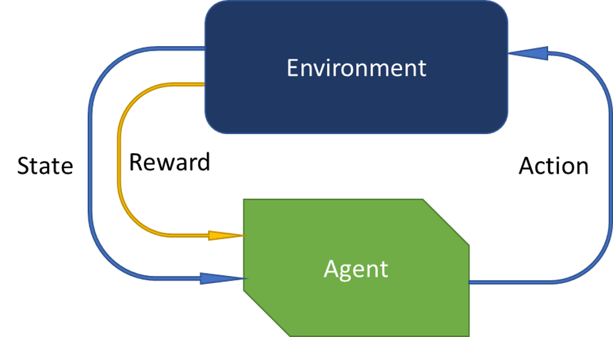

# RL Ib: General RL Theory
In this section, we will discuss the general theory behind reinforcement learning. We will look at the components and key concepts of RL to build a foundation for applying RL to robotics problems. There is a fair amount of math presented in this section, just bear with us and we will get to the fun stuff soon! We won't be directly implementing any of the math, the libraries we will be using will do that for us. The goal of this section is to give you a high-level understanding of the theory behind RL so that you can apply it to robotics problems.

## Components of RL

The key components of reinforcement learning are:

- Agent: The agent is the entity that is learning and taking actions in an environment. It receives observations and rewards from the environment and uses them to choose actions that maximize the reward.
    - Action: An action is a decision or choice that the agent makes in response to its current state/observation. For example, in a game of chess, an action might be moving a specific piece to a specific square on the board.
    - Policy: The policy is a strategy or decision-making process that the agent uses to choose actions in different states. It determines the next action that the agent will take based on the current state and the agent's past experience.
    - Value function: The value function is a measure of the long-term usefulness or reward that an agent can expect from a particular state or action. It is used by the agent to evaluate different states and actions and to determine which ones are likely to lead to the highest rewards.
- Environment: The environment is the world in which the agent is learning and taking actions. It provides observations to the agent and responds to the agent's actions. Each time the agent takes an action, the environment transitions to a new state and provides the agent with a reward, the next observation, and a boolean value indicating whether the episode is done.
    - State: The state of an environment is the current configuration or situation that the agent is in. For example, in a game of chess, the state might include the positions of all of the pieces on the board.
    - Reward: The reward is a scalar value that the environment provides to the agent in response to its actions. The goal of reinforcement learning is to maximize the total reward that the agent receives over time.

These components work together to enable an agent to learn and make decisions in an environment. The agent receives observations from the environment and uses them to update its policy and value function, and then takes actions based on its current policy to try to maximize its reward. Over time, the agent's policy and value function are updated and refined based on its experience and the rewards it receives, and it becomes better at making decisions that lead to high rewards in the environment.

The RL cycle is the process of taking actions in an environment, observing the results, and using the results to improve future actions. The general cycle is as follows:

1. Initialize the environment and the agent
2. Observe the state of the environment
3. Select an action
4. Execute the action and observe the reward and next state
5. Repeat steps 2-5 for some number of rollouts
6. Update the agent's policy
7. Repeat steps 2-6 for some number of steps

## Markov decision process

A Markov decision process (MDP) is a mathematical framework for modeling decision-making in situations where the outcome is uncertain. It is commonly used in reinforcement learning to model an environment and the agent's interactions with it.

The videos below provide a good explanations of MDPs and how they are used in reinforcement learning. Watch any one of them to get a good understanding of MDPs. The first two videos are concise and provide a good overview of MDPs, while the third video provides a more in-depth explanation of MDPs with a fair amount of math and equations.

<iframe width="640" height="360" src="https://www.youtube.com/embed/NFo9v_yKQXA?list=PLzvYlJMoZ02Dxtwe-MmH4nOB5jYlMGBjr" title="Reinforcement Learning: A Six Part Series" frameborder="0" allow="accelerometer; autoplay; clipboard-write; encrypted-media; gyroscope; picture-in-picture" allowfullscreen></iframe>

<iframe width="640" height="360" src="https://www.youtube.com/embed/my207WNoeyA?list=PLZbbT5o_s2xoWNVdDudn51XM8lOuZ_Njv" title="Markov Decision Processes (MDPs) - Structuring a Reinforcement Learning Problem" frameborder="0" allow="accelerometer; autoplay; clipboard-write; encrypted-media; gyroscope; picture-in-picture" allowfullscreen></iframe>

<iframe width="640" height="360" src="https://www.youtube.com/embed/lfHX2hHRMVQ" title="YouTube video player" frameborder="0" allow="accelerometer; autoplay; clipboard-write; encrypted-media; gyroscope; picture-in-picture" allowfullscreen></iframe>

Below is a text explanation of Markov decision processes:

In a MDP, an agent makes a series of decisions that affect the state of the environment and the rewards that the agent receives. The agent's decisions are based on its current state and the rewards that it has received in the past, and the goal is to maximize the total reward that the agent receives over time.

Formally, a MDP is defined by a tuple $(S, A, P, R, \gamma)$, where:

- $S$ is the set of states that the environment can be in.
- $A$ is the set of actions that the agent can take.
- $P$ is the state transition function that defines the probability of transitioning from one state to another based on the current state and action. It is defined as: 

    $$P_{ss'}^a = \mathbb{P}(s_{t+1} = s' \mid s_t = s, a_t = a)$$

- $R$ is the reward function that defines the reward that the agent receives when it takes a specific action in a specific state. It is defined as: 

    $$R_s^a = \mathbb{E}[r_t \mid s_t = s, a_t = a]$$

- $\gamma$ is the discount factor, which determines the importance of future rewards in the agent's decision-making. It is a value between 0 and 1, where a value closer to 0 means that the agent values immediate rewards more, and a value closer to 1 means that the agent values long-term rewards more.

To illustrate how these components work together, and since you like poker so much, consider the example of playing poker. In this situation, the agent (i.e. the poker player) is faced with a series of decisions (e.g. whether to call, raise, or fold) that affect the state of the game (e.g. the cards in the player's hand and on the table) and the rewards that the agent receives (e.g. the amount of money won or lost on each hand). The agent uses its past experience and knowledge of the game to make decisions that are likely to lead to high rewards, and it updates its strategy based on the outcomes of its decisions.

In this example, the poker game can be modeled as a MDP, with the following components:

- $S$: The set of states in the poker game might include all of the possible combinations of cards in the player's hand and on the table.
- $A$: The set of actions in the poker game might include the possible moves that the player can make (e.g. call, raise, or fold).
- $P$: The state transition function in the poker game would define the probability of transitioning to a new state based on the current state and action (e.g. the probability of being dealt a new hand of cards after folding or calling).
- $R$: The reward function in the poker game would define the rewards that the player receives for each action in each state (e.g. the amount of money won or lost on each hand).
- $\gamma$: The discount factor in the poker game might be set to a value between 0 and 1, depending on the player's preference for immediate or long-term rewards.

The agent uses these components of the MDP to make decisions and learn from its experience in the poker game. It uses its policy and value function to choose actions that are likely to lead to high rewards, and it updates these based on its experience in the game. This allows the agent to learn and adapt its strategy over time and become better at playing poker.

For example, if the agent's current state is a pair of aces in its hand and the flop has been dealt, its value function might indicate that raising is a good action because it is likely to lead to a high reward (e.g. winning the pot). Based on this, the agent might choose to raise, and then observe the outcome of the action (e.g. whether the other players fold or call). The agent can then use this experience to update its policy and value function and improve its strategy for future decisions.

In this way, the MDP framework provides a formal structure for modeling decision-making in uncertain environments, and it is a powerful tool for developing reinforcement learning algorithms.

## Policy and Value Functions

In reinforcement learning, a policy is a strategy or decision-making process that an agent uses to choose actions in different states. The goal of the policy is to maximize the total reward that the agent receives over time.

A value function is a measure of the long-term usefulness or reward that an agent can expect from a particular state or action. It is used by the agent to evaluate different states and actions and to determine which ones are likely to lead to the highest rewards.

Together, the policy and value function form the core of a reinforcement learning algorithm. The policy is used to choose actions in different states, and the value function is used to evaluate the potential outcomes of those actions and improve the policy over time.

The video below provides an overview of policies and value functions:

<iframe width="640" height="360" src="https://www.youtube.com/embed/eMxOGwbdqKY?list=PLZbbT5o_s2xoWNVdDudn51XM8lOuZ_Njv" title="Policies and Value Functions - Good Actions for a Reinforcement Learning Agent" frameborder="0" allow="accelerometer; autoplay; clipboard-write; encrypted-media; gyroscope; picture-in-picture" allowfullscreen></iframe>

If we consider the poker game example from above; in this situation, the policy might be a strategy for deciding whether to call, raise, or fold based on the cards in the player's hand and on the table. The value function might be a measure of the expected reward for each possible action in each state (e.g. the expected amount of money won or lost on each hand). The agent can use its policy and value function to choose actions that are likely to lead to high rewards, and it can update these based on its experience in the game to improve its performance over time.

If we consider an example of a 7DOF robotic arm that has to pick up a block and place it in a bin, in this example, the environment is a workspace where the arm must pick up a block and place it in a bin. The state of the environment includes the positions and velocities of the arm and the block, and the action is a torque applied to each joint of the arm.

The policy in this case might be a strategy for deciding which joint torques to apply based on the current state of the arm and the block. For example, the policy might involve moving the arm towards the block, closing the gripper around the block, and then moving the arm towards the bin to place the block inside.

The value function in this case might be a measure of the expected reward for each possible action in each state. For example, the value function might be based on the distance between the arm and the block, the distance between the arm and the bin, and the distance between the block and the bin. The agent can use its policy and value function to choose actions that are likely to lead to high rewards, and it can update these based on its experience in the simulation to improve its performance over time.

## Bellman equations

The Bellman equations are a set of mathematical equations that are commonly used in reinforcement learning to define the relationship between the value of a state or action and the expected future rewards that can be obtained from that state or action.

The videos below provides an overview of the Bellman equations, watch either or both of them:

<iframe width="640" height="360" src="https://www.youtube.com/embed/_j6pvGEchWU?list=PLzvYlJMoZ02Dxtwe-MmH4nOB5jYlMGBjr" title="Bellman Equations, Dynamic Programming, Generalized Policy Iteration | Reinforcement Learning Part 2" frameborder="0" allow="accelerometer; autoplay; clipboard-write; encrypted-media; gyroscope; picture-in-picture" allowfullscreen></iframe>

<iframe width="640" height="360" src="https://www.youtube.com/embed/rP4oEpQbDm4" title="YouTube video player" frameborder="0" allow="accelerometer; autoplay; clipboard-write; encrypted-media; gyroscope; picture-in-picture" allowfullscreen></iframe>

Here is a text explanation of the Bellman equations:

The Bellman equations are named after Richard Bellman, who first developed them in the 1950s as a way of solving dynamic programming problems. In reinforcement learning, the Bellman equations are used to define the value function, which is a measure of the long-term usefulness or reward that an agent can expect from a particular state or action.

There are two main types of Bellman equations: the Bellman expectation equation and the Bellman optimality equation. The Bellman expectation equation defines the value of a state or action in terms of the expected future rewards that can be obtained from that state or action, given the current policy. It is defined as:

$$V^{\pi}(s) = \sum_{a} \pi(a \mid s) \sum_{s', r} p(s', r \mid s, a) [r + \gamma V^{\pi}(s')]$$

The Bellman optimality equation defines the optimal value of a state or action in terms of the maximum expected future rewards that can be obtained from that state or action, regardless of the current policy. It is defined as:

$$V^(s) = \max_{a} \sum_{s', r} p(s', r \mid s, a) [r + \gamma V^(s')]$$

In both of these equations, $V^{\pi}(s)$ and $V^*(s)$ represent the value of a state $s$, $\pi(a \mid s)$ represents the policy for choosing actions in state $s$, $p(s', r \mid s, a)$ represents the state transition function and reward function, $r$ represents the reward, and $\gamma$ represents the discount factor.

These equations are used in reinforcement learning algorithms to evaluate different states and actions and determine which ones are likely to lead to the highest rewards. The value function is used by the agent to guide its decision-making, and it is updated based on the agent's experience and the rewards that it receives.

For example, consider the example of a robot trying to pick up a block and place it in a bin. The robot might use the Bellman equations to define the value of different states (e.g. the positions of the block and the bin) and actions (e.g. the joint angles of the arm). The robot can then use this value function to evaluate different actions in different states and choose the ones that are likely to lead to high rewards (e.g. successfully picking up and placing the block). As the robot takes actions and receives rewards, it can update its value function and improve its decision-making over time.

In this way, the Bellman equations provide a mathematical foundation for reinforcement learning, and they are an important tool for developing algorithms that can learn and adapt to changing environments.

## Action and Observation Spaces

An action space is the set of all possible actions that an agent can take. An observation space is the set of all possible observations that an agent can receive. The action and observation spaces are defined by the environment. For example, The action space of the RoboSuite (with the Panda robot and standard controller) is an 8-dimensional continuous space (one for each joint plus the gripper). The observation space is also continuos but the dimension depends on the task and observation mode. The action space for the CartPole environment is a discrete space with two possible actions: 0 (push cart to the left) and 1 (push cart to the right). The observation space for the CartPole environment is a continuous space with four dimensions: the cart position, the cart velocity, the pole angle, and the pole velocity at tip.

### Discrete vs. Continuous Action Spaces

Discrete action spaces are defined by a finite set of possible actions. For example, the action space for the CartPole environment is a discrete space with two possible actions: 0 (push cart to the left) and 1 (push cart to the right).

Continuous action spaces are defined by a continuous range of possible actions. For example, the action space of the RoboSuite (with the Panda robot and standard controller) is an 8-dimensional continuous space (one for each joint plus the gripper). Each value in the action vector/list represents the applied torque to the corresponding joint the torque can be any real number between the minimum and maximum value.

### Episodic vs. Continuous Environments

episodic tasks are tasks that are divided into a series of individual episodes, each of which has a defined beginning and end. The goal of the agent in an episodic task is to maximize the total reward that it receives over the course of each episode.

Continuous tasks, on the other hand, are tasks that do not have a clear beginning or end, and they do not have a defined sequence of episodes. The goal of the agent in a continuous task is to maximize the total reward that it receives over the course of the entire task.

In general, episodic tasks are easier to model and to solve using reinforcement learning algorithms, because they have a clear structure and a well-defined goal. Continuous tasks, on the other hand, can be more challenging to model and to solve, because they do not have a clear structure and they require the agent to continuously learn and adapt to the environment.

### Deterministic vs. Stochastic Environments

A deterministic environment is an environment where the outcome of an action is always the same, given the same state and action. In other words, the state transitions and rewards in a deterministic environment are completely predictable, and the agent can always be sure of the outcome of its actions.

On the other hand, a stochastic environment is an environment where the outcome of an action is uncertain, and it can vary from one instance to another. In other words, the state transitions and rewards in a stochastic environment are not predictable, and the agent must use probabilistic methods to estimate the outcomes of its actions.

Tic-Tac-Toe is an example of a deterministic environment, because the outcome of each action is always the same, given the same state and action. On the other hand, the game of poker is an example of a stochastic environment, in this situation, the environment is stochastic, because the outcome of each action (e.g. betting or folding) is uncertain, and it can vary depending on the cards that the agent is dealt and the actions of the other players. 

In general, deterministic environments are easier to model and to solve using reinforcement learning algorithms, because the agent can always be sure of the outcomes of its actions. Stochastic environments, on the other hand, can be more

### Fully Observable vs. Partially Observable Environments

In addition to being deterministic or stochastic, environments can also be either fully observable or partially observable. In a fully observable environment, the agent has access to all of the information that it needs to make decisions and take actions. In a partially observable environment, the agent does not have access to all of the information, and it must use its observations and its knowledge of the environment to infer the state of the environment and to make decisions.

For example, consider the example of an agent playing a game of chess. In this situation, the environment is fully observable, because the agent has access to all of the information that it needs to make decisions (e.g. the positions of all of the pieces on the board). On the other hand, consider the example of a robot navigating a maze. In this situation, the environment is partially observable, because the robot can only see a limited portion of the maze at any given time, and it must use its observations and its knowledge of the maze to infer the state of the environment and to plan its actions.

Overall, the degree of observability of an environment is an important factor in the design and implementation of reinforcement learning algorithms, and it can affect the complexity of the learning process and the performance of the agent.

## Reward Functions and Expected Returns

A reward function is a function that defines the reward that an agent receives when it takes a specific action in a specific state. The goal of the agent is to maximize the total reward that it receives over time.

The video below provides an overview of reward functions, watch it:

<iframe width="640" height="360" src="https://www.youtube.com/embed/a-SnJtmBtyA?list=PLZbbT5o_s2xoWNVdDudn51XM8lOuZ_Njv" title="Expected Return - What Drives a Reinforcement Learning Agent in an MDP" frameborder="0" allow="accelerometer; autoplay; clipboard-write; encrypted-media; gyroscope; picture-in-picture" allowfullscreen></iframe>

And here is a text explanation of the reward functions and expected returns:

The reward provides feedback to the agent about the quality of its actions. The reward function is defined by the environment and can be customized to reflect the specific goals and objectives of the agent.

For example, consider the example of a robot trying to pick up a block and place it in a bin. In this situation, the reward function might be defined as follows:

The robot receives a reward of +1 for successfully picking up and placing the block. The robot receives a penalty of -1 for failing to pick up or dropping it on the floor. The robot receives a reward of 0 for all other actions. This reward function provides clear feedback to the robot about the quality of its actions, and it encourages the robot to learn a policy that achieves the goal.

### Expected Return

Expected return is a term that is related to the reward function. It refers to the expected value of the total reward that an agent can expect to receive over a specific time horizon. In other words, it is the average reward that the agent can expect to receive for a specific state or action, given its current policy.

### Discounted Return

Reward discounting is a technique that is used to balance the importance of immediate and future rewards. It allows the agent to trade off short-term rewards for long-term rewards, and it is a key factor in the agent's decision-making.

The discount factor is a parameter that is used to control the amount of discounting that is applied to future rewards. It is a value between 0 and 1, where a value closer to 0 means that the agent values immediate rewards more, and a value closer to 1 means that the agent values long-term rewards more.

The discounted return for a specific state or action is defined as the sum of the discounted future rewards that the agent can expect to receive from that state or action. It is calculated using the following equation:

$$G_t = R_{t+1} + \gamma R_{t+2} + \gamma^2 R_{t+3} + \dots = \sum_{k=0}^{\infty} \gamma^k R_{t+k+1}$$

In this equation, $G_t$ is the discounted return at time $t$, $R_t$ is the reward at time $t$, and $\gamma$ is the discount factor. The value of $\gamma$ determines the amount of discounting that is applied to the future rewards.

The discounted return is a useful metric for evaluating different states and actions and determining which ones are likely to lead to the highest rewards. It allows the agent to take into account the value of future rewards and make informed decisions about how to maximize its total reward.

For example, consider the example of a robot trying to pick up a block and place it in a bin. In this situation, the discounted return for a specific state (e.g. the position of the block and the bin) and action (e.g. the joint angles of the arm) would be the sum of the discounted future rewards that the robot can expect to receive from that state and action. The robot can then use this discounted return to evaluate different actions in different states and choose the ones that are likely to lead to the highest rewards (e.g. successfully picking up and placing the block).

### Reward Shaping: Sparse vs. Dense Rewards

Reward shaping is a technique that is used to modify the reward function in order to make it easier for the agent to learn. If the agent only receives a reward when it achieves its goal, then it may not be able to learn how to achieve its goal efficiently. Reward shaping allows the agent to receive additional rewards or penalties for taking actions that are likely to lead to its goal, and it can help the agent to learn more quickly and efficiently.

For example, consider the example of a robot trying to pick up a block and place it in a bin. In this situation, the environment's reward function might be defined as follows:

- The robot receives a reward of +1 for successfully picking up and placing the block.
- The robot receives a penalty of -1 for failing to pick up or place the block, or for dropping the block outside of the bin.
- The robot receives a reward of 0 for all other actions.

In this case, the reward function provides a sparse signal to the robot, and it may not be sufficient for the robot to learn how to pick up and place the block efficiently. In order to improve the robot's learning, we could use reward shaping to add additional rewards or penalties to the reward function. For example, we could add the following rewards or penalties:

- The robot receives a reward of +0.1 for every step that it takes in the direction of the block.
- The robot receives a penalty of -0.1 for every step that it takes away from the block.
- The robot receives a reward of +0.1 for every step that it takes in the direction of the bin.
- The robot receives a penalty of -0.1 for every step that it takes away from the bin.

These additional rewards and penalties would provide additional guidance to the robot and help it learn how to pick up and place the block more efficiently. They would also make the reward function less sparse and less noisy, and they would make it easier for the robot to learn and adapt to the environment.

### Poorly Defined Reward Functions

The agent will always act to maximise the reward function. A poorly defined reward function can lead to unexpected and undesirable behavior.  In the video below the reward function is just the points scored. The agent can ge points by being in the lead and also by picking up power-ups. The agent learns to pick up power-ups instead of racing. This is not the desired behavior. 

<iframe width="320" height="180" src="https://www.youtube.com/embed/tlOIHko8ySg" title="CoastRunners 7" frameborder="0" allow="accelerometer; autoplay; clipboard-write; encrypted-media; gyroscope; picture-in-picture" allowfullscreen></iframe>

Read more here: [Faulty Reward Functions in the Wild](https://openai.com/blog/faulty-reward-functions/)

## Exploration vs Exploitation

A common problem in RL is the exploration vs exploitation dilemma. The agent must balance the need to explore new actions in order to discover new rewards with the need to exploit actions that have already been discovered to yield high rewards. This is explained further in the videos below. Watch either one, the last one is a lot more detailed.

<iframe width="640" height="360" src="https://www.youtube.com/embed/mo96Nqlo1L8?list=PLZbbT5o_s2xoWNVdDudn51XM8lOuZ_Njv" title="Exploration vs. Exploitation - Learning the Optimal Reinforcement Learning Policy" frameborder="0" allow="accelerometer; autoplay; clipboard-write; 
encrypted-media; gyroscope; picture-in-picture" allowfullscreen></iframe>

<iframe  width="640" height="360" src="https://www.youtube.com/embed/sGuiWX07sKw?list=PLqYmG7hTraZDM-OYHWgPebj2MfCFzFObQ" title="RL Course by David Silver - Lecture 9: Exploration and Exploitation" frameborder="0" allow="accelerometer; autoplay; clipboard-write; encrypted-media; gyroscope; picture-in-picture" allowfullscreen></iframe>

## RL Taxonomy

The RL taxonomy is a framework for categorizing RL algorithms. The hierarchy is as follows:

This splits RL algorithms into model-based and model-free methods, and into on-policy and off-policy methods.

### Model based vs Model Free

Model based methods learn a model of the environment and use that model to make predictions about the future. Model free methods do not learn a model of the environment and instead learn directly from experience. We will focus on model free methods in this course.

This optional video explains the use of model-free methods for control:

<iframe width="640" height="360" src="https://www.youtube.com/embed/0g4j2k_Ggc4?list=PLqYmG7hTraZDM-OYHWgPebj2MfCFzFObQ" title="RL Course by David Silver - Lecture 5: Model Free Control" frameborder="0" allow="accelerometer; autoplay; clipboard-write; encrypted-media; gyroscope; picture-in-picture" allowfullscreen></iframe>

### On-policy vs off-policy

On-policy methods learn directly from the policy being followed by the agent. Off-policy methods learn from a different policy than the one being followed by the agent. Off-policy methods allow the agent to learn from experience that is not generated by its current policy. This allows the agent to learn from past experience and to improve its policy without having to collect new experience.

On the other hand, on-policy methods are methods that require the agent to learn from experience that is generated by its current policy. This means that the agent must collect new experience in order to improve its policy, and it cannot learn from past experience.

Off-policy methods are typically more efficient and more sample-efficient than on-policy methods, because they allow the agent to learn from a larger amount of experience. However, they can also be more complex and more difficult to implement, because they require the agent to maintain multiple policies and to estimate the value of past experience.

On-policy methods, on the other hand, are typically simpler and easier to implement, but they can be less efficient and less sample-efficient than off-policy methods, because they require the agent to collect new experience in order to improve its policy.

The video below explains the difference model-based and model free approaches and between on-policy and off-policy methods:

<iframe width="640" height="360" src="https://www.youtube.com/embed/bpUszPiWM7o" title="YouTube video player" frameborder="0" allow="accelerometer; autoplay; clipboard-write; encrypted-media; gyroscope; picture-in-picture" allowfullscreen></iframe>

## Evolutionary algorithms

Evolutionary algorithms are a class of algorithms that use the principles of natural selection to find optimal solutions to problems. Evolutionary algorithms are a type of meta-heuristic, which is an algorithm that uses heuristics to find approximate solutions to problems. You start with a population of individuals (agents whose policies have different weights), and then you use a fitness (reward) function to evaluate the fitness of each individual. The fitter individuals are more likely to reproduce, and the less fit individuals are less likely to reproduce. The fitter individuals are also more likely to mutate, and the less fit individuals are less likely to mutate. The process of reproduction and mutation is called evolution. This means creating new agents with similar weights to the best agents in the original population. The process of evolution is repeated until the population converges on an optimal solution.

You can read more about evolutionary algorithms in this blog: [A visual Guide to Evolutionary Algorithms](https://blog.otoro.net/2017/10/29/visual-evolution-strategies/) 

## Additional Resources

- [Reinforcement Learning: An Introduction](https://web.stanford.edu/class/psych209/Readings/SuttonBartoIPRLBook2ndEd.pdf) by Sutton and Barto
- [OpenAI Spinning Up](https://spinningup.openai.com/en/latest/) by OpenAI
- [UCL Course on RL](http://www0.cs.ucl.ac.uk/staff/d.silver/web/Teaching.html) by David Silver
- [Deep RL Bootcamp](https://sites.google.com/view/deep-rl-bootcamp/lectures) by Sergey Levine
- [Deep Reinforcement Learning: Pong from Pixels](https://karpathy.github.io/2016/05/31/rl/) by Andrej Karpathy

