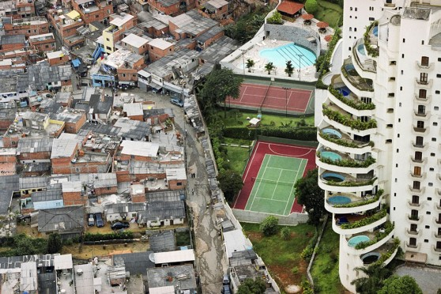
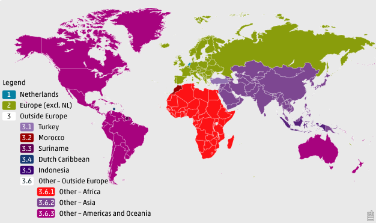

## Sociology 

### 1. Introduction

This module will help you acquire knowledge of sociological theories and their applications by guiding you towards online resources. In addition, it will give you tips on how you can apply your newly gained knowledge to the creative brief.

The creative brief introduces sociological concepts and theories regarding segregation and Quality of Life (QoL). For example, during the block, you, and your teammates, have the option to identify key determinants of QoL and/or segregation within the municipality of Breda. Being aware of relevant theories and practices is an integral part of the first CRISP-DM phase; Business Understanding. Without domain-specific knowledge, you will not be able to produce a solid final deliverable. Thus, before diving into the datasets, make sure you have a clear business understanding of the project.

***

### 2. What is sociology?

> Sociology is the scientific and systematic study of groups and group interactions, societies and social interactions, from small and personal groups to very large groups. A group of people who live in a defined geographic area, who interact with one another, and who share a common culture is what sociologists call a society. ([Source](https://openstax.org/books/introduction-sociology-3e/pages/1-1-what-is-sociology#0)).

<iframe width="560" height="315" src="https://www.youtube-nocookie.com/embed/YnCJU6PaCio" title="YouTube video player" frameborder="0" allow="accelerometer; autoplay; clipboard-write; encrypted-media; gyroscope; picture-in-picture" allowfullscreen></iframe>

*Video 1. 'What is Sociology?' by Crash Course Sociology.*

***

### 3. Segregation & Quality of Life

> It’s not a mystery: where you live determines everything. Your proximity to jobs. The quality of your environment. Where you go to school, whether you’re surveilled and harassed by the police ([Source](https://www.theguardian.com/us-news/2021/jun/28/us-racial-segregation-study-university-of-california-berkeley)).

*__What is segregation?__*

*Figure 1. Residential segregation.*

Segregation refers to the physical separation of two groups, particularly in terms of residence, workplace, and social functions. There are two distinct types of segregation; de jure segregation (i.e., segregation enforced by law) and de facto segregation (i.e., segregation that occurs without laws but because of other factors). Apartheid, a political system in South Africa that legally separated people of different races from 1948- to 1994, is a prime example of de jure segregation. De facto segregation is more common and, for instance, includes residential segregation driven by socioeconomic standing, race and/or ethnicity ([Source](https://openstax.org/books/introduction-sociology-2e/pages/11-4-intergroup-relationships)).

<iframe width="560" height="315" src="https://www.youtube-nocookie.com/embed/qaPQN0aW47I" title="YouTube video player" frameborder="0" allow="accelerometer; autoplay; clipboard-write; encrypted-media; gyroscope; picture-in-picture" allowfullscreen></iframe>

*Video 2. American segregation, mapped at day and night by Vox.*

Although, most of the concepts presented in the video American segregation, mapped at day and night by Vox apply to our use case (e.g., residential segregation), some are culturally dependent and therefore, less relevant. For example, in the Netherlands, the population is classified by origin instead of ethnicity and race:

> As of 2022, Statistics Netherlands (SN/CBS) is adopting a different approach when publishing data on people currently referred to as having a western or non-western migration background. Greater emphasis will be placed on where a person was born and less on where their parents were born. The term ‘migration background’ will no longer be used in this regard. The main categories western/non-western will be replaced by categories based on continents and a few countries that share a specific migration history with the Netherlands ([Source](https://www.cbs.nl/en-gb/news/2022/07/cbs-introducing-new-population-classification-by-origin)).

*Figure 2. Population classification by origin.*

In addition, the concept of suburbia in relation to residential segregation is not applicable within a European context:

> <b>Suburbs Are Not All White Picket Fences: The Banlieues of Paris</b>
  What makes a suburb a suburb? Simply, a suburb is a community surrounding a city. But when you picture a suburb in your mind, your image may vary widely depending on which nation you call home. In the United States, most consider the suburbs home to upper— and middle—class people with private homes. In other countries, like France, the suburbs––or “banlieues”–– are synonymous with housing projects and impoverished communities. In fact, the banlieues of Paris are notorious for their ethnic violence and crime, with higher unemployment and more residents living in poverty than in the city center. Further, the banlieues have a much higher immigrant population, which in Paris is mostly Arabic and African immigrants. This contradicts the clichéd U.S. image of a typical white-picket-fence suburb.
  In 2005, serious riots broke out in the banlieue of Clichy-sous-Bois after two boys were electrocuted while hiding from the police. They were hiding, it is believed, because they were in the wrong place at the wrong time, near the scene of a break-in, and they were afraid the police would not believe in their innocence. Only a few days earlier, interior minister Nicolas Sarkozy (who later became president), had given a speech touting new measures against urban violence and referring to the people of the banlieue as “rabble” (BBC 2005). After the deaths and subsequent riots, Sarkozy reiterated his zero-tolerance policy toward violence and sent in more police. Ultimately, the violence spread across more than thirty towns and cities in France. Thousands of cars were burned, many hundreds of people were arrested, and both police and protesters suffered serious injuries.
  Then-President Jacques Chirac responded by pledging more money for housing programs, jobs programs, and education programs to help the banlieues solve the underlying problems that led to such disastrous unrest. But none of the newly launched programs were effective. Sarkozy ran for president on a platform of tough regulations toward young offenders, and in 2007 the country elected him. More riots ensued as a response to his election. In 2010, Sarkozy promised “war without mercy” against the crime in the banlieues (France24 2010). Six years after the Clichy-sous-Bois riot, circumstances are no better for those in the banlieues ([Source](https://openstax.org/books/introduction-sociology-2e/pages/20-2-urbanization)).

*__What is Quality of Life?__*

The World Health Organization defines Quality of Life (QoL) as 'an individual's perception of their position in life in the context of the culture and value systems in which they live and in relation to their goals, expectations, standards and concerns' ([Source](https://www.sciencedirect.com/topics/earth-and-planetary-sciences/quality-of-life)). As a result, QoL will differ vastly across social groups and individuals within a society. Frequently used indicators of QoL include wealth, employment, the environment, education, physical and mental health, social belonging, and safety.

<iframe width="560" height="315" src="https://www.youtube-nocookie.com/embed/yYNjXRVFnTc" title="YouTube video player" frameborder="0" allow="accelerometer; autoplay; clipboard-write; encrypted-media; gyroscope; picture-in-picture" allowfullscreen></iframe>

*Video 3. 'Quality of life: What matters to you?' by OECD.*

***

### 4. Blended learning

There are many online resources available regarding sociological topics, such as QoL. Please, check the following resources:

__Books:__
- [Introduction to Sociology](https://openstax.org/details/books/introduction-sociology-2e) (Openstax)

__Videos:__
- [Crash Course Sociology](https://www.youtube.com/watch?v=ylXVn-wh9eQ&list=PL8dPuuaLjXtMJ-AfB_7J1538YKWkZAnGA) (Crash Course)

__Courses:__

- [Sociology](https://courses.lumenlearning.com/intro-to-sociology/?utm_referrer=https%3A%2F%2Flumenlearning.com%2Fcourses%2Fintroduction-to-sociology%2F) (Lumen Learning)
- [Introduction to Sociology](https://www.edx.org/course/introduction-to-sociology) (edx, University of Texas Permian Basin)
- [Building Inclusive Cities: Tackling Urban Inequality and Segregation](edx.org/course/building-inclusive-cities-tackling-urban-inequality-and-segregation) (edx, Delft University)

***
