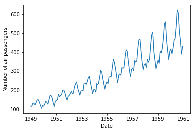
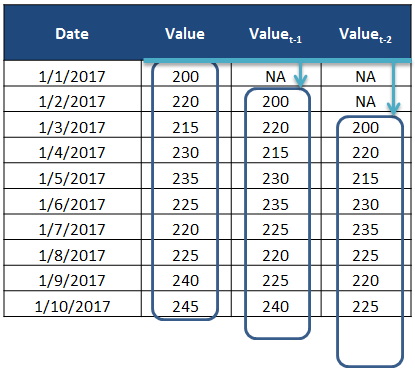
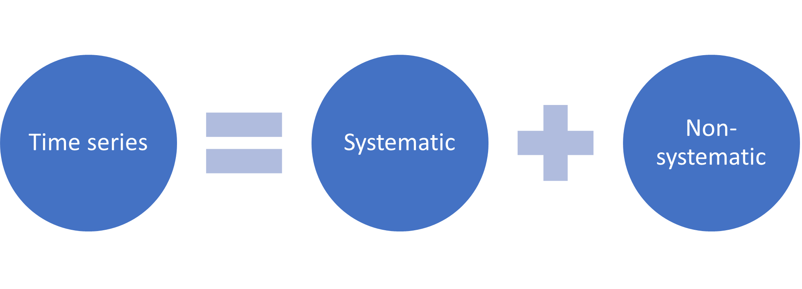
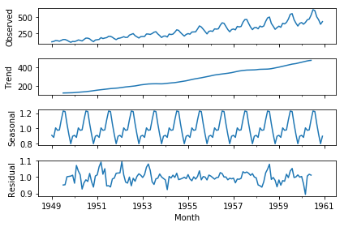
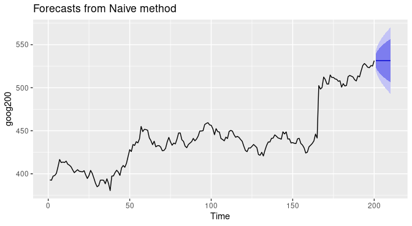

# Time Series (optional)

This module will help you acquire knowledge of time series analysis and forecasting by guiding you towards online resources. In addition, it will give you tips on how you can apply your newly gained knowledge to the creative brief.

## Learning objectives

After this module, you will be able to:

- [ ] Acquire knowledge of time series analysis and forecasting by consulting online resources
- [ ] Apply knowledge of time series analysis and forecasting to the creative brief

## Introduction to time series

Until now, you mostly worked with so-called cross-sectional data - i.e., a set of data values observed at a fixed point in time or where time is of no significance. For example, ProPublica's COMPAS dataset. In Block D, you have the chance to work with a different type of data, namely time series.

### What is time series data, analysis & forecasting?

> Time series analysis is a specific way of analyzing a sequence of data points collected over an interval of time. In time series analysis, analysts record data points at consistent intervals over a set period of time rather than just recording the data points intermittently or randomly. However, this type of analysis is not merely the act of collecting data over time.
  What sets time series data apart from other data is that the analysis can show how variables change over time. In other words, time is a crucial variable because it shows how the data adjusts over the course of the data points as well as the final results. It provides an additional source of information and a set order of dependencies between the data.
  Time series analysis typically requires a large number of data points to ensure consistency and reliability. An extensive data set ensures you have a representative sample size and that analysis can cut through noisy data. It also ensures that any trends or patterns discovered are not outliers and can account for seasonal variance. Additionally, time series data can be used for forecasting—predicting future data based on historical data ([Source](https://www.tableau.com/learn/articles/time-series-analysis)).

Also, check out LaBarr's video, where he explains the difference between the two data types.

<iframe width="560" height="315" src="https://www.youtube-nocookie.com/embed/FsroWpkUuYI" title="YouTube video player" frameborder="0" allow="accelerometer; autoplay; clipboard-write; encrypted-media; gyroscope; picture-in-picture" allowfullscreen></iframe>

*Video 1. What is Time Series Data by Aric LaBarr.*

### Forecasting applications

The applications of time series models are manifold. Below are five examples taken from various industries:  

- Forecasting daily power demand to decide whether to build another power generation plant
- Forecasting weekly call volumes to schedule staff in a call center
- Forecasting weekly inventory requirements to stock inventory to meet demand
- Forecasting daily supply and demand to optimize fleet management and other aspects of the supply chain
- Forecasting daily infection rates to optimize disease control and outbreak programs

### Toy datasets

You can find many toy datasets online, with Air Passengers undoubtedly being the most popular.

- [Air Passengers](https://www.kaggle.com/code/manas13/time-series-air-passenger/data)

Feeling creative?! Clio-Infra offers some quirky time series datasets on their website, such as the number of sheep per capita ranging from the year 1500 to 2010.

*Figure 1. [Lamb of (oh my) God: disbelief at 'alarmingly humanoid' restoration of Ghent altarpiece](https://www.theguardian.com/world/2020/jan/22/alarmingly-humanoid-shear-disbelief-over-restoration-of-ghent-altarpiece) by the Guardian.*

>In 2010, the Netherlands Organisation for Scientific Research (NWO) awarded a subsidy to the Clio Infra project, of which Jan Luiten van Zanden was the main applicant and which is hosted by the International Institute of Social History (IISH). Clio Infra has set up a number of interconnected databases containing worldwide data on social, economic, and institutional indicators for the past five centuries, with special attention to the past 200 years. These indicators allow research into long-term development of worldwide economic growth and inequality ([Source](https://www.tableau.com/learn/articles/time-series-analysis)).

- [Sheep Per Capita](https://clio-infra.eu/Indicators/SheepperCapita.html)

### Notation

Let's start to inspect the Air Passengers dataset. When we visualize it in a line graph, we get the following:

*Figure 2. Visualization of the Air Passengers time series dataset.*

Before we dive deeper into time series analysis and forecasting, we need to take a look at some standard notation:

> The current time is defined as t, an observation at the current time is defined as obs(t). We are often interested in the observations made at prior times, called lag times or lags. Times in the past are negative relative to the current time. For example the previous time is t-1 and the time before that is t-2. The observations at these times are obs(t-1) and obs(t-2) respectively. Times in the future are what we are interested in forecasting and are positive relative to the current time. For example the next time is t+1 and the time after that is t+2. The observations at these times are obs(t+1) and obs(t+2) respectively. For simplicity, we often drop the obs(t) notation and use t+1 instead and assume we are talking about observations at times rather than the time indexes themselves. Additionally, we can refer to an observation at a lag by shorthand such as a lag of 10 or lag=10 which would be the same as t-10.
  To summarize:
  t-n: A prior or lag time (e.g. t-1 for the previous time).
t: A current time and point of reference.
t+n: A future or forecast time (e.g. t+1 for the next time).
  ([Source](https://machinelearningmastery.com/introduction-to-time-series-forecasting-with-python/)).

*Figure 3. Lags in a data table.*

### Components

To understand a forecasting task, it is useful to think of a time series as a combination systematic (i.e., level, trend, and seasonality), and non-systematic (i.e., noise) components. Additionally, all time series have a level, and noise component. The trend and seasonality components are optional.

*Figure 4. High-level decomposition of a time series.*

- Level: The average value in the series
- Trend: The increasing or decreasing value in the series
- Seasonality: The repeating short-term cycle in the series
- Noise: The random variation in the series

Note: You cannot model the non-systematic component of a time series. The systematic component, on the other hand, can be modelled because it is consistent or recurrent over time. For example, my cat Gijsbrecht has the annoying daily habit where he excessively starts to meow in front of his food bowl at 16:00, sharp! Luckily, the meowing usually halts at 17:00 when he receives his daily portion of cat nibble, and a short tummy rub by one of his 'servants' (systematic, pattern/cycle). On very rare occasions, he will start to meow for food in the middle of the night or in the early afternoon (non-systematic, noise).

*Figure 5. Decomposition of the Air Passengers dataset.*

For a more in-depth explanation on decomposing time series (e.g., additive vs. multiplicative model), see video below:

<iframe width="560" height="315" src="https://www.youtube-nocookie.com/embed/0ar9extHObg" title="YouTube video player" frameborder="0" allow="accelerometer; autoplay; clipboard-write; encrypted-media; gyroscope; picture-in-picture" allowfullscreen></iframe>

*Video 2. What is Time Series Decomposition by Aric LaBarr.*

### Algorithms

There are many ways to model a time series to make predictions. For example:

- moving average
- exponential smoothing
- ARIMA

Want to go beyond the basics, and apply advanced models? Then, consider looking into algorithms such as SARIMAX, VARMAX, CNN, and (autoregressive) LSTM.

## Things to consider...

1. How much data do you have available and are you able to gather it all together?
More data is often more helpful, offering greater opportunity for exploratory data analysis, model testing and tuning, and model fidelity.

*For example, ARIMA models need a minimum of 30 data points, while deep learning based models generally need significantly more data points.*

2. What is the time horizon of predictions that is required? Short, medium or long
term? Shorter time horizons are often easier to predict with higher confidence.

*There are many ways to forecast time series data. Some algorithms perform better with shorter time horizons (e.g., ARIMA), while others perform better with larger time horizons (e.g., Prophet). Furthermore, as mentioned earlier, shorter time horizons are generally easier to predict with high confidence (i.e., short time horizon - lower degree of uncertainty, long time horizon - higher degree of uncertainty), therefore they often have smaller [prediction intervals](https://otexts.com/fpp2/prediction-intervals.html) (i.e., blue bands in the picture below).*

*Figure 6. Visualization of the prediction intervals of a time series forecast.*

*For a quick tutorial on applying the ARIMA model to your time series dataset, check the article [ARIMA model in Python](https://python-bloggers.com/2021/04/arima-model-in-python/).*

*Need more in-depth information, see the Section Blended Learning, which lists several (extensive) online courses on the topic of time series analysis and/or forecasting.*

3. Can forecasts be updated frequently over time or must they be made once
and remain static? Updating forecasts as new information becomes available often
results in more accurate predictions.

4. At what temporal frequency are forecasts required? Often forecasts can be made
at a lower or higher frequencies, allowing you to harness down-sampling, and up-sampling
of data, which in turn can offer benefits while modelling.

Time series data often requires cleaning, scaling, and even transformation. For example:

- Frequency. Perhaps data is provided at a frequency that is too high to model or is
unevenly spaced through time requiring resampling for use in some models.

- Outliers. Perhaps there are corrupt or extreme outlier values that need to be identified and handled.

- Missing. Perhaps there are gaps or missing data that need to be interpolated or imputed.

*It is very likely that you will encounter missing values in a dataset (e.g., weather station data). In order to fit your time series data, and subsequently make an accurate prediction with your model, you need to replace the missing data values. There are various methods available that will interpolate or impute your data.*

*Need more information about how to sensibly handle missing data, check out the following article and/or DataCamp courses:*

- [Manipulating Time Series Data in Python](https://app.datacamp.com/learn/courses/manipulating-time-series-data-in-python)
- [Dealing with Missing Data in Python](https://app.datacamp.com/learn/courses/dealing-with-missing-data-in-python)
- [How to Fill Missing Data with Pandas](https://towardsdatascience.com/how-to-fill-missing-data-with-pandas-8cb875362a0d)

*Lastly, some time series methods require the data to meet certain statistical assumptions. For example, ARIMA requires your series to be stationary, while Prophet does not have this specific requirement.*

> A stationary process has the property that the mean, variance and autocorrelation structure do not change over time. Stationarity can be defined in precise mathematical terms, but for our purpose we mean a flat looking series, without trend, constant variance over time, a constant autocorrelation structure over time and no periodic fluctuations (seasonality) ([Source](https://www.itl.nist.gov/div898/handbook/pmc/section4/pmc442.htm#:~:text=A%20common%20assumption%20in%20many,do%20not%20change%20over%20time.)).

*So before you start to model your data, look into the (model-specific) statistical assumptions.*

([Source](https://machinelearningmastery.com/introduction-to-time-series-forecasting-with-python/))

## Blended learning

There are many online resources available on the topic of time series analysis, and/or forecasting. Please, check the following resources:

__Python:__

- [Manipulating Time Series Data in Python](https://app.datacamp.com/learn/courses/manipulating-time-series-data-in-python)
- [Time Series Analysis in Python](https://app.datacamp.com/learn/courses/time-series-analysis-in-python)
- [Visualizing Time Series Data in Python](https://app.datacamp.com/learn/courses/visualizing-time-series-data-in-python)
- [ARIMA Models in Python](https://app.datacamp.com/learn/courses/arima-models-in-python)
- [Machine Learning for Time Series Data in Python](https://app.datacamp.com/learn/courses/machine-learning-for-time-series-data-in-python)

__R:__

- [Forecasting: Principles and Practice](https://otexts.com/fpp2/)
- [Manipulating Time Series Data with xts and zoo in R](https://app.datacamp.com/learn/courses/manipulating-time-series-data-with-xts-and-zoo-in-r)
- [Time Series Analysis in R](https://app.datacamp.com/learn/courses/time-series-analysis-in-r)
- [ARIMA Models in R](https://app.datacamp.com/learn/courses/arima-models-in-r)
- [Forecasting in R](https://app.datacamp.com/learn/courses/forecasting-in-r)
- [Visualizing Time Series Data in R](https://app.datacamp.com/learn/courses/visualizing-time-series-data-in-r)

__Power BI:__

- [Power BI: Integrating AI and Machine Learning](https://www.linkedin.com/learning/power-bi-integrating-ai-and-machine-learning/organizing-time-series-analysis?autoplay=true&resume=false&u=36359204)
- [Time series Forecasting in Power BI](https://pawarbi.github.io/blog/forecasting/python/powerbi/forecasting_in_powerbi/2020/04/24/timeseries-powerbi.html)

__Theory:__

- [ritvikmath](https://www.youtube.com/watch?v=ZoJ2OctrFLA&list=PLvcbYUQ5t0UHOLnBzl46_Q6QKtFgfMGc3)
- [Crash Course Statistics](https://www.youtube.com/watch?v=zouPoc49xbk&list=PL8dPuuaLjXtNM_Y-bUAhblSAdWRnmBUcr)
- [OpenIntro Statistics](https://www.openintro.org/book/os/)
