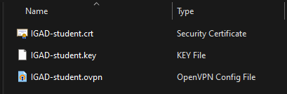
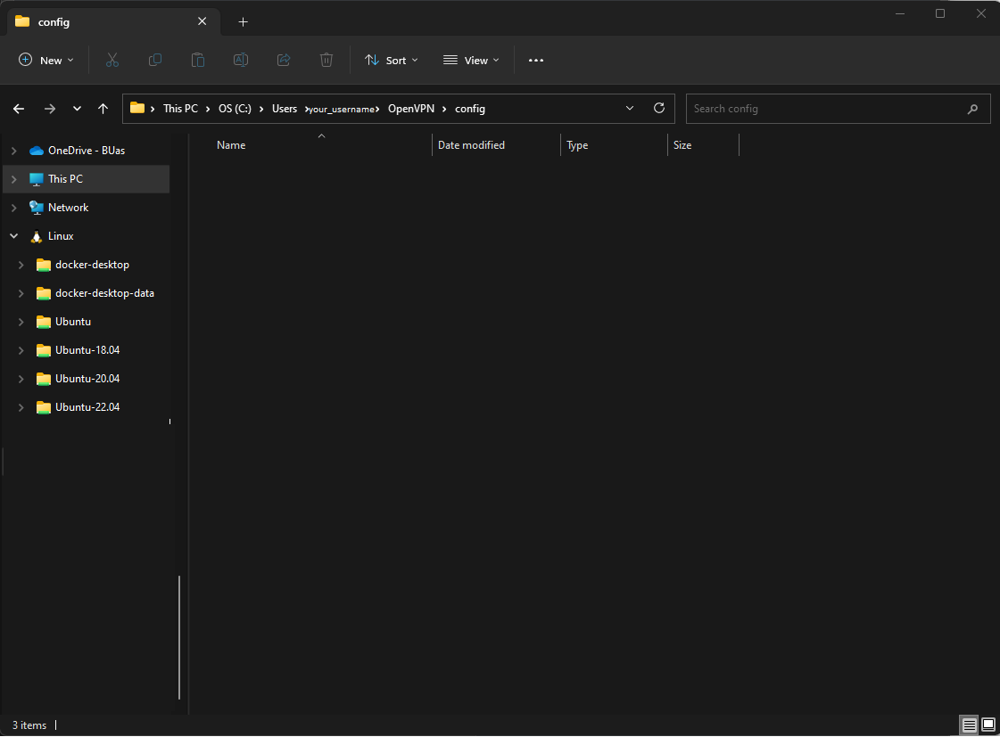

# Accessing the VPN

Follow the steps below to access the VPN:

1. Download the VPN client from the [VPN download page](https://openvpn.net/community-downloads/). (Use the Windows 64-bit MSI installer)

2. Install the VPN client. (Use the default settings)

3. Download the VPN configuration files from [here](https://edubuas-my.sharepoint.com/:u:/g/personal/aswegen_d_buas_nl/Ef0rfzJJdVREoI-d-rnIyiABnnr0fNcQ3oGmtF2uLTDUIg?e=YgZG0F)

4. Extract the files from the zip file. These are the files you need:

5. Copy the files to the following directory: `c:\users\%username%\OpenVPN\config` (replace `%username%` with your username on your PC)

6. Open the VPN client and connect to the VPN. You need to enter your BUas username and password.

7. If the connecction is suuccessful you will see this icon in your system tray:  (the screen is green if you are connected.)
