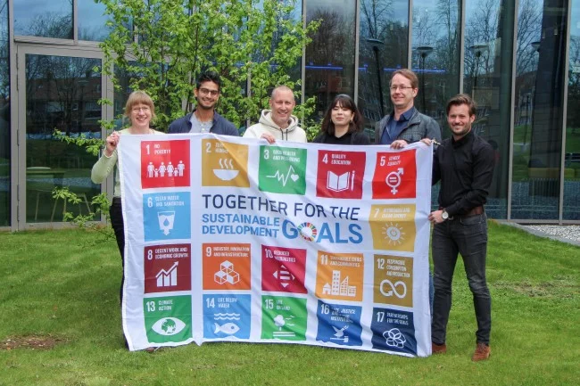
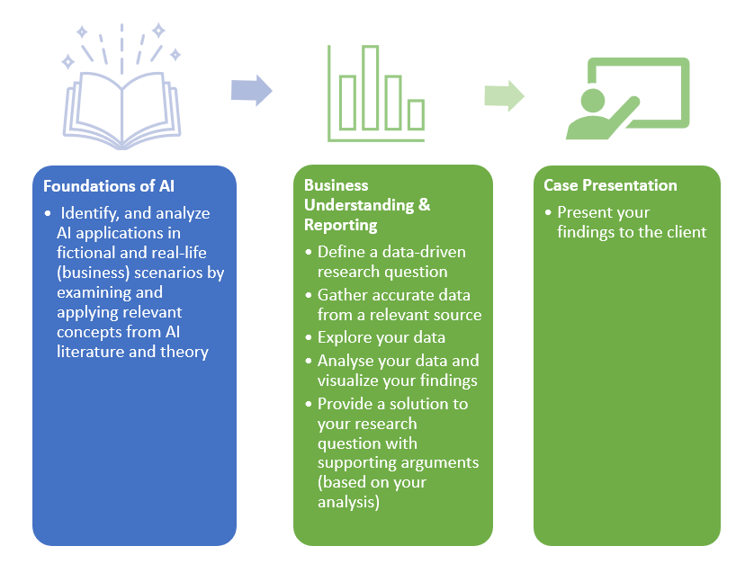
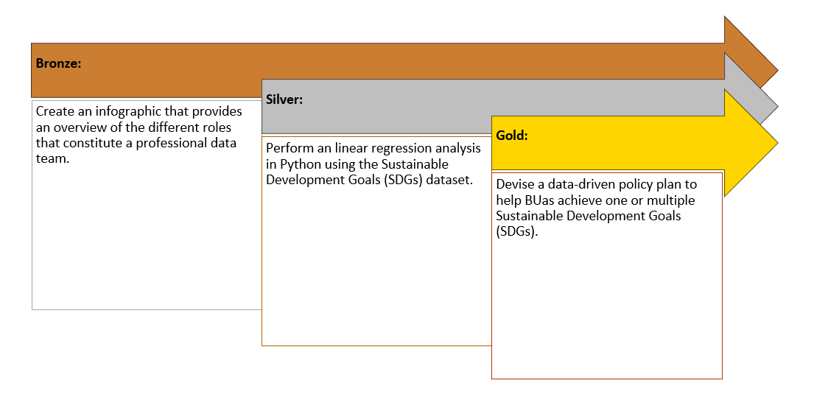

# Block A - Business Understanding

Block A, focusses on the first stage of the *__CRISP-DM__* process, known as *__Business Understanding__*. This phase entails acquiring a deep understanding of the business context and requirements. 

*Figure 1. CRISP DM phases.*

During this phase, you will acquire the skills necessary to formulate a research question that can be addressed through data analysis. You will learn how to find, and collect appropriate data from relevant sources, explore and analyze the collected data, and visualize your findings effectively using the programming language Python and the dashboarding tool Power BI. By doing so, you will be able to propose a solution to your research question, substantiated by sound arguments derived from your analysis. Finally, you will gain proficiency in presenting your findings to the client in a clear and concise manner.

### Staff Members

| Name   |  Availability |  Mentor Group | Email  | Knowledge Module(s)  |
|---|---|---|---|---|
| Dean van Aswegen (Lecturer), MSc. | Mon, Tues, Wed, Thur, Fri  |  Block A, Group 1 (1FAI-01), Year 1 | aswegen.d@buas.nl | :heavy_check_mark: Introduction to Artificial Intelligence   :heavy_check_mark: Introduction to Python Programming   :heavy_check_mark: Introduction to Data Science    | 
| Alican Noyan (Lecturer), PhD.|  Mon, Wed, Thu, Fri  | Block A, Group 2 (1FAI-04), Year 1  |  noyan.a@buas.nl | :heavy_check_mark: Introduction to Artificial Intelligence   :heavy_check_mark: Introduction to Python Programming   :heavy_check_mark: Introduction to Data Science   |
| Irene van Blerck (Lecturer), MSc.    |  Tue, Wed, Thu, Fri | Block A, Group 4 (1FAI-02), Year 1 |  blerck.i@buas.nl | :heavy_check_mark: Introduction to Artificial Intelligence   :heavy_check_mark: Introduction to Python Programming   :heavy_check_mark: Introduction to Data Science   |
| Zhanna Kozlova (Lecturer), MA.   | Fri  |  Block A, Group 5 (1FAI-03), Year 1 | kozlova.z@buas.nl  | :heavy_check_mark: Introduction to Artificial Intelligence   :x: Introduction to Python Programming   :x: Introduction to Data Science   |  
| Bert Heesakkers (Lecturer), MSc.  | NA | Workshops | heesakkers.b@buas.nl | :heavy_check_mark: Introduction to Artificial Intelligence   :x: Introduction to Python Programming   :x: Introduction to Data Science   |
| Frank Peters (Program manager), PhD.  | Mon, Tue, Wed, Thu |  NA | peters.f@buas.nl | NA |

***

## Project Based Learning - Creative Brief

The Sustainable Development Goals (SDGs) were established by the United Nations in 2015 to guide countries in achieving a sustainable future. These 17 global objectives encompass a wide range of areas, including poverty eradication, education, gender equality, economic growth, climate action, and environmental protection.

The *__SDG Hub@BUas__*, referred to as the client, has reached out to you as an aspiring - *__data professional__* - to apply your expertise in providing data-driven solutions. In particular, they require your assistance in monitoring and assessing the advancements made towards the SDGs on a global and/or country-specific scale. 

*Figure 2. Team SDG Hub@BUas.*

The objective is to *__develop an interactive dashboard utilizing your newly acquired skills in data analytics and visualization__*. The dashboard will provide valuable insights to policymakers, researchers, and activists, enabling them to make informed decisions and take targeted actions towards the SDGs. Moreover, it will serve as a tool to raise awareness among the general public, inspiring collective efforts towards creating a more sustainable and equitable world.

Good luck!

***

## Project Based Learning - Knowledge Modules

The ADS&AI program is structured into 8-week blocks. On Monday, Wednesday and Thursday you work individually on the development of fundamental skills, which are needed to successfully complete the Creative brief. In *__DataLab__* (Mandatory! See [DataLab Attendance & Preparation](ADD URL), for more information), scheduled on the Tuesday's and Friday's, you apply your knowledge to the Creative Brief by completing a list of tasks, which you can find [here](ADD URL). 

The block is further divided into two phases, centered around three *__knowledge modules__*:

- Introduction to Artificial Intelligence
- Introduction to Data Science (BRAM, NEEDs TO BE CHANGED?)
- Introduction to Python programming (ALICAN, NEEDS TO BE CHANGED?)

*Figure 3. Overview Block A, Year 1.*

### 1. Introduction to Artificial Intelligence (Week 1-3)

In the first three weeks of Block A, you will acquire foundational knowledge and understanding of the theories, principles, methods, and techniques related to the field of AI. For example, you will be made familiar with the philosophy, history, and taxonomy of AI, among others, by analysing the popular science fiction movie Minority Report. In addition, we will teach you essential soft skills, such as presenting and citing sources.

In DataLab II, Week 3, you are required to give a 7-minute presentation, where you identify, and describe an AI topic in this movie, and place it within the Taxonomy of AI. Furthermore, you will need to evaluate the technical feasibility of the AI topic by critically assessing its possible application(s) within a real-life (business) setting. Lastly, in order to meet the information needs for the 'AI in Science Fiction' presentation, you will need to acquire, evaluate, and use information from various popular and/or scholarly sources, such as blogs and scientific journal articles. Finally, for grading purposes, you will need to make a video recording of your presentation.  

### 2. Business Understanding & Reporting | Case Presentation (Week 4-7)

To change the world, we must first be able to measure it. Measuring and quantifying what matters is a crucial component of evaluating progress. In September 2015, all countries agreed to adopt specific goals as targets or indicators for global development. Collectively, these goals are known as the United Nations Sustainable Development Goals (SDGs).

The SGD Hub@BUAs, hereafter the client, has approached you as an aspiring – data professional – to track and explore the global and country-level progress towards the Sustainable Development Goals:

<!-- convert to short description of what the students need to do: above

Below: convert to use-cases page using Irene's template -->
__1. Define a data-driven research question__

You are expected to frame a data-driven research question related to a sustainable development goal. Questions can range from simple (e.g., how country X is performing on indicator Y) to complex (e.g., how country X is performing on indicator Y, and what are the key variables related to Y). Use SDGTracker to help formulate your problem statement.

__2. Gather accurate data from a relevant source__

You are expected to use the Sustainable Development Goals databank in order to gather the appropriate dataset to answer your research question. Use SDGDataBank to collect the relevant data.

__3. Explore your data__

You are expected to apply Exploratory Data Analysis (EDA) concepts learned in the workshops to your dataset.

__4. Analyse your data and visualize your findings__

You are expected to apply concepts learned in the workshops and [generate appropriate visualisations](https://adsai.buas.nl/Study%20Content/Business%20Intelligence/images/chart_suggestion.jpg), which support your arguments towards answering the research question, in Power BI. Furthermore, you are expected to calculate and interpret at least 1 measure of association such as a correlation coefficient and it's effect size related to your research question.

__5. Provide a solution to your research question with supporting arguments (based on your analysis)__

You are expected to answer your research question with supporting arguments based on the work conducted in the previous DataLabs.

__6. Present your findings to the client__

Presenting your findings is important and requires you to think of an [intuitive user design (guidelines)](https://www.nngroup.com/articles/principles-visual-design/#:~:text=Summary%3A%20The%20principles%20of%20scale,increase%20usability%20when%20applied%20correctly.) to effectively convey your findings to the client. 
In DataLab 2, Week 7, you are expected to provide a live demo of your dashboard to the client, staff and your peers. Students, staff, and the client will be allowed to vote for the best dashboard.

### 3. Introduction to Python programming (Weeks 1-8)

TEXT (ALICAN)

***

## Project Based Learning - Medal Challenges 

You are encouraged to get the best out of yourself. Therefore, within the ADS&AI program, we regularly allow you to push yourself further by giving you so-called bronze-silver-gold challenges. By achieving these, you can earn badges for your GitHub page, which mark excellent students: 

  

  

***

## Project Based Learning - Timeline

### Week 1: Introduction to Artificial Intelligence

#### Monday
- [Philosophy of AI & Information literacy](../../Study%20Content/Artificial%20Intelligence/Week1Day1.html)

#### Tuesday
- [DataLab I: Creative Brief](../../Study%20Content/Artificial%20Intelligence/Week1Day2.html)

#### Wednesday
- [History of AI & GitHub](../../Study%20Content/Artificial%20Intelligence/Week1Day3.html)

#### Thursday
- [Python programming](../../Study%20Content/Artificial%20Intelligence/Week1Day4.html)

#### Friday
- [DataLab II: Creative Brief & Presenting](../../Study%20Content/Artificial%20Intelligence/Week1Day5.html)

### Week 2: Introduction to Artificial Intelligence

#### Monday
- [Intelligent Agents & Conversational AI](../../Study%20Content/Artificial%20Intelligence/Week2Day1.html)

#### Tuesday
- [DataLab I: Creative Brief & Turing Test](../../Study%20Content/Artificial%20Intelligence/Week2Day2.html)

#### Wednesday
- [Taxonomy of AI I](../../Study%20Content/Artificial%20Intelligence/Week2Day3.html)

#### Thursday
- [Python programming](../../Study%20Content/Artificial%20Intelligence/Week2Day4.html)

#### Friday
- [DataLab II: Creative Brief & Feedback](../../Study%20Content/Artificial%20Intelligence/Week2Day5.html)

### Week 3: Introduction to Artificial Intelligence

#### Monday
- [Taxonomy of AI II & State-of-the-art AI](../../Study%20Content/Artificial%20Intelligence/Week3Day1.html)

#### Tuesday
- [DataLab I: Creative Brief](../../Study%20Content/Artificial%20Intelligence/Week3Day2.html)

#### Wednesday
- [Risks & Benefits of AI](../../Study%20Content/Artificial%20Intelligence/Week3Day3.html)

#### Thursday
- [Python programming](../../Study%20Content/Artificial%20Intelligence/Week3Day4.html)

#### Friday
- [DataLab II: 'AI in Science Fiction' presentations](../../Study%20Content/Artificial%20Intelligence/Week3Day5.html)

### Week 4: Introduction to Data Science

#### Monday
- [Quantifying our world into data](https://adsai.buas.nl/Study%20Content/DataScience/Quantifying%20our%20world%20into%20data.html)

#### Tuesday
- [Problem Statements and Research Questions](https://adsai.buas.nl/Study%20Content/DataScience/Problem%20Statements%20and%20Research%20Questions.html)

#### Wednesday
- [Datalab 00: SGD Indicators](https://adsai.buas.nl/Study%20Content/DataScience/Datalab_00_SDG_Indicators.html)

#### Thursday
- [Intro to variables and data transformation](https://adsai.buas.nl/Study%20Content/DataScience/IntroToVariablesAndDataTransformation.html)

#### Friday
- [Datalab 01: Exploratory Data Analysis (EDA)](https://adsai.buas.nl/Study%20Content/DataScience/Datalab_01_ExploratoryDataAnalysis1.html)

### Week 5: Introduction to Data Science

#### Monday
- [Descriptive Analyses and Visualisations 1](https://adsai.buas.nl/Study%20Content/DataScience/DescriptiveAnalysesAndVisualisations1.html)

#### Tuesday
- [Descriptive Analyses and Visualisations 2](https://adsai.buas.nl/Study%20Content/DataScience/DescriptiveAnalysesAndVisualisations2.html)

#### Wednesday
- [Datalab 02: Exploratory Data Analysis (EDA)](https://adsai.buas.nl/Study%20Content/DataScience/Datalab_02_ExploratoryDataAnalysis2.html)

#### Thursday
- [Case Study](https://adsai.buas.nl/Study%20Content/DataScience/Case_Study.html)

#### Friday
- [Datalab 03: Findings & Data Visualisations](https://adsai.buas.nl/Study%20Content/DataScience/Datalab_03_Findings_and_VisualisingData.html)

### Week 6: Introduction to Data Science

#### Monday
- [Variability](https://adsai.buas.nl/Study%20Content/DataScience/Variability.html)

#### Tuesday
- [Analysing Relationships between Variables](https://adsai.buas.nl/Study%20Content/DataScience/Analysing%20Relationships%20between%20Variables.html)

#### Wednesday
- [Datalab 04 Discussion](https://adsai.buas.nl/Study%20Content/DataScience/Datalab_04_Discussion.html)

#### Thursday
- [Reporting & visualisation - Overview](https://adsai.buas.nl/Study%20Content/DataScience/ReportingAndVisualisatingData.html)

#### Friday
- [Datalab 05: Presenting & Storytelling with Data](https://adsai.buas.nl/Study%20Content/DataScience/Datalab_05_Presenting%20and%20Storytelling%20with%20Data.html)

### Week 7: Introduction to Data Science

#### Monday
- [Explanatory Vs Predictive Modelling + Writing a Conclusion](https://adsai.buas.nl/Study%20Content/DataScience/Explanatory%20Versus%20Predictive%20Modelling%20+%20Conclusion.html)

#### Tuesday
- [User-Experience Design in Power BI](https://adsai.buas.nl/Study%20Content/DataScience/User-Experience%20Design%20in%20Power%20BI.html)

#### Wednesday
- [Datalab 06: CRISP-DM](https://adsai.buas.nl/Study%20Content/DataScience/Datalab_06_CrispDM.html)

#### Thursday
- [Extra: Advanced Power BI](https://adsai.buas.nl/Study%20Content/DataScience/AdvancedPowerBI.html)

#### Friday
- [Datalab 07: Dashboard Presentation Day](https://adsai.buas.nl/Study%20Content/DataScience/Datalab_07_DashboardPresentationDay.html)

### Week 8: Introduction to Data Science

TEXT (BRAM)

#### Monday
- 

#### Tuesday
- 

#### Wednesday
- 

#### Thursday
- 

#### Friday
- 

***