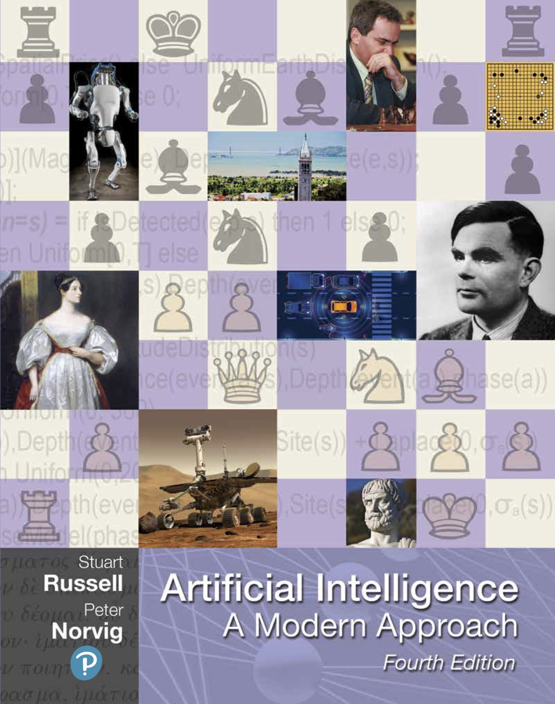
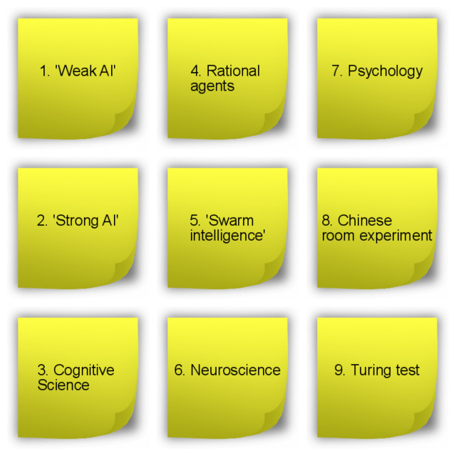
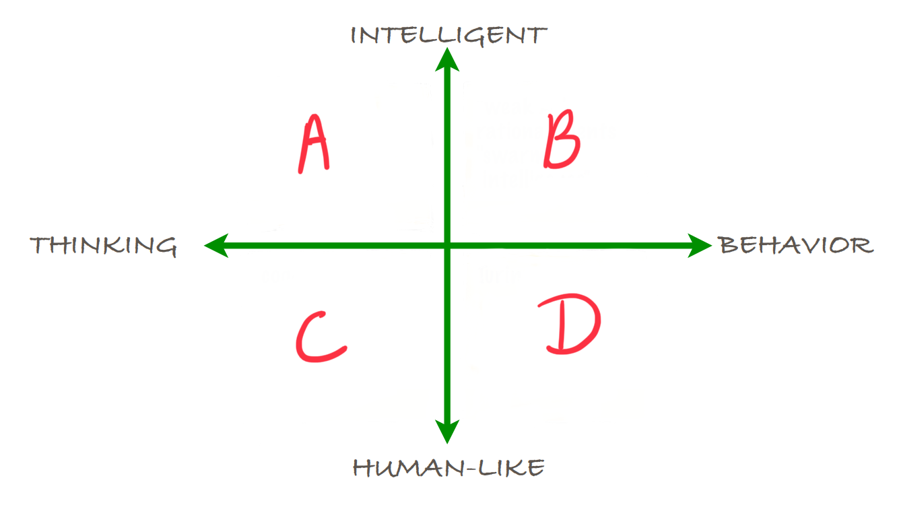

# __Independent study material 1__
\
\

## __Foundations of AI (1): Philosophy, and history of AI__

### 1. Introduction
\
Today, you will start your journey into the wonderful world of Artificial Intelligence :rainbow: :computer: During the first self-study day, you will dive into the foundational concepts of AI by examining its history and philosophy. By the end of this day, having completed the relevant readings and activities listed in the independent study material, you should be well prepared for DataLab 1.    

We advise you to start early with the independent study exercises, because we are going to cover quite a bit of material today!

If you have questions regarding the study material, you can send us an email or attend the Q&A session at the end of each self-study day. For details on availability see Contact page.
\
\
__1a__ Watch the TEDx talk 'Understanding Artificial Intelligence and Its Future' by
Neil Nie.  

*Video 1. TEDx talk 'Understanding Artificial Intelligence and Its Future' by Neil Nie.*

__1b__ Give three examples of AI applications. You can choose real-life examples,
but also examples from popular culture (e.g. movies, books, video games etc.).

***

### 2. Philosophy of Artificial Intelligence
\
For this module you will reading parts of the book Artificial Intelligence: A Modern Approach by Russell and Norvig (2020)[1](#footnote_1).

*Figure 1. Artificial Intelligence: A Modern Approach (Russell and Norvig, 2020).*

You can purchase the book or borrow it from BUAS' library. The library currently has 5 copies available.

Tip: incorporate some screen-free time in your schedule by reading a paper copy of a book/article etc. instead of a digital one. Your eyes will thank me later.

   

__2a__ Read the first two sub-chapters of the book Artificial Intelligence: A Modern Approach by Russell and Norvig (2020) (p.29-62).

Tip: if you cannot find the answer to a question in the provided literature, try to look for an answer online.

   

__2b__ Define the following terms: 'Weak AI', and 'Strong AI'.
\
\
__2c__ What is the 'Chinese room experiment'? Describe its procedure.
\
\
__2d__ What is the 'Chinese room experiment' supposed to show? Select the correct statement, and elaborate on your choice:
\
\
a) Computers are not yet able to simulate the human ability to understand
\
b) Understanding involves more than the ability to formally reproduce appropriate outputs
\
c) It is only possible for systems to demonstrate understanding
\
d) No machine can demonstrate genuine understanding
\
\
__2e__ Connect the Post It notes (Fig 1.) to the relevant quadrant in the philosophy matrix (Fig 2.). For example, A = 1, 2, and  B = 3, 4, 5 etc.
\
\

*Figure 1. Post It notes with philosophy of AI terms.*
\
\
\

*Figure 2. Philosophy of AI matrix.*

__2f__ If you have not taken a coffee break yet, take one right now (with your fellow students via Microsoft Teams)! Unlike computers, humans are only able to maintain true focus for around 45 minutes. If you are experiencing some difficulties concentrating, check out the [Pomodoro technique](https://pomofocus.io/).

***

### 3. History of Artificial Intelligence
\
__3a__ Watch the video on the History of AI by YouTube´s AI with Alex.

*Video 2. History of AI by YouTube´s AI with Alex.*

__3b__ Find, and describe one 'milestone' in the history of AI (maximum length of 100 words). Be creative, so no 'milestones' by Alan Turing! No worries, we are going to extensively discuss his accomplishments during the workshop in DataLab 1 :smiley:

***

## __Turing Test & Chatbots (1): Article and chatbots__

### 4. Preparation for DataLab 1
\
During DataLab 1, you will be given the opportunity to watch Minority Report (bring your own popcorn!). In addition, we will discuss a scientific article by Alan Turing, and perform the Turing test with the chatbots you, and your fellow students found online.

__4a__ Read the following note taking guides:

- [How to take notes of videos](http://kortschakcenter.usc.edu/wp-content/uploads/2014/05/Video-Note-taking.pdf)
- [How to read a paper](http://ccr.sigcomm.org/online/files/p83-keshavA.pdf)

__4b__ Who was Alan Turing? Write down your answer (maximum length of 150 words).

Alert: whoever has the quirkiest fact on Alan Turing will receive a Mars bar at the end of the workshop in DataLab 1.

   

__4c__ Read Turing’s seminal work on AI: [Computing Machinery and Intelligence'](https://watermark.silverchair.com/lix-236-433.pdf?token=AQECAHi208BE49Ooan9kkhW_Ercy7Dm3ZL_9Cf3qfKAc485ysgAAAqswggKnBgkqhkiG9w0BBwagggKYMIIClAIBADCCAo0GCSqGSIb3DQEHATAeBglghkgBZQMEAS4wEQQMi0QU_r8XoVEcFqlmAgEQgIICXtQav8ZfX7wn3sMEOkUNL9dH5VzCvRC2RZmIy7W49sgHTbO69F9san7JvQmPOl81YMQ-3j26uRFGCiboiq7Ab4a4OSL5wtXnXaax9cWDFfrpTRJxWrVNnm8Yno9xXQyrZzJ7RYv1O7VIp4yIGTZvmE7sJuZ2etOCHfwY96_aMFjWAZH7TrUpPKvdY6E-lpyVeXcub5qrchiQHtXedsNatJJd3Y7eVlVwQfbgbLk3UcnQjWaWiDfHempRRjJUW-VGld4bpCBxAvFh5UVXzQm9B24ZFMljiGWJcvav9Qt70Vsu6VcYvx6rKfiKYSKHdpov6GNcCspnsOaVOVmkq66ZAElW5WMD4cZrmkfjTy435CLWORdIOlSJYX2jx7yHi-mV3Jifq0-ij-rRlnttSyodRch07QiU2G0GRKuN9fO9F7EOJtrvOurLEXwJcxaNL3Q4_3V82ffAmvtto5rzFLm0yuWjTG25kT-Hzzq6t4Z17g44vhddVWLZodCytpX8zQpiMnIpPIWCscluaLDDHhoCkY-dQGAzCqLDmC7yM1EuNHo1e99_6K5c8rZf7Yj_Suhzkn_WiTHO09mWW4V1dBHYiDpquaxPg0ENWywf3k7zMa68nqDrn4Aa4vkHHmftIRWkUDft8jjiyGx35bYma10yge1JJNzmSykqjwpTuKRKyhx-aQcYLcKVei5VjSEC4qrEn93N3KQ0FqWBb8YVhtxFhE7Suro5dyr5E9pz3T-OPHBxfImev3B_nZntI6YFihOorG7WuQlAh60yXOcCBHucubn9LuqCTTlEP9RsbnJgig.). Take notes. You will need them for the workshop in DataLab 1.

Tip: if you are having difficulties reading the mathematical equations or understanding the main concept of a text, try to look for additional information online. YouTube, StackOverfow, Quora, and Medium are examples of webpages that can help you in analyzing (scientific) articles.

   

__4b__ Watch video on chatbots and virtual agents by Angela Wick.

*Video 3. Chatbots and virtual agents by Angela Wick.*

__4b__ Find a general purpose/universal chatbot that is accessible via a weblink, and answer the following questions:

- When was it created?
- Who created it?
- Why was it created?

It is important to include evidence of your findings (e.g. webpage link of chatbot, newspaper article, academic
journal article etc.).

Example: [Cleverbot](https://www.cleverbot.com/)

__4c__ Explain what the Loebner Prize is (maximum length of 100 words).

***

## __Footnote(s)__
<a name="footnote_1">1</a>: Hereforth abbreviated as AIMA.

***

## __References__
Diaz, L. (2014, May). How to Take Notes of Videos. USC Kortschak Center for Learning and Creativity.  
http://kortschakcenter.usc.edu/wp-content/uploads/2014/05/Video-Note-taking.pdf
Keshav, S. (2007). How to read a paper. ACM SIGCOMM Computer Communication Review, 37(3), 83-84.
Stuart, R., & Peter, N. Artificial Intelligence: A Modern Approach. 2020.
Turing, A. M. (2009). Computing machinery and intelligence. In Parsing the Turing test (pp. 23-65). Springer, Dordrecht.

Cite videos, and images!
