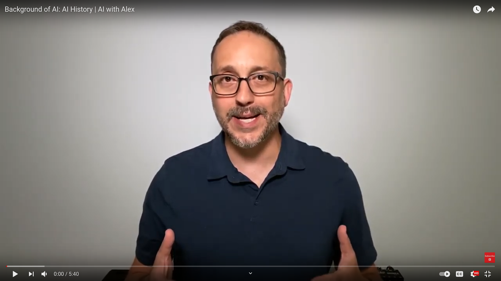
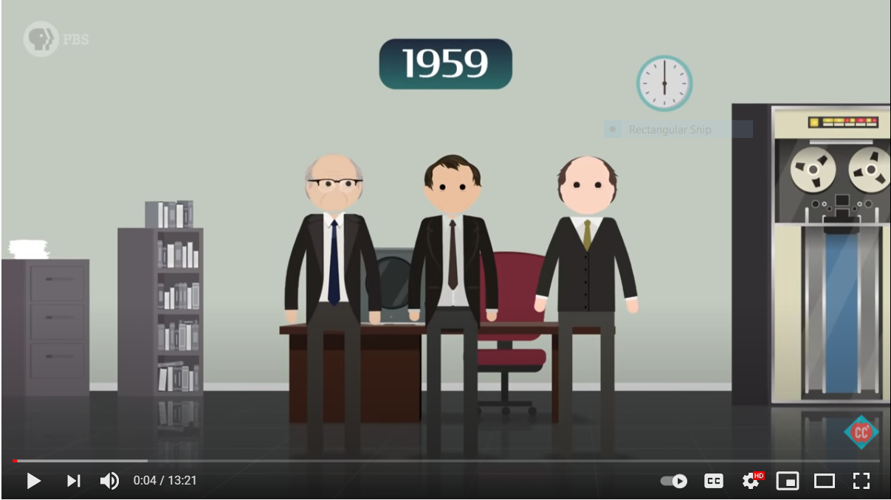
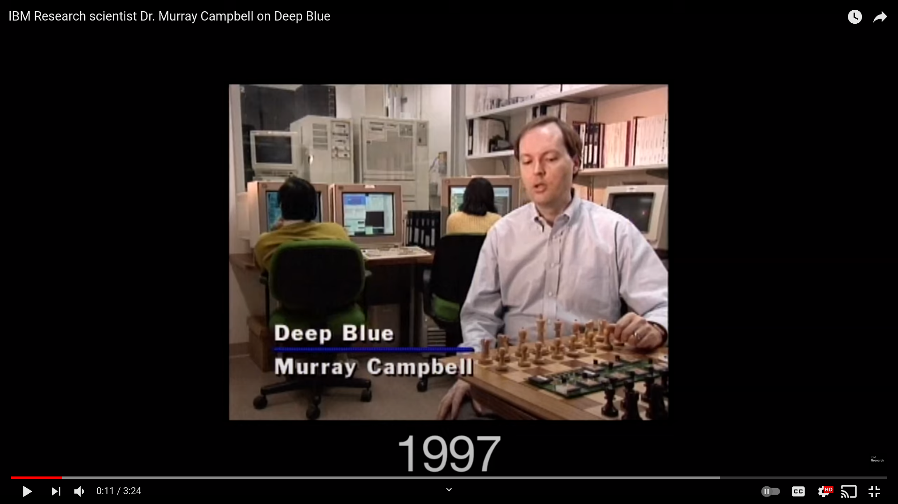

## __The Foundations of Artificial Intelligence__

### __1. Introduction__
\
__1a__ Watch the TEDx talk 'Understanding Artificial Intelligence and Its Future' by Neil Nie.
\
\
__1b__ Give three examples of AI applications. You can choose real-life examples, but also examples from popular culture (e.g. 
movies, books, video games etc.). 

### __2. Philosophy of Artificial Intelligence__ 
\
__2a__ Read the first two sub-chapters of the book Artificial Intelligence: A Modern Approach (AIMA) (p.29-62). 

Tip: if you cannot find the answer to a question in the provided literature, try to look for an answer online.

   

__2b__ Define the following terms: 'Weak AI', and 'Strong AI'. 
\
\
__2c__ What is the 'Chinese room experiment'? Describe its procedure. 
\
\
__2d__ What is the 'Chinese room experiment' supposed to show? Select the correct statement, and elaborate on your choice:
\
\
a. *Computers are not yet able to simulate the human ability to understand*
\
b. *Understanding involves more than the ability to formally reproduce appropriate outputs*
\
c. *It is only possible for systems to demonstrate understanding*
\
d. *No machine can demonstrate genuine understanding*
\
\
__2e__ Connect the Post It notes (Fig 1.) to the relevant quadrant in the philosophy matrix (Fig 2.). For example, A = 1, 2, and  B = 3, 4, 5 etc.
\
\

*Figure 1. Post It notes with philosophy of AI terms.*
\
\
\

*Figure 2. Philosophy of AI matrix.*

### __3 History of Artificial Intelligence__ 
\
__3a__ Watch the video on the History of AI by YouTube´s AI with Alex. 

__3b__ Select, and describe one 'milestone' in the history of AI. Be creative!

### __4. Symbolic AI vs. Non-symbolic AI__

Note: Create video explaining the difference, or write text?

__4a__ Watch the video on symbolic AI by the YouTube channel CrashCourse. 

__4b__ Are artificial neural networks similar to the human brain? Support your answer with arguments.

__4c__ A artificial neural network uses a a) symbolic or b) non-symbolic approach to AI? Select one of the options, and explain 
your choice.

__4d__ Can you think of a scenario where an AI method that uses a symbolic approach would be more suited than a method
that uses a non-symbolic approach? Explain your answer.

### __5. Intelligent Agents__ 
\
__5a__ Read chapter 3 of AIMA (p.96-140).
\
\
__5b__ Watch the video on Deep Blue by IBM. 
\
\

\
\
__5c__ IBM's Deep Blue uses a a) symbolic or b) non-symbolic approach to AI? Select one of the options, and explain your 
choice.
\
\
__5d__ Consider two intelligent agents playing chess with a clock. One of them is called 'Deep Blue', while the other
is called Gary Kasparov. 
- Roughly specify the task environment for Deep Blue (This means specifying each letter in PEAS).
- Determine each of the following properties of this task environment. a) fully observable or partially observable, 
  b) deterministic or stochastic, c) episodic or sequential, d) static, dynamic, or semidynamic, 
  e) discrete or continuous, f) single agent or multi-agent. Explain your answer. (rephrase)

__5e__ Provide an example of an intelligent agent in a business setting, and give a PEAS description of the task 
environment, and characterize it in terms of the properties listed in Section 2.3.2 (p. 117) in AIMA.
