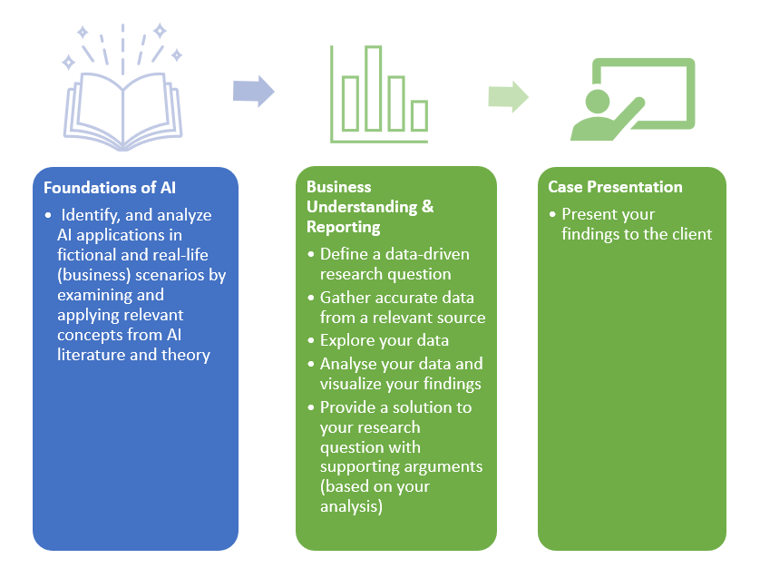

# Block A - Business Understanding

Each of the seven/eight weeks has a fixed structure: on Monday, Wednesday and Thursday you work individually on the development of basic skills, which are needed to execute the DataLab assignments.

__Staff members:__

| Name   |  Availability |  Mentor Group | Email  | Subject  |
|---|---|---|---|---|
| Bram Heijligers (Lecturer), MSc.  |  Wed, Thur, Fri | Group 1, Year 1  | heijligers.b@buas.nl |   |
| Irene van Blerck (Lecturer), MSc.    |  Tue, Wed, Thu, Fri |  Group 2, Year 1 |  blerck.i@buas.nl | Responsible AI, Computer vision |
| Nitin Bushan (Lecturer), PhD.  |  Mon, Tue, Wed, Thu, Fri  | Group 3, Year 1 | bhushan.n@buas.nl |   |
| Zhanna Kozlova (Lecturer), MA.  |   |  Group 1, Year 1 | kozlova.z@buas.nl  |   |
| Alican Noyan (Lecturer), PhD. |   | Group 4, Year 1  |  noyan.a@buas.nl |  |
|Dean van Aswegen (Lecturer), MSc. |   |  Group 5, Year 1 | aswegen.d@buas.nl |   |
|Frank Peters (Program manager), PhD. | Mon, Tue, Wed, Thu |  NA | aswegen.d@buas.nl |   |

Kindly follow the Project Timeline below, this will guide you through what is expected of you on a daily basis.

***

## Project Based Learning - Creative Brief

In Block A, you will start with your journey into the wonderful world of Artificial Intelligence and Data Science  :rainbow: :computer:

The block is divided into two phases:

*Figure 1. Overview Block A, Year 1.*

### 1. Foundations of AI (Week 1-2)

In the first two weeks of Block A, you will acquire foundational knowledge and understanding of the theories, principles, methods, and techniques related to the field of AI. For example, you will be made familiar, with the philosophy, history, and taxonomy of AI, among others, by analysing the popular science fiction movie Minority Report.

In DataLab 2, Week 3, you are required to give a 7-minute presentation, where you identify, and describe an AI topic in this movie, and place it within the Taxonomy of AI. Furthermore, you will need to evaluate the feasibility of the AI topic by critically assessing its possible application(s) within a real-life (business) setting. Lastly, in order to meet the information needs for the 'AI in Science Fiction' presentation, you will need to acquire, evaluate, and use information from various popular and/or scholarly sources, such as blogs and scientific journal articles.  

#### __Deliverable(s)__

- A 7-minute presentation (make sure to also hand-in the slides!)

### 2. Business Understanding & Reporting | Case Presentation (Week 3-7)

To change the world, we must first be able to measure it. Measuring and quantifying what matters is a crucial component of evaluating progress. In September 2015, all countries agreed to adopt specific goals as targets or indicators for global development. Collectively, these goals are known as the United Nations Sustainable Development Goals (SDGs).

The SGD Hub@BUAs, hereafter the client, has approached you as an aspiring – data professional – to track and explore the global and country-level progress towards the Sustainable Development Goals:

__1. Define a data-driven research question__

You are expected to frame a data-driven research question related to a sustainable development goal. Questions can range from simple (e.g., how country X is performing on indicator Y) to complex (e.g., how country X is performing on indicator Y, and what are the key variables related to Y). Use SDGTracker to help formulate your problem statement.

__2. Gather accurate data from a relevant source__

You are expected to use the Sustainable Development Goals databank in order to gather the appropriate dataset to answer your research question. Use SDGDataBank to collect the relevant data.

__3. Explore your data__

You are expected to apply Exploratory Data Analysis (EDA) concepts learned in the workshops to your dataset.

__4. Analyse your data and visualize your findings__

You are expected to apply concepts learned in the workshops and generate appropriate visualisations, which support your arguments towards answering the research question, in Power BI.

__5. Provide a solution to your research question with supporting arguments (based on your analysis)__

You are expected to answer your research question with supporting arguments based on the work conducted in the previous DataLabs.

__6. Present your findings to the client__

In DataLab 2, Week 7, you are expected to provide a live demo of your dashboard to the client, staff and your peers. Students, staff, and the client will be allowed to vote for the best dashboard.

#### __Deliverable(s)__

-  A Power BI dashboard in .pbix-format
-  A 7-minute live demo of the Power BI dashboard

Please refer to the Assessment Rubric in Microsoft Teams for more detailed information.

***

# Project Timeline

## Week 1: Introduction to Artificial Intelligence

### Monday
- [Philosophy AI](../../Study%20Content/Artificial%20Intelligence/Week1Day1.html)

### Tuesday
- [DataLab 1: Minority Report (1) & Information literacy (1)](../../Study%20Content/Artificial%20Intelligence/Week1Day2.html)

### Wednesday
- [History of AI & Information literacy (2)](../../Study%20Content/Artificial%20Intelligence/Week1Day3.html)

### Thursday
- [Conference: Artificial Intelligence & The BUAS domains](../../Study%20Content/Artificial%20Intelligence/Week1Day4.html) (Location: BUAS Campus)

### Friday
- [DataLab 2: Presenting](../../Study%20Content/Artificial%20Intelligence/Week1Day5.html)

## Week 2: Introduction to Artificial Intelligence

### Monday
- [Intelligent Agents & Conversational AI](../../Study%20Content/Artificial%20Intelligence/Week2Day1.html)

### Tuesday
- [DataLab 1: The Turing Test](../../Study%20Content/Artificial%20Intelligence/Week2Day2.html)

### Wednesday
- [Taxonomy of AI (1)](../../Study%20Content/Digital%20Transformation/Scientific%20writing%202.html)

### Thursday
- [Taxonomy of AI (2) & Risk and benefits of AI](../../Study%20Content/Artificial%20Intelligence/Week2Day4.html)

### Friday
- [DataLab 2: Minority Report (2)](../../Study%20Content/Artificial%20Intelligence/Week2Day5.html)

## Week 3: Introduction to Data Science

### Monday
- [Quantifying our world into data](https://adsai.buas.nl/Study%20Content/DataScience/Quantifying%20our%20world%20into%20data.html)
- [Intro to R](https://adsai.buas.nl/Study%20Content/DataScience/IntroToR.html)

### Tuesday
- [Datalab 00 Overview: SGD Indicators](https://adsai.buas.nl/Study%20Content/DataScience/Datalab_00_SDG_Indicators.html)

### Wednesday
- [Intro to variables](https://adsai.buas.nl/Study%20Content/DataScience/IntroToVariables.html)

### Thursday
- [Descriptive Analyses](https://adsai.buas.nl/Study%20Content/DataScience/DescriptiveAnalyses.html)

### Friday
- [Datalab 01: Exploratory Data Analysis (EDA)](https://adsai.buas.nl/Study%20Content/DataScience/Datalab_01_ExploratoryDataAnalysis.html)

## Week 4: Introduction to Data Science

### Monday
- [Introduction to Probability 1](https://adsai.buas.nl/Study%20Content/DataScience/IntroductionToProbability1.html)

### Tuesday
- [Datalab 02: Findings](https://adsai.buas.nl/Study%20Content/DataScience/Datalab_02_Findings_and_VisualisingDataInR.html)

### Wednesday
- [Introduction to Probability 2](https://adsai.buas.nl/Study%20Content/DataScience/IntroductionToProbability2.html)

### Thursday
- [Analysing Relationships between Variables](https://adsai.buas.nl/Study%20Content/DataScience/Analysing%20Relationships%20between%20Variables.html)

### Friday
- [Datalab 03 Discussion](https://adsai.buas.nl/Study%20Content/DataScience/Datalab_03_Discussion.html)

## Week 5: Introduction to Data Science

### Monday
- [Reporting & visualisation - Overview](https://adsai.buas.nl/Study%20Content/DataScience/ReportingAndVisualisatingData.html)

### Tuesday
- [Datalab 04 Overview: Conclusion & References](https://adsai.buas.nl/Study%20Content/DataScience/Datalab_04_Conclusion.html)

### Wednesday
- [Explanatory Vs Predictive Modelling](https://adsai.buas.nl/Study%20Content/DataScience/Explanatory%20Versus%20Predictive%20Modelling.html)

### Thursday
- [Block A recap](https://adsai.buas.nl/Study%20Content/DataScience/BlockA_Recap.html)

### Friday
- [Datalab 05 Overview: Poster Presentation Day](https://adsai.buas.nl/Study%20Content/DataScience/Datalab_05_PosterPresentationDay.html)

## Week 6: Introduction to Data Science

### Monday
- [Programming: A Primer](https://adsai.buas.nl/Study%20Content/Programming/1.StartingProgramming.html)
- [Setting up your development environment](https://adsai.buas.nl/Study%20Content/Programming/2.SetupIDE.html)
- [Python foundation](https://adsai.buas.nl/Study%20Content/Programming/3.Python%20foundations.html)

### Tuesday
- [Data Lab: Python foundation](https://adsai.buas.nl/Study%20Content/Programming/4.DataLabPR1.html)

### Wednesday
- [Python data types & data structures](https://adsai.buas.nl/Study%20Content/Programming/5.Python%20data%20types%20and%20data%20structures.html)

### Thursday
- [Python: Pandas](https://adsai.buas.nl/Study%20Content/Programming/6.Getting%20Started%20with%20Pandas.html)
- [Introduction to Python NumPy](https://adsai.buas.nl/Study%20Content/Programming/7.Python%20Numpy.html)

### Friday
- [Data Lab: Python Pandas & NumPy](https://adsai.buas.nl/Study%20Content/Programming/8.DataLabPR2.html)

## Week 7: Wrap-up

### Monday

- [Image Processing in Python](https://adsai.buas.nl/Study%20Content/Programming/9.Python%20Image%20Processing.html)

### Tuesday
- [Data Lab: Image Steganography](https://adsai.buas.nl/Study%20Content/Programming/10.DataLabPR3.html)

### Wednesday
- [Advanced Numpy: Broadcasting & Vectorizing](https://adsai.buas.nl/Study%20Content/Programming/11.AdvancedNumpy.html)

### Thursday
- [Python:Data visualization](https://adsai.buas.nl/Study%20Content/Programming/12.Data%20visualization%20in%20Python.html)

### Friday
- [Data Lab: Image Steganography](https://adsai.buas.nl/Study%20Content/Programming/13.DataLabPR4.html)

***
