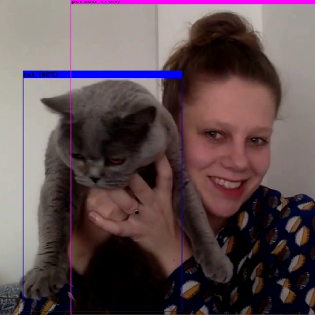

# Block A - Business Understanding

## General Information

Each of the seven/eight weeks has a fixed structure: on Monday, Wednesday and Thursday you work individually on the development of basic skills, which are needed to execute the DataLab assignments.

### Meet the Staff Members

| Name   |  Availability |  Mentor Group | Email  | Subject  |
|---|---|---|---|---|
| Dean van Aswegen (Lecturer), MSc. | Mon, Tues, Wed, Thur, Fri  |  Block A, Group 1 (1FAI-01), Year 1 | aswegen.d@buas.nl | Data Science and AI | 
| Alican Noyan (Lecturer), PhD.|  Mon, Wed, Thu, Fri  | Block A, Group 2 (1FAI-04), Year 1  |  noyan.a@buas.nl | Data Science |
| Gilmara Merrill (Lecturer), MSc.  | Wed, Fri | Block A, Group 3 (1FAI-05), Year 1 | merrill.g@buas.nl | Digital Transformation & Change Management |
| Irene van Blerck (Lecturer), MSc.    |  Tue, Wed, Thu, Fri | Block A, Group 4 (1FAI-02), Year 1 |  blerck.i@buas.nl | Responsible AI, Computer vision |
| Bram Heijligers (Lecturer), MSc.  |  Wed, Thur, Fri | Block A, Group 5 (1FAI-03), Year 1  | heijligers.b@buas.nl | Data Science |
| Zhanna Kozlova (Lecturer), MA.   |   |  Block A, Group 5 (1FAI-03), Year 1 | kozlova.z@buas.nl  |   
| Nitin Bhushan (Lecturer), PhD.    |  Mon, Wed, Thu, Fri  | Block A, Group 1, Year 2 | bhushan.n@buas.nl | Data Science and AI  |
| Bert Heesakkers (Lecturer), MSc.  | NA | Workshops | heesakkers.b@buas.nl |   |
| Frank Peters (Program manager), PhD.  | Mon, Tue, Wed, Thu |  NA | peters.f@buas.nl |   |

### DataLab Attendance & Preparation

Regular attendance and punctuality in every DataLab is required of each student (by default from 9:00 to 17:00). A student who has incurred absences of more than two DataLab sessions without a valid reason throughout the block shall not be given credit, which means you need to retake the entire block; alternatively you can object via the Board of Examiners to your automatic grading suspension.

A student is considered late when they are not yet present during the Standup session, and until the fifteenth minute from the start of DataLab (9:15) Two instances of lateness are counted as one absence.

In case of absence, the student needs to fill in the 'DataLab Absence' [form](https://adsai.buas.nl/Contact%20Us/DataLabAttendance.html) in a timely manner, and subsequently proposes and completes activities that are acceptable alternatives to the in-class learning activities. For more details, contact your mentor.

*__Good__* excuses to miss DataLab:

- Personal illness
- Family emergency
- Death of a loved one
- Medical appointment
- Public transportation issue
- Car (or Other) accident
- Etc.

*__Bad__* excuses to miss DataLab:

- Oversleeping
- Being hangover
- Having no babysitter for your rabbit, dog, cat, etc.
- Boyband breakups and/or related drama
- A birthday party for a four-legged pal
- Having no clean underwear to put on
- Going to the beach because a doctor said that you needed more vitamin D
- The universe telling you to take a day off
- Etc.

The DataLab preparation exercises listed on GitHub Classrooms should be uploaded to your personal GitHub page before the start of the corresponding DataLab session.

### Questions?

If you have questions or issues regarding the course material, please fill out the 'Ask me Anything?' [form](https://adsai.buas.nl/Contact%20Us/AskMeAnything.html). A member of our teaching staff will respond as soon as possible.

Kindly follow the Project Timeline below, this will guide you through what is expected of you on a daily basis.

***

## Project Based Learning - Creative Brief

In Block A, you will start with your journey into the wonderful world of Artificial Intelligence and Data Science  :rainbow: :computer:

The block is divided into two phases:

*Figure 1. Overview Block A, Year 1.*

### 1. Foundations of AI (Week 1-3)

In the first three weeks of Block A, you will acquire foundational knowledge and understanding of the theories, principles, methods, and techniques related to the field of AI. For example, you will be made familiar with the philosophy, history, and taxonomy of AI, among others, by analysing the popular science fiction movie Minority Report. In addition, we will teach you essential soft skills, such as presenting and citing sources.

In DataLab 2, Week 3, you are required to give a 7-minute presentation, where you identify, and describe an AI topic in this movie, and place it within the Taxonomy of AI. Furthermore, you will need to evaluate the feasibility of the AI topic by critically assessing its possible application(s) within a real-life (business) setting. Lastly, in order to meet the information needs for the 'AI in Science Fiction' presentation, you will need to acquire, evaluate, and use information from various popular and/or scholarly sources, such as blogs and scientific journal articles. Finally, for grading purposes, you will need to make a video recording of your presentation.  

#### __Deliverable(s)__

- A 7-minute presentation (make sure to also hand-in the slides!)

### 2. Business Understanding & Reporting | Case Presentation (Week 4-7)

To change the world, we must first be able to measure it. Measuring and quantifying what matters is a crucial component of evaluating progress. In September 2015, all countries agreed to adopt specific goals as targets or indicators for global development. Collectively, these goals are known as the United Nations Sustainable Development Goals (SDGs).

The SGD Hub@BUAs, hereafter the client, has approached you as an aspiring – data professional – to track and explore the global and country-level progress towards the Sustainable Development Goals:

__1. Define a data-driven research question__

You are expected to frame a data-driven research question related to a sustainable development goal. Questions can range from simple (e.g., how country X is performing on indicator Y) to complex (e.g., how country X is performing on indicator Y, and what are the key variables related to Y). Use SDGTracker to help formulate your problem statement.

__2. Gather accurate data from a relevant source__

You are expected to use the Sustainable Development Goals databank in order to gather the appropriate dataset to answer your research question. Use SDGDataBank to collect the relevant data.

__3. Explore your data__

You are expected to apply Exploratory Data Analysis (EDA) concepts learned in the workshops to your dataset.

__4. Analyse your data and visualize your findings__

You are expected to apply concepts learned in the workshops and generate appropriate visualisations, which support your arguments towards answering the research question, in Power BI.

__5. Provide a solution to your research question with supporting arguments (based on your analysis)__

You are expected to answer your research question with supporting arguments based on the work conducted in the previous DataLabs.

__6. Present your findings to the client__

In DataLab 2, Week 7, you are expected to provide a live demo of your dashboard to the client, staff and your peers. Students, staff, and the client will be allowed to vote for the best dashboard.

#### __Deliverable(s)__

-  A Power BI dashboard in .pbix-format
-  A 7-minute live demo of the Power BI dashboard

#### __Criteria__
Please refer to [student template dashboard](https://github.com/BredaUniversityADSAI/ADS-AI/blob/5bf562ad056760e036d9c6d9170de2415dd4b0f6/docs/Study%20Content/DataScience/assets/Templates/DS1_Dashboard_StudentTemplate.pbix) and the Assessment Rubric in Microsoft Teams for more detailed information on grading criteria.

### Challenges 

You are encouraged to get the best out of yourself. Therefore, within the ADS&AI program, we regularly allow you to push yourself further by giving you so-called bronze-silver-gold challenges. By achieving these, you can earn badges for your GitHub page, which mark excellent students: 

  

  

***

# Project Timeline

## Week 1: Introduction to Artificial Intelligence

### Monday
- [Philosophy AI & GitHub (1)](../../Study%20Content/Artificial%20Intelligence/Week1Day1.html)

### Tuesday
- [History of AI & GitHub (2)](../../Study%20Content/Artificial%20Intelligence/Week1Day2.html)

### Wednesday
- [DataLab 1: Minority Report (1) & Information literacy (+ Guest lecture)](../../Study%20Content/Artificial%20Intelligence/Week1Day3.html)

### Thursday
- [Conference: Artificial Intelligence & The BUAS domains](../../Study%20Content/Artificial%20Intelligence/Week1Day4.html) (Location: BUAS Campus)

### Friday
- [DataLab 2: Presenting](../../Study%20Content/Artificial%20Intelligence/Week1Day5.html)

## Week 2: Introduction to Artificial Intelligence

### Monday
- [Intelligent Agents & Conversational AI](../../Study%20Content/Artificial%20Intelligence/Week2Day1.html)

### Tuesday
- [Taxonomy of AI (1)](../../Study%20Content/Artificial%20Intelligence/Week2Day2.html)

### Wednesday
- [DataLab 1: The Turing Test (+ Guest lecture)](../../Study%20Content/Artificial%20Intelligence/Week2Day3.html)

### Thursday
- [Taxonomy of AI (2)](../../Study%20Content/Artificial%20Intelligence/Week2Day4.html)

### Friday
- [DataLab 2: Feedback (+ In-class workshop)](../../Study%20Content/Artificial%20Intelligence/Week2Day5.html)

## Week 3: Introduction to Artificial Intelligence

### Monday
- [Taxonomy of AI (3)](../../Study%20Content/Artificial%20Intelligence/Week3Day1.html)

### Tuesday
- [Risk & Benefits of AI](../../Study%20Content/Artificial%20Intelligence/Week3Day2.html)

### Wednesday
- [DataLab 1: Minority Report (2) (+ Guest lecture)](../../Study%20Content/Artificial%20Intelligence/Week3Day3.html)

### Thursday
- [State-of-the-art AI & Minority Report (3)](../../Study%20Content/Artificial%20Intelligence/Week3Day4.html)

### Friday
- [DataLab 2: 'AI in Science Fiction' presentation](../../Study%20Content/Artificial%20Intelligence/Week3Day5.html)

## Week 4: Introduction to Data Science

### Monday
- [Quantifying our world into data](https://adsai.buas.nl/Study%20Content/DataScience/Quantifying%20our%20world%20into%20data.html)

### Tuesday
- [Problem Statements and Research Questions](https://adsai.buas.nl/Study%20Content/DataScience/Problem%20Statements%20and%20Research%20Questions.html)

### Wednesday
- [Datalab 00: SGD Indicators](https://adsai.buas.nl/Study%20Content/DataScience/Datalab_00_SDG_Indicators.html)

### Thursday
- [Intro to variables and data transformation](https://adsai.buas.nl/Study%20Content/DataScience/IntroToVariablesAndDataTransformation.html)

### Friday
- [Datalab 01: Exploratory Data Analysis (EDA)](https://adsai.buas.nl/Study%20Content/DataScience/Datalab_01_ExploratoryDataAnalysis1.html)

## Week 5: Introduction to Data Science

### Monday
- [Descriptive Analyses and Visualisations 1](https://adsai.buas.nl/Study%20Content/DataScience/DescriptiveAnalysesAndVisualisations1.html)

### Tuesday
- [Descriptive Analyses and Visualisations 2](https://adsai.buas.nl/Study%20Content/DataScience/DescriptiveAnalysesAndVisualisations2.html)

### Wednesday
- [Datalab 02: Exploratory Data Analysis (EDA)](https://adsai.buas.nl/Study%20Content/DataScience/Datalab_02_ExploratoryDataAnalysis2.html)

### Thursday
- [Introduction to Probability 1](https://adsai.buas.nl/Study%20Content/DataScience/IntroductionToProbability1.html)

### Friday
- [Datalab 03: Findings & Data Visualisations](https://adsai.buas.nl/Study%20Content/DataScience/Datalab_03_Findings_and_VisualisingData.html)

## Week 6: Introduction to Data Science

### Monday
- [Introduction to Probability 2](https://adsai.buas.nl/Study%20Content/DataScience/IntroductionToProbability2.html)

### Tuesday
- [Analysing Relationships between Variables](https://adsai.buas.nl/Study%20Content/DataScience/Analysing%20Relationships%20between%20Variables.html)

### Wednesday
- [Datalab 04 Discussion](https://adsai.buas.nl/Study%20Content/DataScience/Datalab_04_Discussion.html)

### Thursday
- [Reporting & visualisation - Overview](https://adsai.buas.nl/Study%20Content/DataScience/ReportingAndVisualisatingData.html)

### Friday
- [Datalab 05: Conclusion & Storytelling with Data](https://adsai.buas.nl/Study%20Content/DataScience/Datalab_05_Conclusion.html)

## Week 7: Introduction to Data Science

### Monday
- [Explanatory Vs Predictive Modelling + more Reporting!](https://adsai.buas.nl/Study%20Content/DataScience/Explanatory%20Versus%20Predictive%20Modelling.html)

### Tuesday
- [User-Experience Design in Power BI](https://adsai.buas.nl/Study%20Content/DataScience/User-Experience%20Design%20in%20Power%20BI.html)

### Wednesday
- [Datalab 06: CRISP-DM](https://adsai.buas.nl/Study%20Content/DataScience/Datalab_06_CrispDM.html)

### Thursday
- [Extra: Advanced Power BI](https://adsai.buas.nl/Study%20Content/DataScience/AdvancedPowerBI.html)

### Friday
- [Datalab 07: Dashboard Presentation Day](https://adsai.buas.nl/Study%20Content/DataScience/Datalab_07_DashboardPresentationDay.html)

***
