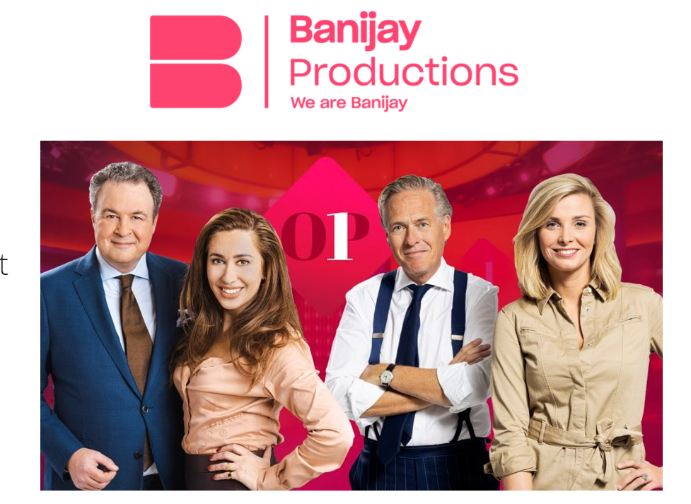

# Block B - Data Understanding and Preparation

Each of the 8 weeks has a fixed structure : on Monday, Tuesday and Thursday you work individually on the development of basic skills, which are needed to execute the DataLab assignments (Wednesday and Friday). 
Kindly follow the table of contents below, this will guide you through what is expected of you on a daily basis. 

Please note that DataLab attendance and preparation is mandatory, click [here](../BlockB/PracticalMatters/DataLabprep.html) to see specific requirements regarding DataLabs.

## Project Based Learning - Creative Brief

In block A, you explored various themes around digital transformation such as business intelligence using Power BI; and critically examined applications of AI and digital technologies to existing businesses processes. In this block, you will take on a more hands-on approach towards improving a business process using digital transformation. In particular, you will explore one specific role within the theme of digitalisation - *the Data Scientist* – and help the client - *Banijay Group* - improve their business processes using data, mathematics, and machine learning.

 
<figure>
    
</figure>
 

The [Banijay Group](https://banijaybenelux.com/){:target="_blank"} is a content creation company for television and multimedia platforms operating within the Media & Entertainment and Telecommunications industries. The group was established in France in 2008, it's present in 21 countries, and it owns 120 production companies that produces 130,000 hours of content such as the world-famous Big Brother, Black Mirror, MasterChef, among many other brands. Banijay's goals are to create, produce and deliver high-quality, multi-genre content and increase its Intellectual Property (IP) through creative entrepreneurship and business acumen.  

> The client has approached you – the Data Scientist – with the aim to analyse their current TV viewership metrics and present a plan to improve their data usage (with multiple sources) and ultimately, help them understand what drives the show's popularity.

**Specifically, the goal for this block is to develop a model that predicts viewer ratings (using Twitter and content data, and any additional data you can collect) using Machine Learning Algorithms and write a report on it. Additionally, the report should contain a section on AI ethics using the knowledge acquired during this block.**

Below you will find the <mark>project requirements</mark>, but there will be an opportunity for you to clarify any questions you may have about the project directly with a stakeholder from Banijay during the **project kick off meeting on Wednesday 23rd November 2022**.

## Project Requirements

With a view to enabling Banijay’s stakeholders to achieve the desired TV ratings, a successful project will meet the following requirements:  

- [Data Governance and Ethics](../BlockB/Project%20Requirements/DataGovernanceRequirements.html){:target="_blank"}
- [Data Pre-processing and Analysis](../BlockB/Project%20Requirements/MachineLearningRequirements.html){:target="_blank"}
- [Report](../BlockB/Project%20Requirements/ReportRequirements.html){:target="_blank"}

## Medal Challenges

All students will be required to submit their findings using a report in **week 8, Friday 20th January 2023.**

After assessment, the top 3 presentations will be selected and the responsible students will have the opportunity to present it on **Wednesday 8th February** to the ADS&AI mentors, all the first year and second year students, and stakeholders from Banijay who will provide them with feedback.

GitHub Medals will be awarded will be awarded with the following criteria:

 Finding additional data that adds insight. 
 Building a ETL data pipeline and reporting application.  
 Being in the top 3 selected to present to Banijay. 

# Block Outline

# Week 1: Programming in Python 

## Monday
- [09:00 to 11:00 Block Kickoff: Fe1.032]()
- [Programming: a primer](../../Study%20Content/Programming/1.StartingProgramming.html)
- [Setting up your development environment](../../Study%20Content/Programming/2.SetupIDE.html)
- [Python for AI and Data Science](../../Study%20Content/Programming/3.Python%20foundations.html)

## Tuesday
- [Python data types & data structures ](../../Study%20Content/Programming/4.Python%20data%20types%20and%20data%20structures.html)

## Wednesday
- [DataLab: Python Foundation exercises](../../Study%20Content/Programming/5.DataLabPR1.html)

## Thursday 
- [Python: Pandas](../../Study%20Content/Programming/6.Getting%20Started%20with%20Pandas.html)
- [Python: Coding standards and reproducible data science](https://adsai.buas.nl/Study%20Content/Programming/7.Python%20PEP8.html)

## Friday
- [DataLab: Pandas](../../Study%20Content/Programming/8.DataLabPR2.html)
- **Formative Feedback I**

# Week 2 : Data Governance & Ethics 

## Monday
- [Data Governance and Ethics (1): Introduction into Ethics: Ethics, Business ethics and introduction into AI ethics](../../Study%20Content/Digital%20Transformation/Data%20Governance%20and%20Ethics%201.html)

## Tuesday
- [Professional writing I: The structure of a paragraph, rules of writing & Bias-free language. AI Business Model Canvas.](../../Study%20Content/Digital%20Transformation/Professional%20writing%201.html)

## Wednesday
**Site-visit:** From 10 to 13 you will be visiting Banijay studios in Amsterdam.  The client will present the Creative Brief and you will have a chance to ask relevant questions. 

__IMPORTANT!!!__

Especially for this occasion, we arranged transportation from you. Please be sharp at __8.00 o'clock at Breda University (AS) next to the Frontier building__. We will depart sharply at 8:30 o'clock.

*Lunch is provided by Banijay, so you don't need to worry about it.*

## Thursday 
- [Data Governance and Ethics (2): Ethical Guidelines for Statistical Practice. Introduction to GDPR](../../Study%20Content/Digital%20Transformation/Data%20Governance%20and%20Ethics%202.html)
- [Professional writing (2): Citations](../../Study%20Content/Digital%20Transformation/Professional%20writing%202.html)

## Friday
- [DataLab: Ethics and AI](../../Study%20Content/Digital%20Transformation/DataLab%20Week%202.%20Day%202.html)
- __Guest lecture from IBM on AI Ethics__

# Week 3 : Python for Data Analysis

## Monday
- [Python: Advanced Pandas](../../Study%20Content/Programming/9.Advanced%20Pandas.html)

## Tuesday
- [Python: Data Visualization](../../Study%20Content/Programming/10.Data%20visualization%20in%20Python.html)

## Wednesday
- [DataLab: Creative Brief](../../Study%20Content/Programming/11.DataLabPR3.html)

## Thursday
- [Python: Data Science and Society](../../Study%20Content/Programming/12.Python%20for%20Society.html)

## Friday
- [DataLab: Data Science and Society](../../Study%20Content/Programming/13.DataLabPR4.html)
- **Formative Feedback II**

# Week 4 : Machine Learning

## Monday
- [Introduction to Machine Learning](../../Study%20Content/Introduction%20to%20Machine%20Learning/SupervisedAndUnsupervisedLearning.html)

## Tuesday
- [Classification Algorithms](../../Study%20Content/Introduction%20to%20Machine%20Learning/ClassificationAlgorithms.html)
- [Evaluating Machine Learning algorithms: Bias and Variance](../../Study%20Content/Introduction%20to%20Machine%20Learning/BiasVariance.html)

## Wednesday
- [DataLab: Creative Brief](../../Study%20Content/Programming/13.DataLabPR4.html)

## Thursday
- [Regression Algorithms](../../Study%20Content/Introduction%20to%20Machine%20Learning/RegressionAlgorithms.html)

## Friday
- [DataLab: Creative Brief](../../Study%20Content/Programming/13.DataLabPR4.html)
- **Guest Lecture and Q&A with Banijay Data Scientist at Fe1.016** (from 3 pm to 5 pm) 

# Week 5 : Machine Learning 

## Monday
- [Logistic Regression](../../Study%20Content/Introduction%20to%20Machine%20Learning/LogisticRegressionAlgorithms.html)

## Tuesday
- [Tree-based Algorithms](../../Study%20Content/Introduction%20to%20Machine%20Learning/DecisionTrees.html)

## Wednesday
- [DataLab: Creative Brief](../../Study%20Content/Programming/13.DataLabPR4.html)
- **Guest lecture on Data Driven Marketing by Fingerspitz from 13:00 – 14:00 at Fe 1.017.**

## Thursday
- [Tuning Machine Learning Algorithms](../../Study%20Content/Introduction%20to%20Machine%20Learning/HyperparameterTuning.html)

## Friday
- [DataLab: Creative Brief](../../Study%20Content/Programming/13.DataLabPR4.html)
- **Formative feedback session III**

# Week 6 : Machine Learning 

## Monday
- [Clustering Algorithms I](../../Study%20Content/Introduction%20to%20Machine%20Learning/ClusteringK-Means.html)

## Tuesday
- [Clustering Algorithms II](../../Study%20Content/Introduction%20to%20Machine%20Learning/DecisionTrees.html)

## Wednesday
- [DataLab: Creative Brief](../../Study%20Content/Programming/13.DataLabPR4.html)

## Thursday
- [Machine Learning: Recap](../../Study%20Content/Introduction%20to%20Machine%20Learning/SupervisedLearningRecap.html)

## Friday
**HOLIDAY**

# Week 7: Linear Algebra

## Monday
- [Introduction to Linear Algebra](../../Study%20Content/Mathematics%20I/1.%20Introduction%20to%20Linear%20Algebra.html)
- [Elementary Operations on Matrices](../../Study%20Content/Mathematics%20I/1.1.%20Elementary%20Operations%20on%20Matrices.html)

## Tuesday
- [Matrix Multiplication and inversion](../../Study%20Content/Mathematics%20I/1.2%20Matrix%20Multiplication%20and%20applications%20to%20linear%20systems.html)
- **DataLab Preparation** (Bert): Bring one object of our preference from your home. 

## Wednesday
- **Workshop**(Bert): Presentation (pitching) Skills, theory and practice.  
- [DataLab: Creative Brief](../../Study%20Content/Programming/13.DataLabPR4.html)

## Thursday
- [Linear algebra applied to Linear Systems](../../Study%20Content/Mathematics%20I/3.%20Linear%20Algebra%20applied%20to%20Linear%20Systems.html)
- [Regression from a Linear Algebra Perspective](../../Study%20Content/Mathematics%20I/4.%20Linear%20Algebra%20and%20(linear)%20Regressions.html)

## Friday
- [DataLab: Creative Brief](../../Study%20Content/Programming/13.DataLabPR4.html)
**Formative feedback session IV**

# Week 8 : Business Case 

## Monday
- [Python: Advanced topics](../../Study%20Content/Programming/11.AdvancedNumpy.html)

## Tuesday
- [Machine Learning: Advanced topics](../../Study%20Content/Introduction%20to%20Machine%20Learning/Perceptron.html)

## Wednesday
- [DataLab: Creative Brief](../../Study%20Content/Programming/13.DataLabPR4.html)

## Thursday
- [Linear Algebra and Image Processing I](../../Study%20Content/Mathematics%20I/6.%20Image%20Processing%20using%20Linear%20Algebra%20I.html)
- [Linear Algebra and Image Processing II](../../Study%20Content/Mathematics%20I/8.%20Linear%20Algebra%20and%20Image%20Processing%20II.html)

## Friday
- **Project Dissemination** 
- [DataLab: Creative Brief](../../Study%20Content/Programming/13.DataLabPR4.html)
