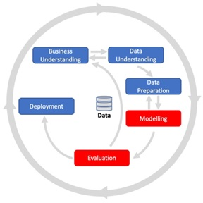
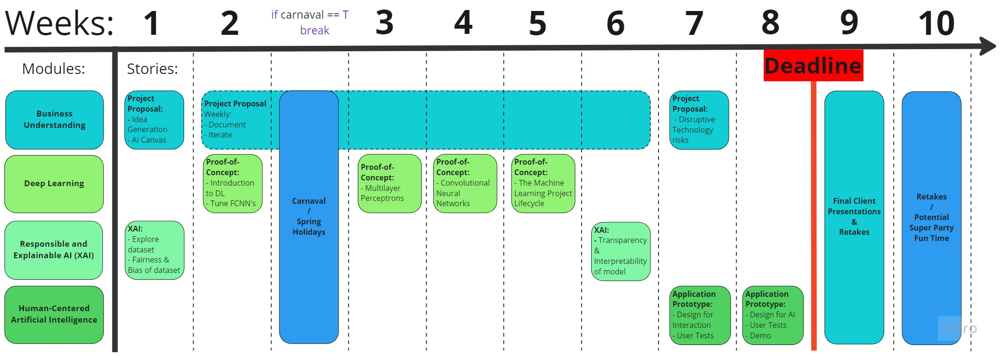
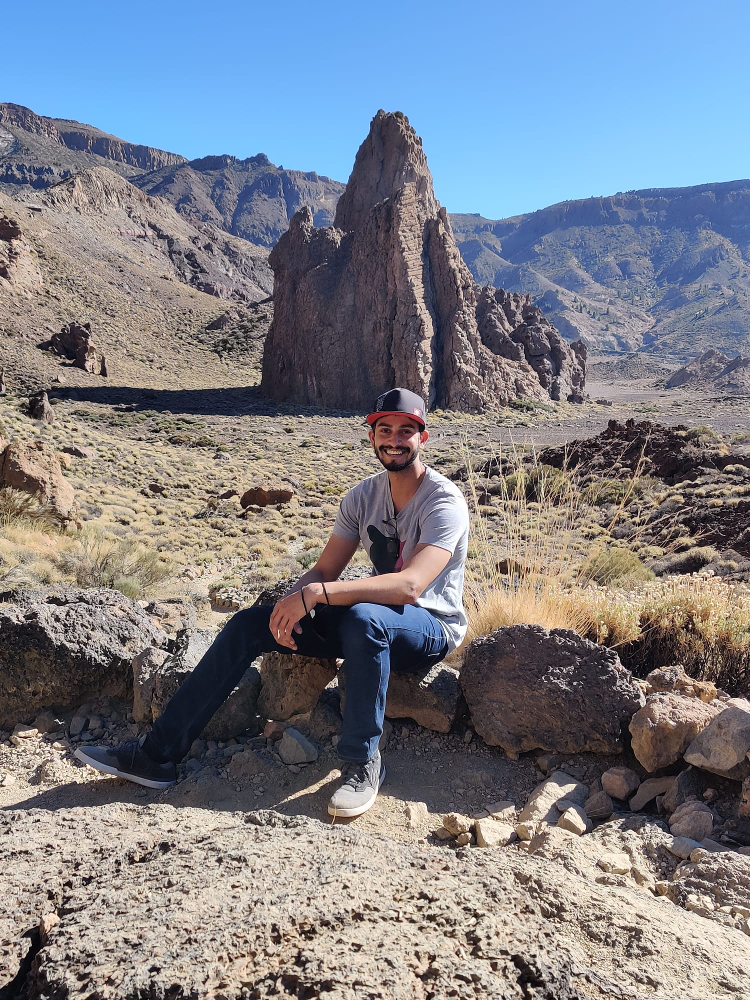

# Block C - Data Modelling

In block A, you explored the foundations of data science and AI and critically examined applications thereof. In block B, you went a step further and helped a real-life client to gain insight into their data by applying various preprocessing and machine learning methods. 

This block will focus on the __*Modeling*__ phase of the __*CRISP-DM*__ lifecycle; you will start incorporating deep learning into your workflow. Therefore, you will learn how to conduct market/consumer research and build transparent, interpretable, and fair AI models. In addition, you will learn how you can embed such an algorithm into an application and how user interaction can help train your model! 

<figure>
    
</figure>

*Figure 1. CRISP-DM Lifecycle.*

## Project Based Learning - Creative Brief

Artificial Intelligence experts are highly sought after, leading many professionals in this field to opt for __*freelance*__ work:

> In 2022, there were 1.2 million people in the Netherlands with self-employment as their primary job, accounting for 12% of the total working population. The sharpest rise in freelancers was seen in the care and welfare domain, followed by the technical, business, and information technology sectors ([Source](https://www.cbs.nl/nl-nl/nieuws/2022/50/aantal-zzp-ers-gegroeid-naar-1-2-miljoen-in-derde-kwartaal-van-2022)). 

One of the main reasons companies hire freelancers is that they are often unsure if they need an in-house professional; if a company has data but is unsure how to use it, it makes more sense to bring in a freelance data professional for a short period to explore and understand the data, business challenges, and opportunities. 

As a freelancer, a balanced combination of both __*soft and hard skills*__ is essential. Your technical proficiency is undoubtedly key, but other aspects, such as business understanding and social skills, are equally important when working on a data science/AI project.

In this block, you will take on the role of freelancing __*- Data Scientist -*__ to assist a company in digitizing one of their business processes by developing an image classification application prototype using the Imsitu dataset. To this end, you will need to create a __*project proposal*__ that touches upon the following topics:

- Market/consumer research and risk assessment
- The design and implementation of a transparent, interpretable (and fair) deep learning-based image classifier
- The development of a user-centered prototype application for your image classifier 

Below you will find the project requirements, but there will be an opportunity for you to clarify any questions about the project during __*the kick-off meeting on Monday 6th of February 2023*__. 

## Project Requirements

This block has four knowledge modules: Business Understanding, Responsible AI, Deep Learning, and Human-Centered AI. Each module has its own set of deliverables, which are specified below:

- [Business Understanding](https://adsai.buas.nl/Study%20Content/Business%20Understanding/BusinessUnderstandingRequirements.html)
- [Responsible AI](../../Study%20Content/Responsible%20and%20Explainable%20AI/ResponsibleAIRequirements.html)
- [Deep Learning](https://adsai.buas.nl/Study%20Content/DeepLearning/21.%20Requirements.html)
- [Human-Centered AI](https://adsai.buas.nl/Study%20Content/Human-Centered%20Artificial%20Intelligence/Assignment.html)

Lastly, you are required to create a project proposal presentation as part of the Creative Brief. In this presentation, you will present your findings related to the knowledge module requirements to the client: 

- [Project Proposal](MS Teams Assignment Template/Project Proposal Template - Y1C_2022-23_ADSAI.pptx): a framework describing the minimum findings to present a full project proposal. **View and edit your own template in the your Microsoft Teams Assignment!**. Note that you can always review the template here to view the presentation requirements after editing your own template!

For more information, see __*Assessment Rubric*__ in Microsoft Teams. 

## Project Timeline

This project aims to develop an image classification application prototype. Below, you will find the project timeline, which gives you an overview of the tasks related to the knowledge modules: 

<figure>

    

</figure>

*Figure 2. Project timeline.*

In __*week 1*__, you will perform an exploratory data analysis to uncover hidden biases in the Imsitu dataset. In addition, you will start with conducting market research to see how you can create an application that generates business value; idea generation (i.e., What are we going to build?). Finally, to further specify your initial idea, you will end the week with a consumer analysis.

:bell: Make sure to update your project proposal presentation regularly!

In __*weeks 2-5*__, you will explore different artificial neural network architectures from which you will gain the skills to create your own image classifier. This model does not have to be the final product but will serve as a [proof of concept](https://en.wikipedia.org/wiki/Proof_of_concept) for your application prototype. 

In __*week 6*__, after you have built and trained the model, you will learn to balance your model's accuracy and interpretability through the application of various explainable AI methods. 

In __*weeks 7-8*__, you will design an application based on your idea and AI canvas that incorporates your image classifier model. The application design is going to be represented by a [wireframe prototype](https://youtube.com/watch?v=89TWEpIitFM&feature=shares). You will also perform some preliminary user tests. Additionally, you will explore disruptive technology risks associated with the proposed application.  

In __*week 9*__, you will present your project proposal to the client. Here you will be given a chance to showcase, explain and defend your proposed project and its components. 

## Deadlines & Deliverables

The final deliverables need to be handed in on __*Friday, the 7th of April, by 16:59 at the latest*__. The project proposal presentations will take place in week 9 during DataLab days and will be attended by a panel of stakeholders (the lecturers responsible for the ILOs; see the Staff section).

For more information on the deliverables, see the requirements section. 

## Questions?

If you have questions or issues regarding the course material, please post a message on the 'Q&A' channel in Teams. The channel will be monitored by mentors but also please help your peers if you have the answer to their question.

Below you will find the timeline on a day-to-day basis. Further down, there is information on the medals and staff for this block, which includes which staff member to go to for ILO-specific questions. 

# Week 1: Responsible AI (Part 1: Bias and Fairness) & Marketing

## Monday
- [Fairness & Bias: Definitions](https://adsai.buas.nl/Study%20Content/Responsible%20and%20Explainable%20AI/ResponsibleAI1.html)

## Tuesday
- [Fairness & Bias: Individual Fairness vs. Group Fairness](https://adsai.buas.nl/Study%20Content/Responsible%20and%20Explainable%20AI/ResponsibleAI2.html)

## Wednesday
- [DataLab: Responsible AI](https://adsai.buas.nl/Study%20Content/Responsible%20and%20Explainable%20AI/UseCases.html)

## Thursday
- [Market Research for Product development & Target Audiences analysis](https://adsai.buas.nl/Study%20Content/Business%20Understanding/BusinessUnderstanding%201.html)
- [ ] Prepare for Feedback Session

## Friday
- [DataLab: Market Research](https://adsai.buas.nl/Study%20Content/Business%20Understanding/BusinessUnderstandingUseCases.html)

- [DataLab: Responsible AI](https://adsai.buas.nl/Study%20Content/Responsible%20and%20Explainable%20AI/UseCases.html)

# Week 2: PoC - Introduction to Deep Learning with Keras

## Monday

- [Introduction to Deep Learning](https://adsai.buas.nl/Study%20Content/DeepLearning/1.%20Introduction%20to%20Deep%20Learning.html)

## Tuesday

- [The Mathematical Building Blocks of Neural Networks](https://adsai.buas.nl/Study%20Content/DeepLearning/2.%20The%20Mathematical%20Building%20Blocks%20of%20Neural%20Networks.html)

## Wednesday

- [DataLab: Multilayer Perceptrons 1](https://adsai.buas.nl/Study%20Content/DeepLearning/3.%20DataLab%20MLP.html)

## Thursday

- [Improving Model Performance](https://adsai.buas.nl/Study%20Content/DeepLearning/4.%20Improving%20model%20performance.html)

## Friday
- [DataLab: Multilayer Perceptrons 2](https://adsai.buas.nl/Study%20Content/DeepLearning/5.%20DataLab%20MLP.html)
- [ ] 10:00 Feedback Session
- [ ] 15:30 Guest Lecture: "A Day in the life of.."

---
# Sprint/Carnaval Holidays
:smiley: :neckbeard: :alien: :construction_worker: :cop: :man_with_turban: :guardsman:
---

# Week 3 : PoC - Implementing multilayer perceptrons with Python and NumPy

## Monday
- [Week 2 review](https://adsai.buas.nl/Study%20Content/DeepLearning/6.%20Review.html)

## Tuesday
- [Understanding neural networks](https://adsai.buas.nl/Study%20Content/DeepLearning/7.%20NNs%20under%20the%20hood.html)

## Wednesday
- [DataLab: MLP from scratch 1](https://adsai.buas.nl/Study%20Content/DeepLearning/8.%20DataLab%20MLP%20from%20scratch.html)

## Thursday
- [Gradient Descent](https://adsai.buas.nl/Study%20Content/DeepLearning/9.%20Gradient%20Descent.html)
- [ ] Prepare for Feedback Session

## Friday
- [DataLab: MLP from scratch 2](https://adsai.buas.nl/Study%20Content/DeepLearning/10.%20DataLab%20MLP%20from%20scratch.html)

# Week 4 : PoC - Convolutional Neural Networks with Keras

## Monday
- [Introduction to Convolutional Neural Networks 1](https://adsai.buas.nl/Study%20Content/DeepLearning/11.%20CNN%20day%201.html)

## Tuesday
- [Introduction to Convolutional Neural Networks 2](https://adsai.buas.nl/Study%20Content/DeepLearning/12.%20CNN%20day%202.html)

## Wednesday
- [DataLab: Convolutional Neural Networks](https://adsai.buas.nl/Study%20Content/DeepLearning/13.%20CNN%20day%203.html)

## Thursday
- [Working with small datasets](https://adsai.buas.nl/Study%20Content/DeepLearning/14.%20CNN%20day%204.html)

## Friday
- [DataLab: Working with small datasets](https://adsai.buas.nl/Study%20Content/DeepLearning/15.%20CNN%20day%205.html)

# Week 5 : PoC - The Machine Learning Project Lifecycle

## Monday
- [The Machine Learning Project Lifecycle 1](https://adsai.buas.nl/Study%20Content/DeepLearning/16.%20ML%20workflow%20day%201.html)

## Tuesday
- [The Machine Learning Project Lifecycle 2](https://adsai.buas.nl/Study%20Content/DeepLearning/17.%20ML%20workflow%20day%202.html)

## Wednesday
- [DataLab: The Machine Learning Project Lifecycle](https://adsai.buas.nl/Study%20Content/DeepLearning/18.%20ML%20workflow%20day%203.html)

## Thursday
- [The Machine Learning Project Lifecycle 3](https://adsai.buas.nl/Study%20Content/DeepLearning/19.%20ML%20workflow%20day%204.html)
- [ ] Prepare for Feedback Session

## Friday
- [DataLab: The Machine Learning Project Lifecycle](https://adsai.buas.nl/Study%20Content/DeepLearning/20.%20ML%20workflow%20day%205.html)
- [ ] Feedback Session

# Week 6: Responsible AI (Part 2: Transparency and Interpretability)

## Monday
- [XAI: The need for explanations!](../../Study%20Content/Responsible%20and%20Explainable%20AI/XAI1.html)

## Tuesday
- [Feature Attribution in Computer Vision](../../Study%20Content/Responsible%20and%20Explainable%20AI/XAI2.html)

## Wednesday
- [DataLab: Responsible AI](https://adsai.buas.nl/Study%20Content/Responsible%20and%20Explainable%20AI/UseCases.html)

## Thursday
- [Moving beyond feature attribution](../../Study%20Content/Responsible%20and%20Explainable%20AI/XAI3.html)

## Friday
- [DataLab: Responsible AI](https://adsai.buas.nl/Study%20Content/Responsible%20and%20Explainable%20AI/UseCases.html)

# Week 7 : Prototype - Human Centered AI

## Monday
- [Interaction & information processing fundamentals](../../Study%20Content/Human-Centered%20Artificial%20Intelligence/Interaction_Information_Processing_Fundamentals.html)

## Tuesday
- [Interaction design](../../Study%20Content/Human-Centered%20Artificial%20Intelligence/Interaction_Design.html)

## Wednesday
- [DataLab: Wizzard of Ozz Workshop](../../Study%20Content/Human-Centered%20Artificial%20Intelligence/Datalab14_Conceptualizing_A_Wireframe_Prototype.html)

## Thursday
- [Interface design](../../Study%20Content/Human-Centered%20Artificial%20Intelligence/Interface_Design.html)

## Friday
- [ ] Lecture on Disruptive technologies at Oc1.008 (from 10:00 to 12:00).
- [DataLab: Risk-Assessment of disruptive technologies](../../Study%20Content/Business%20Understanding/BusinessUnderstandingUseCases.html)
- [ ] Feedback Session

# Week 8: Prototype - Human Centered AI

## Monday
- [U/X testing using A/B testing](../../Study%20Content/Human-Centered%20Artificial%20Intelligence/User_Testing.html)

## Tuesday
- [User-Centered design for AI](../../Study%20Content/Human-Centered%20Artificial%20Intelligence/User-Centered_Design_for_AI.html)
- [Designing for AI Algorithms Implementation](../../Study%20Content/Human-Centered%20Artificial%20Intelligence/Designing_for_AI_Algorithm_Implementation.html)

## Wednesday
- [DataLab: A/B Testing](../../Study%20Content/Human-Centered%20Artificial%20Intelligence/Datalab15_Introduction_To_AB-Testing.html)

## Thursday
- [DataLab: Wireframes and final presentation](../../Study%20Content/Human-Centered%20Artificial%20Intelligence/Datalab16_Client_Testing_of_Wireframe_Prototypes.html)

## Friday
Good Friday - Day off!

## Extra Curricular Learning
For professional ILO 2 you need to demonstrate self-exploration and personal development, good academic practices in learning how to learn and the acquisition of professional knowledge through research, study, analysis, applied practice, discussion and reporting. For each ILO condition, the following should be evidenced in your learning log:
- ILO 2.1, Poor: Identify an area of improvement in terms of knowledge and skills, evidence working on this. Confer with your mentor on whether your improvement plan is valid. Tip: Take a look at last blocks self-reflection and work on your identified areas of improvement over there!
- ILO 2.1, Insufficient: You can do this by looking into extracurricular resources (e.g. transformer neural networks) or attending extracurricular activities yourself (e.g. such as attending a guild or [Dealing with stress training](https://hub.buas.nl/read/dealing-with-stress-2/)). 
- ILO 2.1, Sufficient: Your learning and development is clearly evidenced.
- ILO 2.1, Good: Your learning goes beyond the current confines of the project. Something which takes the project to the next level (e.g. fitting a transformer model to do image classification, actually creating your application, classify video data with Python)
- ILO 2.1, Excellent: you also share your learning/development experience succesfully with your peers and evidence what you learned them. Evidencing peer-learning can be done using written testemonies accompanied with output from the learners. Confer with your mentor on whether your evidence is valid. 

We made a example selection of valuable resources for extracurricular learning and development to get you started:

### Business Understanding:
- [Putting Personas to Work in UX Design: What They Are and Why They’re Important by Adobe](https://xd.adobe.com/ideas/process/user-research/putting-personas-to-work-in-ux-design/)

-[How to spot a real value proposition, Victor Camlek](https://citeseerx.ist.psu.edu/document?repid=rep1&type=pdf&doi=97692a7b49112cb1d6a8d9d8988c846570cf3cd9)

-[New Product Development and Product Life-Cycle Strategies by Kotler](https://nscpolteksby.ac.id/ebook/files/Ebook/Business%20Administration/Principles%20of%20Marketing%2014th%20Edition%20-%20Kotler%20and%20Amstrong%20(2012)/Chapter%209%20-%20New%20Product%20Development%20and%20Product%20Life-Cycle%20Strategies.pdf)

### Responsible AI:
- See Microsoft Teams [post](https://teams.microsoft.com/l/message/19:9l-cMzc2_wRBzhLOQBPGLsqQa-xYrgo1PwUYl2RSdKc1@thread.tacv2/1674467916210?tenantId=0a33589b-0036-4fe8-a829-3ed0926af886&groupId=fca04ab7-f1da-4871-9cba-063e53a95b6d&parentMessageId=1674467916210&teamName=FAI1.P2-01%20%20Project%201B%20ADS%26AI%202022-23&channelName=General&createdTime=1674467916210&allowXTenantAccess=false).

### Deep Learning:
- [A Recipe for Training Neural Networks](http://karpathy.github.io/2019/04/25/recipe/)

### Human-Centered Artificial Intelligence:
- [AI guidebook provided by Google](https://pair.withgoogle.com/guidebook)
- [Designing with Data](http://shop.oreilly.com/product/0636920026228.do)
- [The Design of Everyday Things, Donald A. Norman](https://login.proxy1.dom1.nhtv.nl/login?url=https://search.ebscohost.com/login.aspx?direct=true&db=cat01829a&AN=buas.393706974&site=eds-live)
- [Adaptive AI Interfaces](https://design.google/library/ux-ai/)

## Medal Challenges 

You are encouraged to get the best out of yourself. Therefore, within the ADS&AI program, we regularly allow you to push yourself further by giving you so-called bronze-silver-gold challenges. By achieving these, you can earn badges for your GitHub page, which mark excellent students:

: Write an explainable AI tutorial.

:  Load, pre-process, and classify video data with Python

: Being in the top 3 regarding the 'best overall' project results. 

## Staff Members

| Name   |  Availability |  Mentor Group | Email  | Subject  |
|---|---|---|---|---|
| Dean van Aswegen (Lecturer), MSc. | Mon, Tues, Wed, Thur, Fri  |  Block C, Group 3 (1FAI-03), Year 1 | aswegen.d@buas.nl | Neural Networks & Deep Learning (ILO 4.1) | 
| Alican Noyan (Lecturer), PhD.|  Mon, Wed, Thu, Fri  | Block C, Group 1 (2FAI-01), Year 1  |  noyan.a@buas.nl | Neural Networks & Deep Learning (ILO 4.1) |
| Irene van Blerck (Lecturer), MSc.    |  Tue, Wed, Thu, Fri | Block C, Group 4 (1FAI-04), Year 1 |  blerck.i@buas.nl | Responsible AI (ILO 3.1; Fairness & Bias), Neural Networks & Deep Learning (ILO 4.1) |
| Bram Heijligers (Lecturer), MSc.  |  Wed, Thur, Fri | Block C, Group 1 (1FAI-01), Year 1  | heijligers.b@buas.nl | Human-Centered Artificial Intelligence (ILO 5.1) |
| Zhanna Kozlova (Lecturer), MA.   |   |  Block C, Group 1 (1FAI-01), Year 1 | kozlova.z@buas.nl  |  Business Understanding (ILO 2.1)  |
| Nitin Bhushan (Lecturer), PhD.    |  Mon, Tues, Wed, Thu, Fri  | Block C, Group 5 (1FAI-05), Year 1 | bhushan.n@buas.nl | Responsible AI (ILO 3.1; Transparency & Interpretability)  |
| Frank Peters (Program manager), PhD.  | Mon, Tue, Wed, Thu |  Program Manager | peters.f@buas.nl |   |
