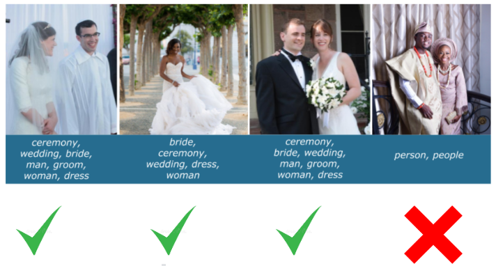

# Block C - Data Modelling

In block A, you explored the foundations of data science and AI and critically examined applications thereof of in existing businesses processes. In block B, you went a step further and helped a real-life client get more insight out of their data using data science tools to pre-process, analyse and get insight out of data. In this block, you will take on a more hands-on approach towards data modelling using tools such as deep learning. In particular, this block will focus on key aspects of **the modelling phase of a data science project lifecycle** such as deep learning, explainable and responsible artificial intelligence (AI), and human-centered artificial intelligence. 

<figure>
    
</figure>
 

Therefore, we are going to create a project proposal for an smartphone application which uses the camera to scan object to achieve some kind of business value. You're going to design this application keeping the user experience, business value and disruptive technology risks in mind. The project proposal itself will take the shape of a powerpoint presentation where you argue why your deep learning model is responsible and why it adds value to the core use-case.

The topics include, but are not limited to:
- Business Understanding: Why create this application? What is it's value and for whom is it valuable?
- Explainable AI: How does you deep-learning model work?
- Deep Learning: How do we achieve the computer vision task lying at the core of your project proposal?
- Responsible AI: Why is you model and application thereof done in a responsible manner?
- Human-centered Artificial Intelligence: How do we design an application keeping both the user-experience and (changing) artificial intelligence algorithm in mind?

***

## Project Based Learning - Creative Brief

 In this project, you will develop responsible and explainable AI algorithms which are human centered.
 This assignment is based on the Kaggle Inclusive Images Challenge (see [here](http://Inclusive%20Images%20Challenge%20|%20Kaggle)) organised jointly by Google and Kaggle.

 Large, publicly available image datasets, such as ImageNet, Open Images and Conceptual Captions are commonly used to develop and rank image classification algorithms. While these datasets are a necessary and critical part of developing useful machine learning (ML) models, some open-source data may be biased. As patterns in such datasets ultimately decide what an AI model learns and predicts, such bias may lead us to develop models that may not necessarily reflect the true reality.

For example, the images below show the predictions of a standard AI image classifier trained to predict if a given image represents a wedding or not. While the AI correctly detects a wedding in the first 3 images, it fails to do so in the last image. This is a consequence of developing an AI algorithm without being sensitive to biases that might exist in the training data.

<figure>
    
</figure>
 

Your goal for this block is to create a project proposal for an AI application which operates in a responsible, transparent and explainable manner. To this end, you are expected to design, implement and evaluate AI algorithms based on deep neural networks that can accurately classify an image while being sensitive to biases that may be present in the data the network is trained on. Further, keeping the end user in mind, imagine a use-case where such an algorithm would have value and create a protype of an application using the concepts learned in Human-Centered AI. Finally, you need to explain why the market needs your application by conducting market research, target audience analysis and S.W.O.T. 

At the beginning of the project, you will be introduced to the project by one of the lecturers. Throught out the block, you can consult the lecturers if you have any questions or wish to deepen your understanding of project. Please refer to the creative brief requirment below for more detailed information.

### Creative Brief Requirements:
1. [ ] [Project Proposal](MS Teams Assignment Template/Project Proposal Template - Y1C_2022-23_ADSAI.pptx): PowerPoint presentation of your project proposal for a computer vision application. See you Microsoft Teams Assignment for the template. Requirements 1 to 5 are listed below need to be explained and reflected upon in the final client presentation.  
2. [ ] [Business Understanding](https://adsai.buas.nl/Study%20Content/Business%20Understanding/BusinessUnderstandingRequirements.html):
3. [ ] [Proof of Concept (PoC)](https://adsai.buas.nl/Study%20Content/DeepLearning/21.%20Requirements.html): Proof of Concept (PoC) the core functionality of your deep learning model.
4. [ ] [Responsible & Explainable AI](../../Study%20Content/Responsible%20and%20Explainable%20AI/ResponsibleAIRequirements.html): Jupyter notebook, and two Python scripts
5. [ ] [Application Prototype](https://adsai.buas.nl/Study%20Content/Human-Centered%20Artificial%20Intelligence/Assignment.html): Prototype in the form of a wireframe of your human-centered artificial intelligence application made in [Proto.io](wwww.proto.io)  

Please click the links above to view more detailed requirements and exact mapping of the assessment rubric! 

# Deadlines & deliverable
Requirement 1 to 5 are to be delivered be handed-in
on Friday the 7th of April by 16:59 latest. The final client presentation will take place in week 9 from Wednesday and Friday. The client presentation will be attended by a panel of stakeholders (the lecturers responsible for the ILO's; see the staff section.

---

## Questions?

If you have questions or issues regarding the course material, please post a message on the 'Q&A' channel in Teams. The channel will be monitored by mentors but also please help your peers if you have the answer to their question.

---

# Creative Brief Timeline

The project timeline is aligned with the knowledge modules you will find in the ADS&AI digital learning environment.

<figure>

    

</figure>
 

Below you're find the timeline on a day-to-day basis. Further down there's info on the medals and staff for this block; which includes which staff member to go to for ILO-specific questions. 

***

# Week 1: Responsible AI (Part 1: Bias and Fairness) & Marketing

## Monday
- [Fairness & Bias: Definitions](https://adsai.buas.nl/Study%20Content/Responsible%20and%20Explainable%20AI/ResponsibleAI1.html)

## Tuesday
- [Fairness & Bias: Individual Fairness vs. Group Fairness](https://adsai.buas.nl/Study%20Content/Responsible%20and%20Explainable%20AI/ResponsibleAI2.html)

## Wednesday
- [DataLab: Responsible AI](https://adsai.buas.nl/Study%20Content/Responsible%20and%20Explainable%20AI/UseCases.html)

## Thursday
- [Market Research for Product development & Target Audiences](https://adsai.buas.nl/Study%20Content/Business%20Understanding/BusinessUnderstanding%201.html)

## Friday
- [DataLab: Marketing](LinkToPage)
- [DataLab: Responsible AI](https://adsai.buas.nl/Study%20Content/Responsible%20and%20Explainable%20AI/UseCases.html)

# Week 2 : PoC - Introduction to Deep Learning with Keras

## Monday

- [Introduction to Deep Learning](https://adsai.buas.nl/Study%20Content/DeepLearning/1.%20Introduction%20to%20Deep%20Learning.html)

## Tuesday

- [The Mathematical Building Blocks of Neural Networks](https://adsai.buas.nl/Study%20Content/DeepLearning/2.%20The%20Mathematical%20Building%20Blocks%20of%20Neural%20Networks.html)

## Wednesday

- [DataLab: Multilayer Perceptrons 1](https://adsai.buas.nl/Study%20Content/DeepLearning/3.%20DataLab%20MLP.html)

## Thursday

- [Improving Model Performance](https://adsai.buas.nl/Study%20Content/DeepLearning/4.%20Improving%20model%20performance.html)

## Friday
- [DataLab: Multilayer Perceptrons 2](https://adsai.buas.nl/Study%20Content/DeepLearning/5.%20DataLab%20MLP.html)

---
# Sprint/Carnaval Holidays
:smiley: :neckbeard: :alien: :construction_worker: :cop: :man_with_turban: :guardsman:
---

# Week 3 : PoC - Implementing multilayer perceptrons with Python and NumPy

## Monday
- [Week 2 review](https://adsai.buas.nl/Study%20Content/DeepLearning/6.%20Review.html)

## Tuesday
- [Understanding neural networks](https://adsai.buas.nl/Study%20Content/DeepLearning/7.%20NNs%20under%20the%20hood.html)

## Wednesday
- [DataLab: MLP from scratch 1](https://adsai.buas.nl/Study%20Content/DeepLearning/8.%20DataLab%20MLP%20from%20scratch.html)

## Thursday
- [Gradient Descent](https://adsai.buas.nl/Study%20Content/DeepLearning/9.%20Gradient%20Descent.html)

## Friday
- [DataLab: MLP from scratch 2](https://adsai.buas.nl/Study%20Content/DeepLearning/10.%20DataLab%20MLP%20from%20scratch.html)

# Week 4 : PoC - Convolutional Neural Networks with Keras

## Monday
- [Introduction to Convolutional Neural Networks 1](https://adsai.buas.nl/Study%20Content/DeepLearning/11.%20CNN%20day%201.html)

## Tuesday
- [Introduction to Convolutional Neural Networks 2](https://adsai.buas.nl/Study%20Content/DeepLearning/12.%20CNN%20day%202.html)

## Wednesday
- [DataLab: Convolutional Neural Networks](https://adsai.buas.nl/Study%20Content/DeepLearning/13.%20CNN%20day%203.html)

## Thursday
- [Working with small datasets](https://adsai.buas.nl/Study%20Content/DeepLearning/14.%20CNN%20day%204.html)

## Friday
- [DataLab: Working with small datasets](https://adsai.buas.nl/Study%20Content/DeepLearning/15.%20CNN%20day%205.html)

# Week 5 : PoC - The Machine Learning Project Lifecycle

## Monday
- [The Machine Learning Project Lifecycle 1](https://adsai.buas.nl/Study%20Content/DeepLearning/16.%20ML%20workflow%20day%201.html)

## Tuesday
- [The Machine Learning Project Lifecycle 2](https://adsai.buas.nl/Study%20Content/DeepLearning/17.%20ML%20workflow%20day%202.html)

## Wednesday
- [DataLab: The Machine Learning Project Lifecycle](https://adsai.buas.nl/Study%20Content/DeepLearning/18.%20ML%20workflow%20day%203.html)

## Thursday
- [The Machine Learning Project Lifecycle 3](https://adsai.buas.nl/Study%20Content/DeepLearning/19.%20ML%20workflow%20day%204.html)

## Friday
- [DataLab: The Machine Learning Project Lifecycle](https://adsai.buas.nl/Study%20Content/DeepLearning/20.%20ML%20workflow%20day%205.html)

# Week 6: Responsible AI (Part 2: Transparency and Interpretability)

## Monday
- [NameSelf-StudyDay](LinkToPage)

## Tuesday
- [NameSelf-StudyDay](LinkToPage)

## Wednesday
- [DataLab: Responsible AI](https://adsai.buas.nl/Study%20Content/Responsible%20and%20Explainable%20AI/UseCases.html)

## Thursday
- [NameSelf-StudyDay](LinkToPage)

## Friday
- [DataLab: Responsible AI](https://adsai.buas.nl/Study%20Content/Responsible%20and%20Explainable%20AI/UseCases.html)

# Week 7 : Prototype - Human Centered AI

## Monday
[Interaction & information processing fundamentals](../../Study%20Content/Human-Centered%20Artificial%20Intelligence/Interaction_Information_Processing_Fundamentals.html)

## Tuesday
[Interaction design](../../Study%20Content/Human-Centered%20Artificial%20Intelligence/Interaction_Design.html)

## Wednesday
[DataLab: Risk-Assessment of disruptive technologies](../../Study%20Content/Human-Centered%20Artificial%20Intelligence/Datalab13_Risk-Assessment_of_Disruptive_Technologies.html)

## Thursday
[Interface design](../../Study%20Content/Human-Centered%20Artificial%20Intelligence/Interface_Design.html)

[S.W.O.T. analysis](../../Study%20Content/Business%20Understanding/BusinessUnderstanding%202.html)

## Friday
[DataLab: Wizzard of Ozz Workshop](../../Study%20Content/Human-Centered%20Artificial%20Intelligence/Datalab14_Conceptualizing_A_Wireframe_Prototype.html)

# Week 8: Prototype - Human Centered AI

## Monday
[U/X testing using A/B testing](../../Study%20Content/Human-Centered%20Artificial%20Intelligence/User_Testing.html)

## Tuesday
- [User-Centered design for AI](../../Study%20Content/Human-Centered%20Artificial%20Intelligence/User-Centered_Design_for_AI.html)
- [Designing for AI Algorithms Implementation](../../Study%20Content/Human-Centered%20Artificial%20Intelligence/Designing_for_AI_Algorithm_Implementation.html)

## Wednesday
[DataLab: A/B Testing](../../Study%20Content/Human-Centered%20Artificial%20Intelligence/Datalab15_Introduction_To_AB-Testing.html)

## Thursday
[DataLab: Wireframes and final presentation](../../Study%20Content/Human-Centered%20Artificial%20Intelligence/Datalab16_Client_Testing_of_Wireframe_Prototypes.html)

## Friday
Good Friday - Day off!

## Extra Curricular Learning
For proffessional ILO 2 you need to demonstrate self-exploration and personal development, good academic practices in learning how to learn and the acquisition of professional knowledge through research, 
study, analysis, applied practice, discussion and reporting. For each ILO condition, the following should be evidence in your learning log:
- ILO 2.1, Poor: Identify an area of improvement in terms of knowledge and skills, evidence working on this. Confer with your mentor on whether your improvement plan is valid. Tip: Take a look at last blocks self-reflection and work on your identified areas of improvement over there!
- ILO 2.1, Insufficient: You can do this by looking into extracurricular resources (e.g. transformer neural networks) or attending extracurricular activities yourself (e.g. such as attending a guild or [Dealing with stress training](https://hub.buas.nl/read/dealing-with-stress-2/)). 
- ILO 2.1, Sufficient: Your learning and development is clearly evidenced.
- ILO 2.1, Good: Your learning goes beyond the current confines of the project. Something which takes the project to the next level (e.g. fitting a transformer model to do image classification, actually creating your application)
- ILO 2.1, Excellent: you also share your learning/development experience succesfully with your peers and evidence what you learned them. Evidence peer-learning can be done using written

We made a example selection of valuable resources for extracurricular learning and development to get you started:

### Business Understanding:
- SomeResource

### Responsible AI:
- SomeResource

### Deep Learning:
- SomeResource

### Human-Centered Artificial Intelligence:
- [AI guidebook provided by Google](https://pair.withgoogle.com/guidebook)
− [Designing with Data](http://shop.oreilly.com/product/0636920026228.do)
− [The Design of Everyday Things, Donald A. Norman](https://login.proxy1.dom1.nhtv.nl/login?url=https://search.ebscohost.com/login.aspx?direct=true&db=cat01829a&AN=buas.393706974&site=eds-live)
- [Adaptive AI Interfaces](https://design.google/library/ux-ai/)

## Medal Challenges 

The medal courses for this block have been specifically selected to help boost your portfolio and extend your knowledge and expertise. You may also finish them after the initial deadline!

  

## Staff Members

| Name   |  Availability |  Mentor Group | Email  | Subject  |
|---|---|---|---|---|
| Dean van Aswegen (Lecturer), MSc. | Mon, Tues, Wed, Thur, Fri  |  Block A, Group 1 (1FAI-01), Year 1 | aswegen.d@buas.nl | Mentor | 
| Alican Noyan (Lecturer), PhD.|  Mon, Wed, Thu, Fri  | Block A, Group 2 (1FAI-04), Year 1  |  noyan.a@buas.nl | Neural Networks & Deep Learning (ILO 4.1) |
| Irene van Blerck (Lecturer), MSc.    |  Tue, Wed, Thu, Fri | Block A, Group 4 (1FAI-02), Year 1 |  blerck.i@buas.nl | Responsible & Explainable AI (ILO 3.1) |
| Bram Heijligers (Lecturer), MSc.  |  Wed, Thur, Fri | Block A, Group 5 (1FAI-03), Year 1  | heijligers.b@buas.nl | Human-Centered Artificial Intelligence (ILO 5.1) |
| Zhanna Kozlova (Lecturer), MA.   |   |  Block A, Group 5 (1FAI-03), Year 1 | kozlova.z@buas.nl  |  Business Understanding (ILO 2.1)  |
| Nitin Bhushan (Lecturer), PhD.    |  Mon, Wed, Thu, Fri  | Block A, Group 1, Year 2 | bhushan.n@buas.nl | Mentor  |
| Frank Peters (Program manager), PhD.  | Mon, Tue, Wed, Thu |  Program Manager | peters.f@buas.nl |   |
