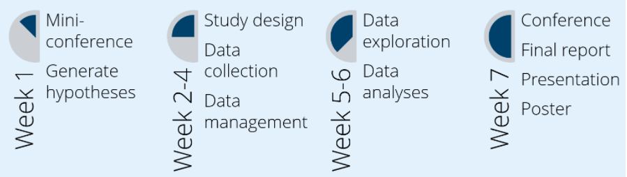

# Block A - Analytics Translator

A creative project brief is like an open invitation. It invites an individual to
propose their own creative vision while still giving a clear direction on the desired outcomes.
It is quite customary in the data science industry for projects to have abstract
requirements. A typical example being “Can we improve our existing business processes using data?”.
Similarly, our creative briefs set out to align with specific learning goals.
The requirements set in the brief below will lead junior data scientists to learn about different topics,
while still allowing for creative freedom in proposing and implementing a solution.
Select an approach that best fits your personal learning goals, investigate the requirements,
and amaze us with your creative problem solving!

 
<figure>
    
</figure>
 

In the current block, the creative brief will span the whole block (**7 weeks**) and will focus
on key compentencies of a role unique to the data science and
AI industry- **the digital transformation consultant**. In some sectors, also known as an **analytics translator**.
This role encompasses several skills such as data analysis, communication, research, analysis,
and to a large extent, decision making.

Here are some articles that describe the role in a bit more detail:

[McKinsey](https://www.mckinsey.com/business-functions/quantumblack/our-insights/analytics-translator){:target="_blank"}  
[GoDataDriven](https://godatadriven.com/topic/analytics-translator/){:target="_blank"}  
[Ortec](https://ortec.com/en/news-more/insights/era-analytics-translator){:target="_blank"}  
[A day in the life of an Analytics Translator](https://www.jads.nl/guest-blog-harm-bodewes/){:target="_blank"}

## Creative Brief: AI at BUAS
<!-- rewrite to align with BUas strategic agenda, data-driven policy & BUas + strategy -->

Advances in artificial intelligence (AI) are predicted to impact nearly all
domains of the Breda University of Applied Sciences (Buas). 

In fact, BUas has made it a strategic priority to become a data-driven organisation and being able to work with data and AI is aimed to be a BUas + competency. Meaning that all students should have some basic capacity to work with data and AI.
TODO: Add details about the AI in BUas project

**Your goal for this block is to use quantitative and qualitative methods to
explore and understand (staff and student)
attitudes, knowledge, acceptance, and perceived impact of AI across
Buas domains and guide stakeholders towards the best course of action regarding AI at Buas.**

In particular, you are expected to investigate the following questions:

TODO: ADD  RQs here.

## Project timeline

</figure>
 

> <mark>Please note that during weeks 1 to 4, you will work in a group. Weeks 4 to 7
is individual work.</mark>   This ensures that you can pool in resources for study design,
data collection, and data management; while allowing for individual preferences in
data analyses and project dissemination.

The project timeline is aligned with the knowledge modules you will find on
the ADSAI digital learning environment. 

### Week 1
**no conference this year**

Use this week to perform a literature review and design hypotheses which you will then put
to the test in the upcoming weeks. 

To learn more about how to conduct a literature review, please visit the [Information Skills Toolbox](https://buas.libguides.com/toolboxENG) offered by the BUas Library.

Further, as your final deliverable includes a technical report, 
please ensure that you learn the fundamentals of scientific writing using Latex. 

> Please ensure that you have also reviewed the assessement rubric, and contact your lecturers in case of any queries.

The knowledge modules linked to this phase are: 

- [ ] [Writing in the Sciences: Stanford](https://www.coursera.org/learn/sciwrite){:target="_blank"}
- [ ] [Writing in Latex: A Primer](https://www.overleaf.com/learn/latex/Tutorials){:target="_blank"}

You are expected to start drafting a research proposal individually by the end of Week 1.

### Week 2-4
Use week 2 to design your study and submit your research proposal. Once your proposal is approved, as a team, gather your quantitative and qualitative data in week 3 and 4, ensuring that you have a strategy for data management.

The knowledge modules linked to this phase are:

- [ ] [Research Methods:](https://www.coursera.org/learn/research-methods){:target="_blank"}   Complete the first 3 week modules and take a screenshot of each completed quiz; your score does not count towards your final grade, and attach it to your learning log. Do the week 4 module on Thursday the 15th of September, reflect on your research design in your learning log in separate slide and iterate on it accordingly.
- [ ] [Quantitative Methods:](https://www.coursera.org/learn/quantitative-methods){:target="_blank"} Complete the first 6 week modules and take a screenshot of each completed quiz; your score does not count towards your final grade, and attach it to your learning log. 
- [ ] Qualitative Methods: Covered by a Guest Lecture by Shima Rezaei Rashnoodi on Monday Week 3 from 10:00 - 12:00; check your calendar for the location, and a workshop on Friday in datalab days in week 3. Attendance is mandatory and recorded. In case of absence, contact your mentor for a valid leave of absence and an alternative knowledge module. 

### Week 5-6
Use these weeks to explore and analyse your data using statistical methods. 

The knowledge modules linked to this phase are:

- [ ] [Quantitative Data Analysis: A Primer](../../Study%20Content/Statistical%20Inference/){:target="_blank"}

If you wish to go deeper into the world of inferential statistics, here are some resources that you may find useful.
- [ ] [Intermediate Statistics](https://www.linkedin.com/learning/statistics-foundations-2/welcome?autoplay=true&u=36359204){:target="_blank"}
- [ ] [Advanced Statistics](https://www.linkedin.com/learning/statistics-foundations-3/welcome?autoplay=true&u=36359204){:target="_blank"}

In addition, during these weeks you should make sure to manage your data according to the [BUas data management plan](https://buas.libguides.com/rdm/dmp) and evidence this accordingly.

### Week 7
In this week, you are expected to report and present your project findings.

## Project Requirements

Your project should:
- [ ] use a valid and reliable instrument to measure how staff and students
think about AI, in particular their attitudes, acceptance, and perceived impact of AI.
- [ ] consist of quantitative as well as qualitative design component.
- [ ] adhere to the [Buas Data Management Protocol](https://eur04.safelinks.protection.outlook.com/?url=https%3A%2F%2Fbuas.libguides.com%2Frdm%2F&amp;data=05%7C01%7Cbhushan.n%40buas.nl%7C4ed2eff45e2d4b7f4e3708da9adcc744%7C0a33589b00364fe8a8293ed0926af886%7C0%7C0%7C637992570267015436%7CUnknown%7CTWFpbGZsb3d8eyJWIjoiMC4wLjAwMDAiLCJQIjoiV2luMzIiLCJBTiI6Ik1haWwiLCJXVCI6Mn0%3D%7C3000%7C%7C%7C&amp;sdata=ca6ub%2B8SNA6LqsOxGD92%2FS%2Bfbwqj47X7xhfgMajGeLo%3D&amp;reserved=0){:target="_blank"}.

## Project Deliverables

Your final (<mark>group</mark>) deliverable is a [Data Management plan](https://buas.libguides.com/rdm/dmp) which contains:
- [ ] description of the data collection process (which tools/instruments are used).
- [ ] description of the data: what is the format (file-type) of the data.
- [ ] [a codebook describing variables](https://github.com/BredaUniversityADSAI/ADS-AI/blob/f020e08818bb64486e784e2447334fb866ee1df9/docs/Study%20Content/Research%20Methodology/Assets/Codebook_Template.md). 
- [ ] description of data storage protocol: file structure and filenames.

Your final (<mark>individual</mark>) deliverables are:
- [ ] a research proposal detailing your research plan (max 1000 words) documenting your research question and study design (APA style, Latex formatted).
- [ ] scientific report (~4000 words +- 200) documenting your complete research cycle (introduction, methods, results, discussion; APA style, Latex formatted).

> The top two papers will be invited to present their findings and the dataset to the BUas Management Team via a presentation.
 

 ### Medal Challenges

The medal courses for this block have been specifically selected to help boost your portfolio and extend your knowledge and expertise. You can complete these challenges as a group or individually, and you can also finish them after the initial deadline!

<figure>
    
</figure>
 

<!--
- [ ] Bronze medal: [Do part 1 of this course.]() 
- [ ] Silver medal: [Do part 2 of this course.]()
- [ ] Gold medal: 1) Choose a [academic conference](https://en.wikipedia.org/wiki/Academic_conference) to publish your paper in; 2) confer with your mentor about the suitability of the conference; 3) prepare a draft according to their formatting standards; 4) Get your paper checked by your mentor; 5) Potentially iterate based on feedback; 6) submit your draft to the selected conference. -->

## Resources

[1] [Artificial Intelligence: American Attitudes and Trends](https://governanceai.github.io/US-Public-Opinion-Report-Jan-2019/executive-summary.html)  
[2] [OpenStax Online Textbook](https://openstax.org/books/introductory-statistics/pages/1-introduction)  
[3] Creswell, J. W., & Poth, C. N. (2016). Qualitative inquiry and research design: Choosing among five approaches. Sage publications. ([Versions 2](https://search.library.buas.nl/cgi-bin/koha/opac-detail.pl?biblionumber=10404) and 5 are available in the library) 
[4] [Overleaf APA7 template](https://www.overleaf.com/latex/templates/template-and-sample-for-authoring-apa7-manuscripts/pvhtwcrvcmsp) 
[5] Lapan, Stephen D., Quartaroli, MarryLynn T. and Riemer, Frances J., (2012), Qualitative research: an introduction to methods and designs,  San Francisco, Calif : Jossey-Bass. (Available in the Library) 
[6] [BUas Data Management Protocol](https://eur04.safelinks.protection.outlook.com/?url=https%3A%2F%2Fbuas.libguides.com%2Frdm%2F&amp;data=05%7C01%7Cbhushan.n%40buas.nl%7C4ed2eff45e2d4b7f4e3708da9adcc744%7C0a33589b00364fe8a8293ed0926af886%7C0%7C0%7C637992570267015436%7CUnknown%7CTWFpbGZsb3d8eyJWIjoiMC4wLjAwMDAiLCJQIjoiV2luMzIiLCJBTiI6Ik1haWwiLCJXVCI6Mn0%3D%7C3000%7C%7C%7C&amp;sdata=ca6ub%2B8SNA6LqsOxGD92%2FS%2Bfbwqj47X7xhfgMajGeLo%3D&amp;reserved=0)

