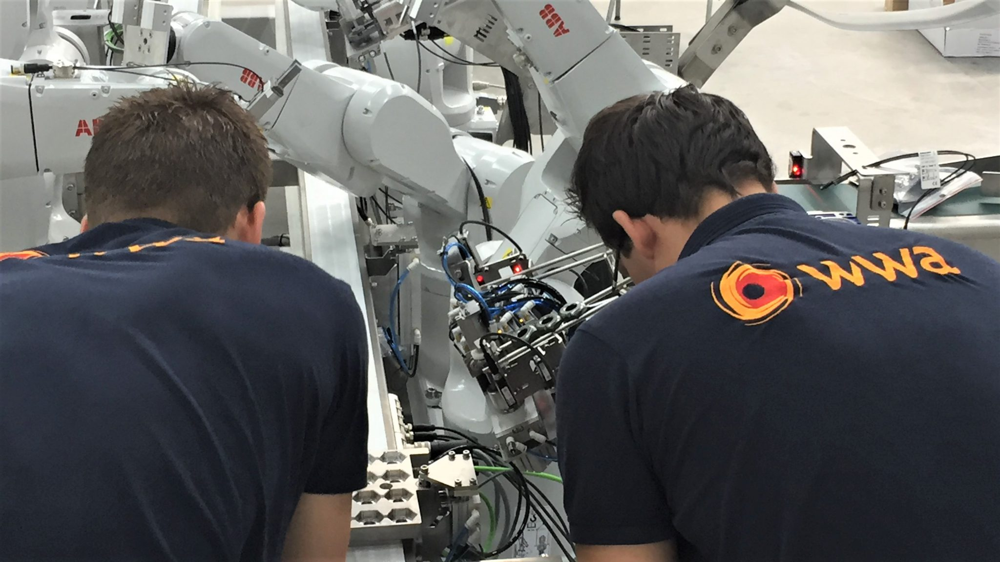
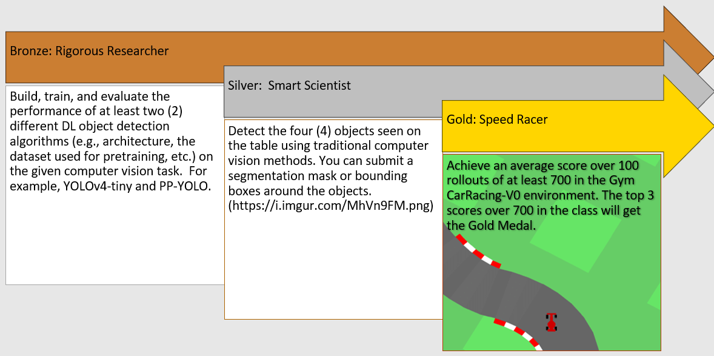

# Block B - Artificial Intelligence Scientist - Vision & Robotics

In Block B, which spans eight weeks, you will explore one specific role within a professional data team - The Artificial Intelligence Researcher. During the block, you will work on a Computer vision and Robotics themed real-use case. The research topics include, but are not limited to:

- Computer vision; Object detection (e.g., YOLO, Faster-RCNN, edge detection, etc.)
- Reinforcement learning; Applied to robotic control (e.g., DQN, A2C, PPO)
- Cognition: models of perception, learning, decision-making and action within situational context
- MLOps (e.g., bash scripting, virtual environments, experiment tracking etc.) 

## Staff Members

| Name   |  Availability |  Week | Email  | Subject  |
|---|---|---|---|---|
| Dean van Aswegen (Lecturer)  | Mon, Tue, Wed, Thu, Fri  |  Weeks 4-8 | aswegen.d@buas.nl | Robotics & Reinforcement learning | 
| Alican Noyan (Lecturer), PhD.|  Mon, Wed, Thu, Fri  | Week 2 |  noyan.a@buas.nl | Traditional computer vision |
| Irene van Blerck (Mentor), MSc.  |  Tue, Wed, Thu, Fri | Weeks 1-3, 8 |  blerck.i@buas.nl | Data collection & DL computer vision |
| Bram Heijligers (Lecturer), MSc.  |  Wed, Thu, Fri | Week 1 & 5 | heijligers.b@buas.nl | Cognition & Data Management | 
| Frank Peters, PhD.  | Mon, Tue, Wed, Thu |  Omnipresent | peters.f@buas.nl | Supreme Leader of the ADSAI Department, A.K.A. 'El Patron'  |

## DataLab Attendance 

Regular attendance and punctuality in every DataLab is required of each student (by default from 9:00 to 17:00). A student who has incurred absences of more than two DataLab sessions without a valid reason throughout the block shall not be given credit for the professional ILO(s). 

A student is considered late when they are not yet present until the fifteenth minute from the start of DataLab (9:15) Two instances of lateness are counted as one absence.

In case of absence, the student needs to fill in the 'DataLab Absence' [form](https://adsai.buas.nl/Contact%20Us/DataLabAttendance.html) in a timely manner (before 9:00), and subsequently proposes and completes activities that are acceptable alternatives to the in-class learning activities. For more details, contact your mentor.

*__Good__* excuses to miss DataLab:

- Personal illness
- Family emergency
- Death of a loved one
- Medical appointment
- Public transportation issue
- Car (or Other) accident
- Etc.

*__Bad__* excuses to miss DataLab:

- Oversleeping
- Being hangover
- Having no babysitter for your rabbit, dog, cat, etc.
- Boyband breakups and/or related drama
- A birthday party for a four-legged pal
- Having no clean underwear to put on
- Going to the beach because a doctor said that you needed more vitamin D
- The universe telling you to take a day off
- Etc.

## Questions?

If you have questions or issues regarding the course material, please post a message on the 'Q&A' channel in Teams. The channel will be monitored by mentors but also please help your peers if you have the answer to their question.

***

# Creative Brief

In the past five years, leading companies like Philips and Nokia have started integrating artificial intelligence (AI), particularly machine learning, into their manufacturing processes. Recently, small and mid-size enterprises (SMEs), seeking a competitive edge, also started to adopt Industry 4.0 technologies. However, digitalizing a business comes with several challenges, especially for SMEs, which do not have the same resources as more prominent manufacturing companies. To answer questions like 'Where should you focus, and how should you start?' requires expert knowledge from professionals such as an Artificial Intelligence Researcher, and Analytics Translator.  

*Figure 1. WWA employers working on robot arm.*

[WWA](https://www.wwa.nl/), a regional SME in manufacturing-process automation,  hereafter the client, has approached you as an – Artificial Intelligence Researcher – to digitilize its business processes by designing and developing a practical, Industry 4.0, robotics application that can perform bin picking by applying cognitive models, (advanced) reinforcement learning and computer vision algorithms. 

Good luck!

## Project Timeline

The project timeline is aligned with the knowledge modules you will find in the ADS&AI digital learning environment.

Note: During Weeks 1-2, you will work in a project group, Weeks 3-8 are devoted to individual work. This ensures that you can pool resources for data collection, and data management; while allowing for individual preferences in data analyses and project dissemination. 

### Week 1

The block starts with a kick-off lecture. 

- <mark>Field trip (WWA): 15th of November, 10:00-12:00 (Further details will follow).</mark>
- [ICT setup](../../Study%20Content/MLOps/MLOps1.html)
- [Data collection](../../Study%20Content/ComputerVision/ComputerVisionDataCollection.html)
- [Robotic Simulation Primer](https://adsai.buas.nl/Study%20Content/Robotics%20and%20Reinforcement%20Learning/3.%20Robotic%20Simulation%20Primer.html)
- [Data management](https://adsai.buas.nl/Study%20Content/Research%20Methodology/Overview.html)
- [Cognition workshop](https://adsai.buas.nl/Study%20Content/Cognition%20Fundamentals/Perception%20&%20Learning%20-%20Workshop.html): 9:00 - 17:00 on Thursday the 17th of November (Check MyTimetable).

*Ethics and Data Management*

In this block we don't work with humans or animals but with robots which makes our lives much easier! Therefore, we don't need to bother ourselves with a letter of informed consent or a research information letter. For this block we need to use and fill in the following templates: 
- [BUas Ethics Review](https://adsai.buas.nl/Year2/BlockB/#buas-ethics-review); 
- [Research Data Management Guide](https://adsai.buas.nl/Year2/BlockB/#research-data-management-plan); 
- [Codebook](https://adsai.buas.nl/Year2/BlockB/#codebook). 

*This is a group deliverable*, so you can all hand-in the same files; and evidence that you did follow through with you Research Data Management Plan & Procedures described in there. Make sure that you contribute to each of these deliverables and are able to evidence this!

#### <mark>DataLab (group)</mark>

DataLab 1, Goal(s):

- [ ] Demonstrate business understanding by identifying, and describing the project's problem statement
- [ ] Setup your ICT environment (e.g, WSL2, IDE, MLOps tool, etc.)
- [ ] Create one (1) real-life image dataset ('difficult' object detection task)
- [ ] Create one (1) synthetic image dataset ('easy' object detection task)

DataLab 2, Goal(s):
- [ ] [Create flowchart of perceptual & learning model for object detection](https://adsai.buas.nl/Study%20Content/Cognition%20Fundamentals/Perception%20and%20Learning%20-%20Datalab%20material.html) 
- [ ] [Create first draft of data management plan, ethics review & codebook](https://adsai.buas.nl/Study%20Content/Research%20Methodology/Overview.html)

### Week 2

- [Data annotation](../../Study%20Content/ComputerVision/ComputerVisionDataAnnotation.html)
- [Computer vision: Introduction](https://adsai.buas.nl/Study%20Content/ComputerVision/ComputerVisionIntroduction.html)
- [Traditional computer vision](https://adsai.buas.nl/Study%20Content/ComputerVision/TradDLComputerVision.html)

#### <mark>DataLab (group)</mark>

DataLab 1, Goal(s):

- [ ] Create one (1) annotated image dataset with the real-life data ('difficult' object detection task)
- [ ] Create one (1) annotated image dataset with the synthetic data ('easy' object detection task)

__Formative feedback I__

DataLab 2, Goal(s): 

Make sure that you completed the independent-study on [Traditional computer vision](https://adsai.buas.nl/Study%20Content/ComputerVision/TradDLComputerVision.html) before this DataLab, because the point of the DataLab is to apply what you have learned during the independent-study days.

[Here is the notebook](https://edubuas-my.sharepoint.com/:f:/g/personal/noyan_a_buas_nl/EhLpd_KatBdMt3c3staHUBUBQ8yY9XRRkjqgq-3Ns4EDfg?e=cDzhy2) you will use today.

- [ ] Detect edges and contours
- [ ] Plot image histograms and apply thresholding
- [ ] Detect objects
- [ ] Detect overlapping objects
 
### Week 3

- [DL computer vision I: Theory](../../Study%20Content/ComputerVision/DLComputerVision1a.html)
- [DL computer vision II: Application](../../Study%20Content/ComputerVision/DLComputerVision1b.html)
- [DL computer vision III: Hyperparameter tuning](../../Study%20Content/ComputerVision/ComputerVisionHyperparameterTuning.html)

#### <mark>DataLab (individual)</mark>

Make sure to complete the independent-study on [DL computer vision II: Theory](../../Study%20Content/ComputerVision/DLComputerVision1a.html) before the first DataLab session, because the point of this week is to apply what you have learned during the independent-study days.

DataLab 1, Goal(s):

- [ ] Demonstrate foundational knowledge and understanding of the theories, principles, methods, and techniques related to the subfield of object detection by summarizing, and critically evaluating some of its seminal works.
- [ ] Identify, evaluate, and integrate relevant information on DL methods from a variety of sources to solve an object detection task 
- [ ] Validate the installation of your chosen algorithm/toolbox/etc. by performing inference on a single image using a pre-trained object detection model 

DataLab 2, Goal(s):
 
- [ ] Builds, (trains), and evaluates a traditional and DL object detection model on the real-life data ('difficult' object detection task)
- [ ] Optimize the hyperparameters of the DL object detection model on the real-life data ('difficult' object detection task)
- [ ] Compares and contrasts traditional and DL object detection techniques, and subsequently determines which implementation, - i.e, object detection model, provides the best performance on the real-life data ('difficult' object detection task)

### Week 4

In week 4 we will start diving into the world of robotics so that we can eventually apply our object detection models to a practical use case. By the end of the week you will have a good understanding of the basics of robotic simulation and how to use it to create a baseline controller enabling a robotic arm to stack boxes in virtual environment.

Knowledge Modules:

- [Robotics I: Intro, Applications, and Components](https://adsai.buas.nl/Study%20Content/Robotics%20and%20Reinforcement%20Learning/4.%20Robotics%20I.html)
- [Robotics Ib: Co-ordinate Systems, Degrees of Freedom, and Work Envelopes](https://adsai.buas.nl/Study%20Content/Robotics%20and%20Reinforcement%20Learning/4.1%20Robotics%20Ib.html)
- [Robotics II: Control Systems](https://adsai.buas.nl/Study%20Content/Robotics%20and%20Reinforcement%20Learning/5.%20Robotics%20II.html)
- [Robotics IIb: Practical Examples](https://adsai.buas.nl/Study%20Content/Robotics%20and%20Reinforcement%20Learning/5.1%20Robotics%20IIb.html)

#### <mark>DataLab (individual)</mark>

DataLab 1, Prep and Goal(s):

- [Prep](https://adsai.buas.nl/Study%20Content/Robotics%20and%20Reinforcement%20Learning/5.2%20Datalab1-Prep.html) 
- [Robotics IIIa: Robotic Simulation](https://adsai.buas.nl/Study%20Content/Robotics%20and%20Reinforcement%20Learning/6.%20Robotics%20IIIa.html)
- [DataLab 1](https://adsai.buas.nl/Study%20Content/Robotics%20and%20Reinforcement%20Learning/6.1%20Datalab1.html)

More Knowledge Modules:

- [Robotics IIc: Advanced Control Concepts](https://adsai.buas.nl/Study%20Content/Robotics%20and%20Reinforcement%20Learning/6.2%20Robotics%20IIc.html)

DataLab 2, Prep and Goal(s):

- [Prep](https://adsai.buas.nl/Study%20Content/Robotics%20and%20Reinforcement%20Learning/6.4%20Datalab2-Prep.html)
- [DataLab 2](https://adsai.buas.nl/Study%20Content/Robotics%20and%20Reinforcement%20Learning/6.5%20Datalab2.html)

__Formative feedback II__

### Week 5

In week 5 we will take our baseline robot controller to the next level by incorporating our object detection model into the controller. This will enable the robot to detect the boxes and stack them in a more realistic way. We will also start looking at the basics of reinforcement learning and how it can be used to train a robot to perform tasks. 

- [Reinforcement Learning I: Intro and Applications](https://adsai.buas.nl/Study%20Content/Robotics%20and%20Reinforcement%20Learning/7.%20Reinforcement%20Learning%20I.html)
- [Reinforcement Learning Ib: Key Concepts and Theory](https://adsai.buas.nl/Study%20Content/Robotics%20and%20Reinforcement%20Learning/7.%20Reinforcement%20Learning%20Ib.html)
- [Reinforcement Learning II: Applying Reinforcement Learning](https://adsai.buas.nl/Study%20Content/Robotics%20and%20Reinforcement%20Learning/8.%20Reinforcement%20Learning%20II.html)

#### <mark>DataLab (individual)</mark>

DataLab 3, Prep and Goal(s):

- [Prep](https://adsai.buas.nl/Study%20Content/Robotics%20and%20Reinforcement%20Learning/9.%20Datalab3-Prep.html)
- [DataLab 3](https://adsai.buas.nl/Study%20Content/Robotics%20and%20Reinforcement%20Learning/9.1%20Datalab3.html)

Thursday the 15th of December: 9:00 - 17:00 in Hs1.033
- [Cognition workshop: decision-making & action-taking](https://adsai.buas.nl/Study%20Content/Cognition%20Fundamentals/Decision-making%20&%20Actions-%20Workshop.html)

DataLab 4, Cognition Fundamentals - Friday the 16th of December:
- [Prep](https://adsai.buas.nl/Study%20Content/Robotics%20and%20Reinforcement%20Learning/10.%20Datalab4-Prep.html)
- [Decision-making & action-taking models for reinfocement learning](https://adsai.buas.nl/Study%20Content/Cognition%20Fundamentals/Decision-making%20&%20Actions%20-%20Datalab%20material.html)
- [Custom RoboSuite Gym Environement](https://adsai.buas.nl/Study%20Content/Robotics%20and%20Reinforcement%20Learning/10.1%20Datalab4.html)

### Week 6

We have now covered the majority of the knowledge modules and will spend most of the next two weeks training and evaluating our models. 

Catch up on the follwing:
- PID Controller for the pick and place task (Sufficient - ILO 4.1)
- Data collection for the co-ordinate estimation model (Good - ILO 4.1)
- Building and training the co-ordinate estimation model (Good - ILO 4.1)
- Integrating the co-ordinate estimation model  (Good - ILO 4.1)
- Creating the gym environment wrapper for RL (Poor and Insufficient - ILO 4.2)

Work through this knowledge Module:
- [Reinforcement Learning III: Models and Hyperparameters](https://adsai.buas.nl/Study%20Content/Robotics%20and%20Reinforcement%20Learning/11.%20Reinforcement%20Learning%20III.html)

#### <mark>DataLab (individual)</mark>

DataLab 5, Prep and Goal(s):

- [Prep](https://adsai.buas.nl/Study%20Content/Robotics%20and%20Reinforcement%20Learning/10.2%20Remote%20Training%20with%20ClearML.html)
- [DataLab 5](https://adsai.buas.nl/Study%20Content/Robotics%20and%20Reinforcement%20Learning/11.1%20Datalab5.html)

One more knowledge module:
- [Evaluating Control Algorithm Performance I]()

__Formative feedback III (End of Week 6 {THURSDAY})__

DataLab 6, Prep and Goal(s):

- [Holiday!](https://www.youtube.com/watch?v=dQw4w9WgXcQ)

### Week 7

- [Robotics IIIb: Advanced RoboSuite](https://adsai.buas.nl/Study%20Content/Robotics%20and%20Reinforcement%20Learning/6.3%20Robotics%20IIIb.html)

DataLab 7, Prep and Goal(s):

- [Let's get pixelated!]()

DataLab 8, Prep and Goal(s):

- [Performance evaluation]()

### Week 8 

- Live demo of the application to the client

#### <mark>DataLab (individual)</mark>

DataLab 1, Prep and Goal(s):

- [Demo preparation]()

DataLab 2, Prep and Goal(s):

- [Demo Day]()

*** 

## Project Requirements
Consider each of these task as mandatory to complete your project:

### Computer Vision

In the first three weeks of Block B, you will acquire foundational knowledge and understanding of the theories, principles, methods, and techniques related to the field of computer vision. For example, you will be made familiar with various object detection algorithms, which deploy a traditional or deep learning-based approach to localizing and classifying objects in visual media. In addition, we will teach you to apply these algorithms to annotated image datasets comprised of either real-life or synthetic data. 

To solve the project's computer vision task, you need to:

- Demonstrate foundational knowledge and understanding of the theories, principles, methods, and techniques related to the (sub)fields of computer vision by interpreting, and subsequently disseminating the project findings via a written report (ILO 2.1). For example, you will have to provide a written technical analysis of the implemented object detection algorithm (Sufficient). 
- Acquire, store and process raw image data in a way that allows for data exploration and analysis (ILO 3.1). For example, as a team, you will need to create two (2) annotated image datasets for object detection (Poor).
-  Implement a traditional and DL object detection algorithm, making appropriate use of current tools and libraries, and cognitive models (ILO 3.2). For example, you will need to build, (train), and evaluate a traditional and deep learning-based object detection algorithm (Sufficient).

### Robotics and Reinforcement Learning

### _Implement a baseline controller_ (ILO 4.1)

Use traditional control methods combined with computer vision to create a controller for a simulated robotic arm to enable it to perform a pick and place task. 
The arm needs to: 
- Locate objects in its workspace 
- Classify the objects 
- Pick up the object
- Place the objects in a specific area based on the classification 
    
### _Investigate the feasibility of the application of reinforcement learning to the pick and place task_ (ILO 4.2)
Use reinforment learning to develop a controller for a simulated robotic arm to enable it to perform a pick and place task. Create and compare different reinforcement learning controllers using different: 
- Models (e.g. DQN, A2C, PPO, etc.) 
- Action spaces (e.g. discrete, continuous, etc.)
- Observation spaces (e.g. image, vector, etc.)
- Hyperpameters 
- Reward fucntions 

You will also need to compare these controllers to the baseline controller, and determine which controller is the most suitable for the pick and place task.

### Cognition
Complete the cognition task by using cognitive theory and cognitive models to **conceptualize**, build (implemented in the 'Computer Vision' task & 'Robotics and Reinforcement Learning' task) and **improve on** the application.

Evidence in technical report, and integrate in object detection algorithm:
- Identifies appropriate perceptual features for object detection. (ILO 3.2 - Sufficient)
- Identifies required prior-knowledge for contextualizing object detection. (ILO 3.2 - Good)
- Uses cognitive models of pattern recognition to improve feature and/or object detection. (ILO 3.2 - Excellent)

Evidence in technical report, and integrate in robotic controller & reinforcement learning algorithm:
- Identifies relevant environmental input required for situational awareness & setup for processing said input. (ILO 4.1 - Poor & Insufficient)
- The robot controller can respond to different situational conditions using formal logic. (ILO 4.1 - Excellent)
- Identifies relevant environmental input required for RL & setup for processing said input. (ILO 4.2 - Poor & Insufficient)
- Suggestions for model improvement, real-world implementation, knowledge acquisition and decision-making are made. (ILO 4.2 - Excellent)

### Technical Report
- Describes the data aquisition, and pre-processing steps (e.g., annotation, quality assessment, etc.) (ILO 2.1 - Insufficient)
- Provides a written technical analysis of the implemented object detection, and robot control algorithm (ILO 2.1 - Sufficient). For more information, see 'Technical analysis' section of [DL computer vision I: Theory](../../Study%20Content/ComputerVision/DLComputerVision1a.html).
- Provides written recommendations for further research, taking into account the client's  business strategy (ILO 2.1 - Good)

### BUas Ethics Review
- Fill in [the template](https://github.com/BredaUniversityADSAI/ADS-AI/blob/06638451273822b5dac37395a524ff7e4129dc38/docs/Study%20Content/Research%20Methodology/Assets/BUas%20Research%20Ethics%20Review%20Application%20Form-H.docx). (ILO 2.1 - Poor)
- [Submit review to Bram and get accepted](mailto:heijligers.b@buas.nl). (ILO 2.1 - Insufficient & Sufficient)

### Research Data Management Plan
- Follows [BUas guidelines](https://eur04.safelinks.protection.outlook.com/?url=https%3A%2F%2Fbuas.libguides.com%2Frdm%2F&data=05%7C01%7Cheijligers.b%40buas.nl%7C32902d1d66724d35fa3908dab1cae705%7C0a33589b00364fe8a8293ed0926af886%7C0%7C0%7C638017782263648569%7CUnknown%7CTWFpbGZsb3d8eyJWIjoiMC4wLjAwMDAiLCJQIjoiV2luMzIiLCJBTiI6Ik1haWwiLCJXVCI6Mn0%3D%7C3000%7C%7C%7C&sdata=hjY%2BMICD5oxH7rIo95xmB8UtbHkP726e%2BbPAKbyJ1sk%3D&reserved=0). (ILO 3.1 - Sufficient)
- Follow your planned procedures as demonstrated by your data storage. (ILO 3.1 - Good)
- Excecuted procedures ensured adhering to F.A.I.R. principles as demonstrated by your data storage. (ILO 3.1 - Excellent)

### Codebook
- Fill in [the template](https://github.com/BredaUniversityADSAI/ADS-AI/blob/06638451273822b5dac37395a524ff7e4129dc38/docs/Study%20Content/Research%20Methodology/Assets/Codebook_Template.md) (ILO 3.1 - Insufficient)
- Meet the criteria set in the template. (ILO 3.1 - Sufficient, ILO 3.2 - Poor)

***

## Project Deliverable(s)

__Group:__

- Two (2) annotated image datasets for an object detection task (ILO 3.1) (included in the computer vision folder of the repository)
- [BUas Ethics Review](https://adsai.buas.nl/Study%20Content/Research%20Methodology/Overview.html#templates)
- [Research Data Management Plan](https://adsai.buas.nl/Study%20Content/Research%20Methodology/Overview.html#templates)
- [Codebook](https://adsai.buas.nl/Study%20Content/Research%20Methodology/Overview.html#templates)

__Individual:__

- Technical report (ILO 2.1)
- GitHub folders with clear and concise README.md that explains the project and how to run the code, as well as showcasing the results. The final code and trained models (i.e. weights) should be included so the results can be replicated. These folders are required for:
    - Computer vision (ILO 3.2)
    - Baseline controller (ILO 4.1)
    - Reinforcement learning controller (ILO 4.2)

<mark>For more details, see self-assessment rubric.</mark>

***

## Medal Challenges 

The medal courses for this block have been specifically selected to help boost your portfolio and extend your knowledge and expertise. You may also finish them after the initial deadline!

  

 

*** 
