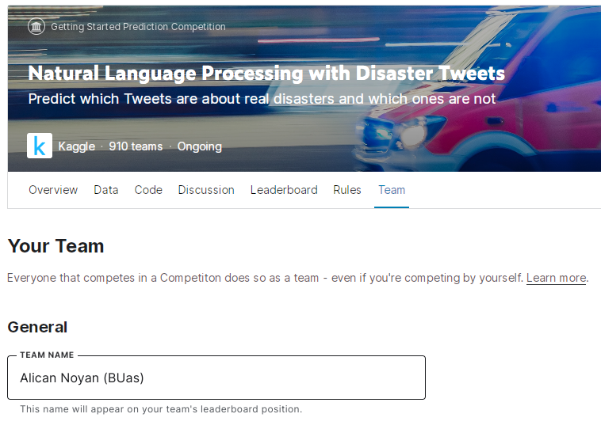

# Block C - Artificial Intelligence Scientist - Natural Language Processing

Natural language is a language that has evolved naturally as a means of communication among people. Computer analysis of natural language is called Natural Language Processing (NLP). NLP is used for e-mail classification, smart assistants, search engines, language translation, and many more applications. For example, hundreds of millions of people use Google Translate daily!

NLP is an interdisciplinary field combining linguistics, computer science, and AI. Linguistic knowledge is key for building NLP models. A word can have multiple meanings, that is, **polysemous**. *Mouse* refers to an animal as well as computer hardware. Two words can be **synonyms**, meaning the same thing, such as *train* and *educate*. Yet you *train* a machine learning model, not *educate* a machine learning model, because *train* is part of the machine learning **lexicon**. There are a lot of words that are not synonyms but can be **similar** such as *cat* and *dog*. The meaning of two words can be **related** in ways other than similarity (*coffee* and *cup*). Words also have **connotations**, meaning the reader's sentiment about the word. *Happy* has a positive connotation. Similar words can have different connotations. *Fake* and *replica* are similar words yet *fake* has a more negative connotation. On top of that, word usage evolves. *Awful* originally meant impressive instead of extremely bad. Add to these irony, slang, idioms, humor, and differences between the 7000 languages that exist...

<iframe width="896" height="504" src="https://www.youtube-nocookie.com/embed/4LjDe4sLER0" title="YouTube video player" frameborder="0" allow="accelerometer; autoplay; clipboard-write; encrypted-media; gyroscope; picture-in-picture" allowfullscreen></iframe>
Video 1: Qué difícil es hablar el español.

## Textbooks
In this block, you will follow two books. The first book is excellent for conceptual understanding of NLP, and the second book is focused on hands-on NLP with Python. Furthermore, there's a third book for those interested in how humans learn a language and how NLP is used to research this field of cognition.

1) D. Jurafsky, J.H. Martin, Speech and Language Processing, 3rd edition draft, 2022\
Book website: [https://web.stanford.edu/~jurafsky/slp3/](https://web.stanford.edu/~jurafsky/slp3/) \
Book pdf: [https://web.stanford.edu/~jurafsky/slp3/ed3book_jan122022.pdf](https://web.stanford.edu/~jurafsky/slp3/ed3book_jan122022.pdf)

2) S. Bird, E. Klein, E. Loper, Natural Language Processing with Python\
Book website: [https://www.nltk.org/book/](https://www.nltk.org/book/)

3)[Alishahi, A. (2010). Computational modeling of human language acquisition. Synthesis Lectures on Human Language Technologies, 3(1), 1-107.](https://github.com/BredaUniversityADSAI/ADS-AI/blob/d42ffd034a2d1a35752d7c83c30300288a4ae153/docs/Study%20Content/Cognition%20Fundamentals/assets/sources/Computational%20Modeling%20of%20Human%20Language%20Acquisition.pdf)

## Staff Members

| Name   |  Availability |  Week | Email  | Subject  |
|---|---|---|---|---|
| Alican Noyan (Lecturer), PhD.|  Mon, Wed, Thu, Fri  | Weeks 1-8 |  noyan.a@buas.nl | Natural Language Processing |
| Bram Heijligers (Lecturer), MSc.  |  Wed, Thu, Fri | Week 4 | heijligers.b@buas.nl | Cognition & Data Management | 
| Frank Peters, PhD.  | Mon, Tue, Wed, Thu |  Omnipresent | peters.f@buas.nl | Supreme Leader of the ADSAI Department, A.K.A. 'El Patron'  |

## DataLab Attendance 

Regular attendance and punctuality in every DataLab is required of each student (by default from 9:00 to 17:00). A student who has incurred absences of more than two DataLab sessions without a valid reason throughout the block shall not be given credit for the professional ILO(s). 

A student is considered late when they are not yet present until the fifteenth minute from the start of DataLab (9:15). Two instances of lateness are counted as one absence.

In case of absence, the student needs to fill in the 'DataLab Absence' [form](https://adsai.buas.nl/Contact%20Us/DataLabAttendance.html) in a timely manner (before 9:00) and subsequently proposes and completes activities that are acceptable alternatives to the in-class learning activities. For more details, contact your mentor.

*__Good__* excuses to miss DataLab:

- Personal illness
- Family emergency
- Death of a loved one
- Medical appointment
- Public transportation issue
- Car (or Other) accident
- Etc.

*__Bad__* excuses to miss DataLab:

- Oversleeping
- Being hangover
- Having no babysitter for your rabbit, dog, cat, etc.
- Boyband breakups and/or related drama
- A birthday party for a four-legged pal
- Having no clean underwear to put on
- Going to the beach because a doctor said that you needed more vitamin D
- The universe telling you to take a day off
- Etc.

## Questions?

If you have questions or issues regarding the course material, please post a message on the 'Q&A' channel in Teams. The channel will be monitored by mentors but also please help your peers if you have the answer to their questions.

## Creative Brief - Disaster or not?

During emergencies, individuals, news agencies, disaster relief organizations, and emergency management agencies use social media for communication, information diffusion, making sense of the event, and managing risks. As a result, Twitter has become an essential communication channel during natural disasters and terror attacks.

> "The main reason I like [Twitter] as a source of data is that it integrates not just a measure of typical exposure — which is ‘Did the water come 
> onto the land in a place where it wasn’t supposed to be? [It also] measures ‘What are people noticing? What are people talking about?’ Twitter can
> give us this aggregated measure of what those social consequences of that particular flood are."

> Dr. Frances Moore
> Assistant Professor in the Department of Environmental Science and Policy at the University of California, Davis\
> [Source](https://blog.twitter.com/en_us/topics/company/2022/when-natural-disasters-happen-twitter-can-help-heres-how)

On the other hand, Twitter contains vast amounts of misinformation, making accurate identification of emergency tweets indispensable. In this block, you will build NLP models for identifying emergency tweets. You will join one of the largest active NLP competitions on Kaggle titled [Natural Language Processing with Disaster Tweets.](https://www.kaggle.com/c/nlp-getting-started) Your task is to predict whether a given tweet is about a disaster. If so, predict a 1. If not, predict a 0. The training dataset consists of more than 7000 tweets together with tweet location and keywords.

Each sample in the train and test set has the following information:

- [ ] The text of a tweet
- [ ] A keyword from that tweet (e.g., 'earthquake')
- [ ] The location the tweet was sent from
- [ ] The label 0 or 1 (only training set)

In addition to distinguishing spam or not spam, it’s not always clear whether a person’s words are actually announcing a disaster. Take a look at the tweets shown in Figure 1. Both tweets mention that something is *ablaze*. *Ablaze* is **polysemous**. According to the Oxford Languages English dictionary, *ablaze* can mean the following:

- [ ] burning fiercely.\
*"his clothes were ablaze"*

- [ ] very brightly coloured or lighted.\
*"New England is ablaze with colour in autumn"*

- [ ] filled with anger or another strong emotion.\
*"his eyes were ablaze with excitement"*

The tweet on the left-hand side uses the second meaning of *ablaze*, therefore is not about a disaster. However, the other tweet uses its first meaning and talks about a disaster.

 \
Figure 1: Two tweets using the word ablaze with different meanings.

## Project Timeline

The block starts with an online kick-off lecture on **Feb 6th, 2023 Monday at 14:00**.

### Week 1

 This week you will work on preprocessing text.

**Self-study**

Study the following:

- Speech and Language Processing/Chapter 2
  - Section 2.1/Regular Expressions
  - Section 2.2/Words
  - Section 2.3/Corpora
  - Complete Exercise 2.1

- Natural Language Processing with Python/Chapter 1
  - Section 1/Computing with Language: Texts and Words
  - Section 2/A Closer Look at Python: Texts as Lists of Words
  - Complete the exercises indicated by "Your Turn". An example:
  >Your Turn: How many times does the word lol appear in text5? How much is this as a percentage of the total number of words in this text?

**DataLab 1: Regular Expressions**

After this datalab, you will be able to:

- [ ] Construct regular expressions
- [ ] Use Python's `re` library methods such as `re.findall()`
- [ ] Operate regular expression explainer tools such as [regexr.com](https://regexr.com/)
- [ ] Compare regular expressions and Python string methods for a given use case

**Self-study**

Complete the course [Regular Expression in Python](https://app.datacamp.com/learn/courses/regular-expressions-in-python).

Study the following:

- Speech and Language Processing/Chapter 2
  - Section 2.4/TextNormalization
  - Section 2.5/MinimumEditDistance
  - Section 2.6/Summary

- Natural Language Processing with Python/Chapter 1
  - Section 3/Computing with Language: Simple Statistics
  - Section 4/Back to Python: Making Decisions and Taking Control
  - Section 5/Automatic Natural Language Understanding
  - Complete the exercises indicated by "Your Turn". An example:
  >Your Turn: How many times does the word lol appear in text5? How much is this as a percentage of the total number of words in this text?

**DataLab 2: Tweet preprocessing**

After this datalab, you will be able to:

- [ ] Use regular expressions for text preprocessing
- [ ] Explain and employ tokenization
- [ ] Explain and employ stemming
- [ ] Remove stopwords and punctuation
- [ ] Design a text preprocessing pipeline

### Week 2

So far you have learned how to preprocess text. This week you will learn about two NLP algorithms and construct your first models. You will use the skills you acquired last week to prepare the datasets for training these models.

**Self-study**

Study the following:

- Speech and Language Processing
    - Chapter 4/Naive Bayes and Sentiment Classification
    - Complete Exercise 4.1
- Natural Language Processing with Python
    - Chapter 2/Accessing Text Corpora and Lexical Resources
    - Chapter 3/Processing Raw Text
    - Complete the exercises indicated by "Your Turn". An example:
    >Your Turn: How many times does the word lol appear in text5? How much is this as a percentage of the total number of words in this text?

**DataLab 1: Naive Bayes**

After this datalab, you will be able to:

- [ ] Construct a frequency distribution table for a given corpus
- [ ] Apply Laplacian smoothing to calculate word ratios
- [ ] Calculate log-likelihood for each word in the frequency distribution table
- [ ] Calculate the probability of a sentence belonging to a class

**Self-study**

Study the following:

- Speech and Language Processing
    - Chapter 5/Logistic Regression

**DataLab 2: Logistic regression**

- 10:00 Feedback Session
- 15:30 Guest Lecture: "A Day in the life of.." by Santiago Villa Cardenas, venue Fe1.016.

After this datalab, you will be able to:

- [ ] Construct input features from a frequency distribution table
- [ ] Train a logistic regression model on the features you created
- [ ] Design new features
 
### Week 3

**Cognitive Models of Language Learning**

Self-Study, datalab prep:
[Auditory Perception; memory & attention in the context of language/communication](link)
[Cognitive theory of language acquisition](link)

DataLab 1, Goal(s):
[] 1st draft: [Flowchart: Cognitve model of language learning](link)

Self-Study, datalab prep:
[Adaptive language acquisition & Computational models  of language acquisition](link)

DataLab 2, Goal(s):
[] Elaborate on: [Flowchart: Cognitve model of language learning](link)
[] Optional Excellent: [Create computational model of language learning](link)

### Week 4

In weeks 1 and 2, you learned how to preprocess text data and develop language models. This week you will start competing on Kaggle using the algorithms you have learned.

**Self-study**

1. Sign up to Kaggle. Setup your Kaggle profile by providing your name, profile picture, location and occupation. You can also add your LinkedIn and Github profiles. If you have a well prepared profile, you can include it in your CV. Please remember that Kaggle only allows one profile per user.
2. Check the [Kaggle Progression System](https://www.kaggle.com/progression/) and aim to become a contributor before the end of this week. Being a contributor will give you access to additional features.
3. Join the competition [NLP with disaster tweets](https://www.kaggle.com/competitions/nlp-getting-started).
4. On the competition page, you will see different tabs such as `Overview`, `Data`, and `Code`.Take a look at all of them.
5. Edit your name under the `Team` tab to include (BUas) so that it is easy to find your submissions. 
6. Under the `Data` tab, click `Download All`.
7. Inside the downloaded folder, you will find `test.csv` and `train.csv`. You will see another file named `sample_submission.csv` which shows you the expected format for your predictions.
8. Go back to the competition page. Click on `Submit Predictions` and submit the `sample_submission.csv` to the competition.
9. Log your submission to the excel file `Kaggle-Y2C_2022-23_ADSAI` under your Teams assignment.
10. Congrats! You created your Kaggle account, joined the competition, and made your first submission. You are ready to compete :trophy:
11. For more details on how Kaggle works, read the [docs](https://www.kaggle.com/docs).
12. Finally and most importantly, do not cheat! Cheating is not taken lightly on Kaggle. You can be banned.

**DataLab 1: Kaggle**

Open your favorite IDE, load `train.csv` and `test.csv`, and start building your models. Preprocess the data as you have learned on Week 1. Make at least two submissions, one with a Naive Bayes model and one with a Logistic Regression model, as you have learned on Week 2. Log your submissions to `Kaggle-Y2C_2022-23_ADSAI`.

After this datalab, you will be able to:

- [ ] Compete at Kaggle
- [ ] Build language models for Kaggle

DataLab 2, Goal(s):
- [ ] Embeddings

__Formative feedback II__

### Week 5

DataLab 1, Prep and Goal(s): Neural Networks 1

DataLab 2, Prep and Goal(s): Neural Networks 2

### Week 6

DataLab 1, Prep and Goal(s): Neural Networks 3

DataLab 2, Prep and Goal(s): Final day of individual Kaggle submissions

__Formative feedback III__

### Week 7

DataLab 1, Prep and Goal(s): Kaggle Team submissions 1

DataLab 2, Prep and Goal(s): Kaggle Team submissions 2

### Week 8 

DataLab 1, Prep and Goal(s): Kaggle presentations

DataLab 2, Prep and Goal(s): Holiday!

***

## Medal Challenges 

The medal courses for this block have been specifically selected to help boost your portfolio and extend your knowledge and expertise.

  

*** 
