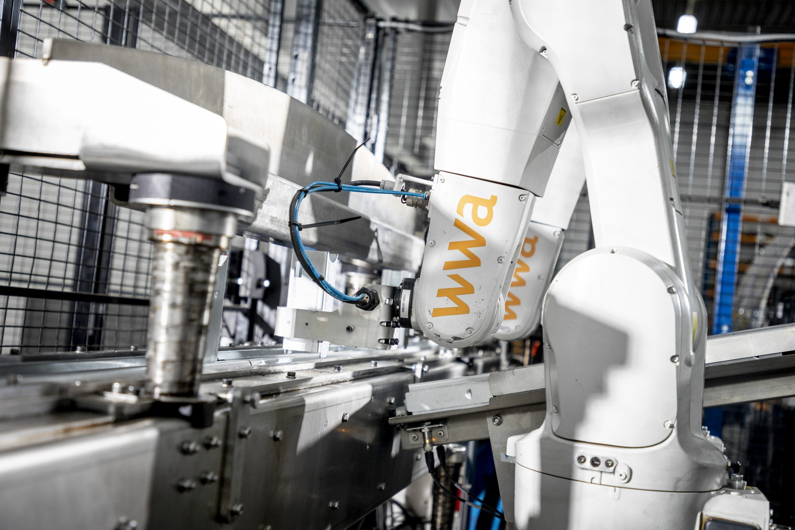
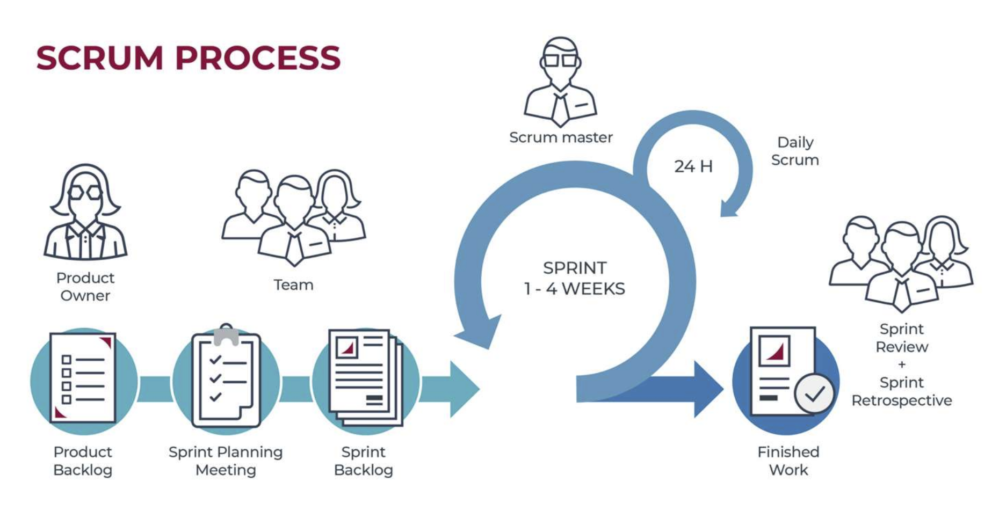
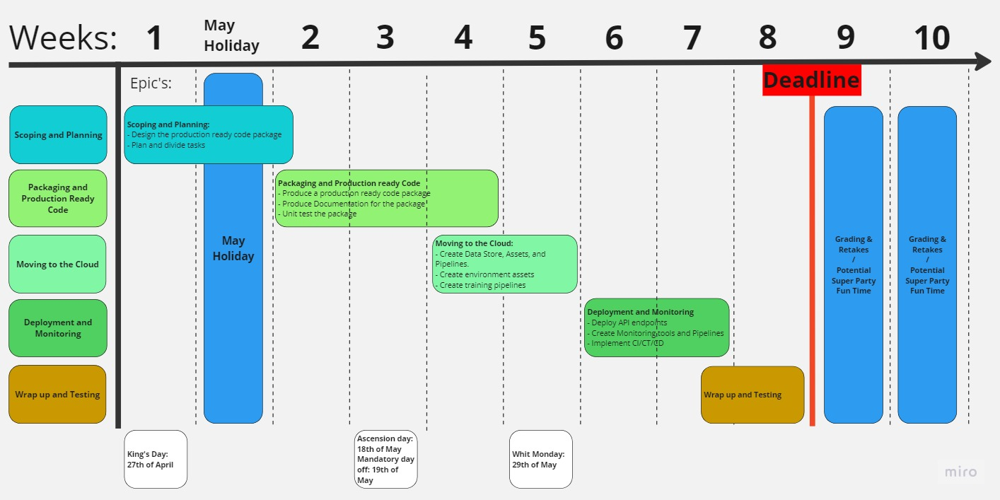

# Block D - Engineer - MLOps

In Blocks B and C you built machine learning models for computer vision and natural language processing. The focus was on the modelling component of the CRISP-DM cycle. You produced proof of concept models that were able to solve a given problem. However, these models were not production ready. In this block you will learn how to productionise and deploy your model/s to a cloud platform. You will also learn how to monitor your model/s and ensure that they are continuously retrained on new data. You will create a robust codebase and establish data ingestion and model training pipelines. Additionally, you will learn how to devise a model deployment approach and implement a monitoring strategy. Finally, you will learn how to demonstrate your deployed model/s in action.

### Learning Objectives

By the end of this block you will be able to:

- [ ] Understand the concept of MLOps and the role of DevOps in the ML lifecycle
- [ ] Create a robust codebase and establish data ingestion and model training pipelines
- [ ] Productionise and deploy your model/s to a cloud platform using different deployment strategies
- [ ] Monitor your model/s and ensure that they are continuously retrained on new data
- [ ] Create professional documentation for your project

# Project Based Learning - Creative Brief

### Option 1: Computer Vision and Robotics 

Robots are increasingly being used in warehouses to automate the picking and packing of goods. This is a highly repetitive task that is prone to human error. Computer vision models can be used for object detection, localisation and pose prediction, which are essential for robotic manipulation. In block C, you built proof of concept computer vision models for object detection, localisation and pose prediction. This block your task is to productionise and deploy your model/s to a cloud platform. 

For more details click [here](https://adsai.buas.nl/Year2/BlockD/Creative%20Brief%20-%20Computer%20Vision.html)

### Option 2: Natural Language Processing 

During emergencies, individuals, news agencies, disaster relief organizations, and emergency management agencies use social media for communication, information diffusion, making sense of the event, and managing risks. As a result, Twitter has become an essential communication channel during natural disasters and terror attacks. On the other hand, Twitter contains vast amounts of misinformation, making accurate identification of emergency tweets indispensable. In block C, you built NLP models for identifying emergency tweets. This block your task is to productionise and deploy your model/s to a cloud platform. 

 

For more details click [here](https://adsai.buas.nl/Year2/BlockD/Creative%20Brief%20-%20Natural%20Language%20Processing.html)

## General Project Requirements

Select one of the given options and develop a production-grade model that can be deployed on a cloud platform. Your tasks include creating a robust codebase, establishing data ingestion and model training pipelines, devising a model deployment approach, and implementing a monitoring strategy. Additionally, you must demonstrate your deployed model(s) in action.

Requirements:

- Develop a scalable API that accepts input data and returns predictions along with confidence scores
- Ensure that the model supports automatic retraining on a weekly basis
- Continuously monitor prediction accuracy to prevent model drift
- Maintain clear records of the deployed model and its training process for auditing purposes (data, code, and model versioning)
- Minimize manual intervention in deployment, with manual approval required for production
- Store and manage code in a code repository, such as Azure DevOps or GitHub

## Project Deliverables - Due Friday 23rd June 2023 at 16:59

- [ ] A GitHub repository containing all the code and documentation for your project.
- [ ] A README.md file containing a description of your project, how to install your package and how to use it.
- [ ] Installable Python package(s) containing your code. (Include a wheel file and a source distribution)
- [ ] Microsoft Azure ML workspace containing your model/s.
- [ ] A demo of the deployed model/s.
- [ ] Project planning and scoping document, including tasks, timelines and sprint planning.
- [ ] Learning log, work log, and completed peer reviews.

## Team-based working - Agile Scrum

For block D, you are expected to follow an agile project management methodology called 'Scrum' as you did in Year 1.

The Scrum methodology is characterized by short phases called “sprints” wherein
project work: tasks, occurs. During sprint planning, the project team identifies a
small part of the scope; a set of tasks, to be completed during the upcoming sprint,
which is usually a two week period of time.

At the end of the sprint, this work should be ready to be delivered to the
client. Finally, the sprint ends with a sprint review and retrospective—or
rather, lessons learned. This cycle is repeated throughout the project
lifecycle until the entirety of the scope has been delivered or block D is at an end.

Please watch the following video to get a brief refresher on scrum as an agile project management methodology.

<!-- blank line -->
<figure class="video_container">
<iframe width="560" height="315" src="https://www.youtube.com/embed/gy1c4_YixCo" title="YouTube video player" frameborder="0" allow="accelerometer; autoplay; clipboard-write; encrypted-media; gyroscope; picture-in-picture" allowfullscreen></iframe>
</figure>
<!-- blank line -->

The following diagram illustrates the Scrum framework, showing the roles, events, artifacts, and flow of Scrum:

 

In this block we will be using Azure DevOps to manage our project and facilitate our agile project management methodology. We will be using the following Azure DevOps features:

- [ ] **Boards** - To manage our project backlog and tasks, plan our sprints, and track our progress.
- [ ] **Repos** - To store our code and documentation.

***

## Medal Challenges 

The medal courses for this block have been specifically selected to help boost your portfolio and extend your knowledge and expertise. You may also finish them after the initial deadline!

GitHub Medals will be awarded will be awarded with the following criteria:

 Write a blog post describing and comparing the MLOps tools offered by AWS, Azure and GCP. Include a comparison of the pricing models and the pros and cons of each.

 Create a Streamlit app that allows you to upload data make predictions using a model that you have deployed to a cloud platform and then visualise the results using an explainable AI tool.

 Create a web based GUI for your deployed app that adds business value to the model.

*** 

# _Block Outline_

# Week 1 - Introduction to MLOps, Project Briefing and Project Planning and Scoping

This week you will be introduced to the concept of MLOps and the tools and technologies that are used to productionise and deploy machine learning models. You will also be briefed on the project and start planning and scoping your project.

### Goals for this Week

- [ ] Understand the concept of MLOps and the tools, technologies and frameworks that are used to productionise and deploy machine learning models.
- [ ] Create a project plan and road map for your project.
- [ ] Create a plan for your python package.

### Suggested Learning Modules

- [MLOps: Machine Learning Operations](https://adsai.buas.nl/Study%20Content/MLOps%20II/1.%20Introduction%20to%20MLOps.html)
- [Virtual environments & Package management with Python](https://adsai.buas.nl/Study%20Content/MLOps%20II/2.%20VirtualEnvironmentPackageManagement.html)
- [Production Ready Code with Python](https://adsai.buas.nl/Study%20Content/MLOps%20II/3.%20CodeFormatting.html)
- [Working with Azure Devops](https://adsai.buas.nl/Study%20Content/MLOps%20II/4.%20Working%20with%20Azure%20Devops.html)
- [Production Ready Code Cheat Sheet](https://adsai.buas.nl/Study%20Content/MLOps%20II/PRC%20Cheat%20Sheet.html) 

### Datalabs

- [Datalab 1: Project and Package Planning](https://adsai.buas.nl/Study%20Content/MLOps%20II/5.%20Datalab1.html)

# Week 2-3 - Creating Production Ready Code (ILO 4)

Over the next two weeks you will create production ready code. You will learn how to write clean, modular and well documented code. That conforms with industry best practices. You will also learn how to build and distribute Python packages, and how to use logging and testing to ensure that your code is robust and reliable.

### Goals for this Sprint

- [ ] Create a complete well documented and tested Python package, that can be installed and used by others.

### Suggested Learning Modules

- [MLOps Maturity Levels - Article from MS Azure ML Accelerator](https://microsoft.github.io/azureml-ops-accelerator/1-MLOpsFoundation/1-MLOpsOverview/2-MLOpsMaturityModel.html)
- [Testing and Logging with Python](../../Study%20Content/MLOps%20II/6.%20Testing.html)
- [Documentation for Python](../../Study%20Content/MLOps%20II/7.%20Documenting.html)
- [Client-side Continuous Integration Tools with Python](../../Study%20Content/MLOps%20II/8.%20ContinuousIntegration.html)
- [Building Packages for Users - CLIs and APIs](../../Study%20Content/MLOps%20II/9.%20Package%20User%20Interfaces%20-%20CLI%20and%20API.html)
- [Building and Distributing Python Packages](../../Study%20Content/MLOps%20II/10.%20Building%20and%20Distributing%20Python%20Packages.html) 

# Week 4-5 - Data Pipelines and Model Training in the Cloud (ILO 5)

Weeks 4 and 5 will focus on creating data pipelines and model training pipelines. You will create versioned models, data assets, and environments. You will also learn how to automate the model training process. 

Goals for this Sprint

- [ ] Host and manage your data in the cloud.
- [ ] Manage environments and dependencies in the cloud.
- [ ] Create a data pipeline and model training pipeline in the cloud.

    ⚠️ Before you have your sprint planning meetings please work on any outstanding issues from the previous sprint, as well the first module below and start the second module (up to and including section 2.1) ⚠️

### Suggested Learning Modules
- [Intro to the Cloud and MLOps Tools](../../Study%20Content/MLOps%20II/11.%20Intro%20to%20the%20Cloud%20and%20MLOps%20Tools.html)
- [Microsoft Azure Machine Learning I](../../Study%20Content/MLOps%20II/12.%20Azure%20Machine%20Learning.html)
- [Application Programming Interfaces (APIs)](../../Study%20Content/MLOps%20II/14.%20Application%20Programming%20Interfaces%20-%20APIs.html)
- [Containerisation with Docker](../../Study%20Content/MLOps%20II/13.%20Containerisation.html)
- [Microsoft Azure Machine Learning II](../../Study%20Content/MLOps%20II/15.%20Azure%20Machine%20Learning%20II.html)
- [MLFlow](../../Study%20Content/MLOps%20II/16.%20MLFlow.html)

# Week 6-7 - Model Deployment and Monitoring (ILO 6)

Goals for this Sprint

- [ ] Create an API for your model - for inference and training.
- [ ] Deploy your model to the cloud - using multiple deployment methods/strategies.
- [ ] Setup monitoring for your model.

Weeks 6 and 7 will focus on model deployment and monitoring. You will learn how to deploy your model to a cloud platform. You will then use what you have learnt to deploy and monitor your model in the cloud. 

    ⚠️ Before you have your sprint planning meetings please work on any outstanding issues from the previous sprint ⚠️

### Suggested Learning Modules
- [ML Application Deployment Options and Strategies](../../Study%20Content/MLOps%20II/17.%20Deployment%20Options%20and%20Strategies.html)
- [Application Programming Interfaces (APIs)](../../Study%20Content/MLOps%20II/14.%20Application%20Programming%20Interfaces%20-%20APIs.html)
- [Azure Machine Learning III - Deployment](../../Study%20Content/MLOps%20II/18.%20Azure%20Machine%20Learning%20III.html)

🌟 Coming Soon:
- [Advanced GitHub and CI/CT/CD](../../Study%20Content/MLOps%20II/19.%20Advanced%20GitHub%20Techniques.html)
- [Azure Machine Learning IV - Monitoring and Automation](../../Study%20Content/MLOps%20II/19.%20Azure%20Machine%20Learning%20IV.html)

# Week 8 - Testing and Evaluation (ILO 4-6)

Week 8 will focus on testing and evaluation. You will test your deployment and evaluate its performance. You will also create a demo of your model, and wrap up your project.

***

## Staff Members

| Name   |  Availability |  Week | Email  | Subject  |
|---|---|---|---|---|
| Dean van Aswegen (Lecturer)  | Mon, Tue, Wed, Thu, Fri  |  ALL OF THEM!!! | aswegen.d@buas.nl | MLOps |
| Alican Noyan , PhD.|  Mon, Wed, Thu, Fri  | Consult as required |  noyan.a@buas.nl | NLP | 
| Frank Peters, PhD.  | Mon, Tue, Wed, Thu |  Omnipresent | peters.f@buas.nl | Supreme Leader of the ADSAI Department, A.K.A. 'El Patron'  |

***



